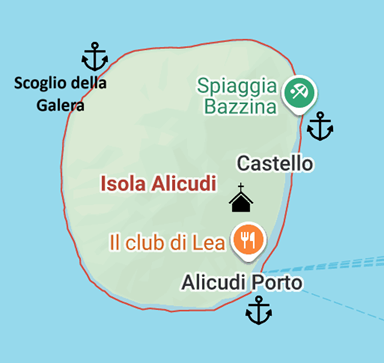
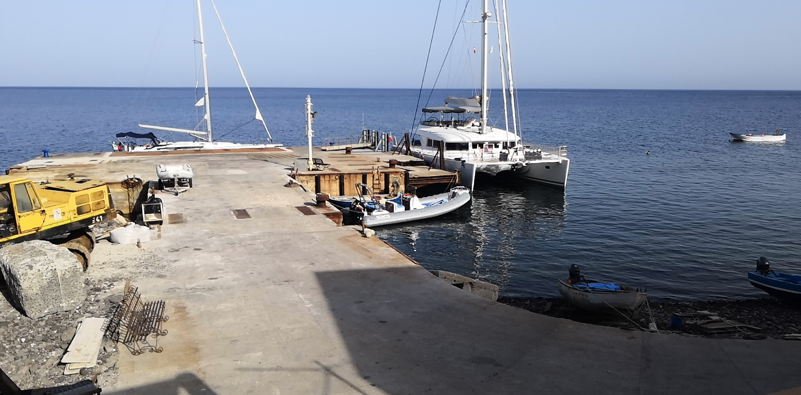
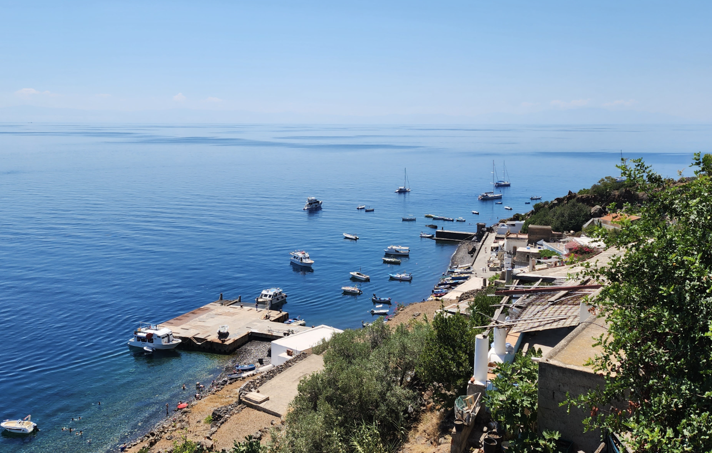
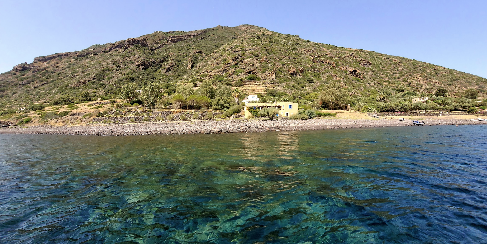
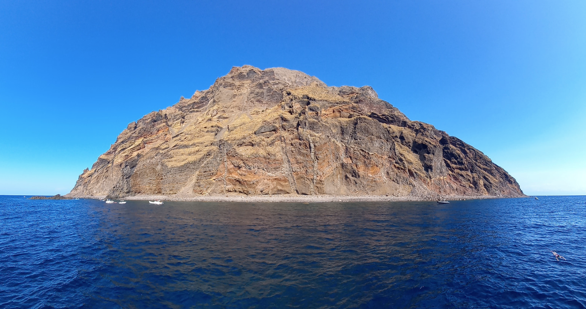
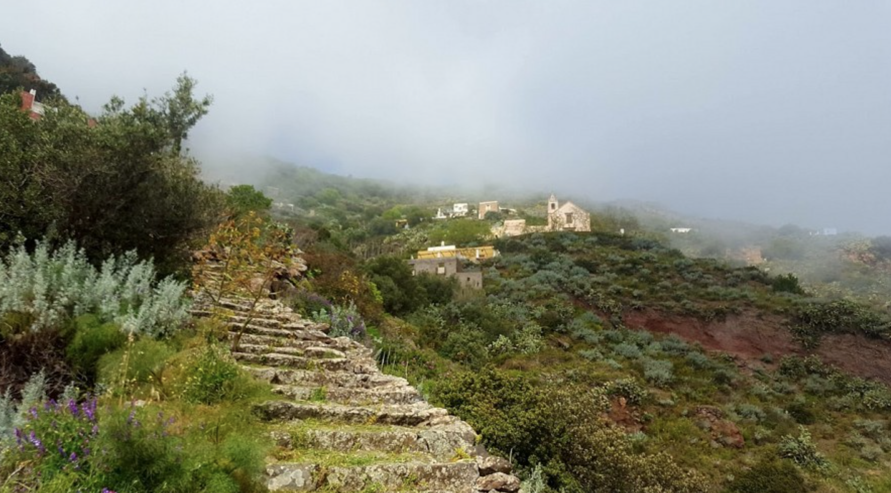
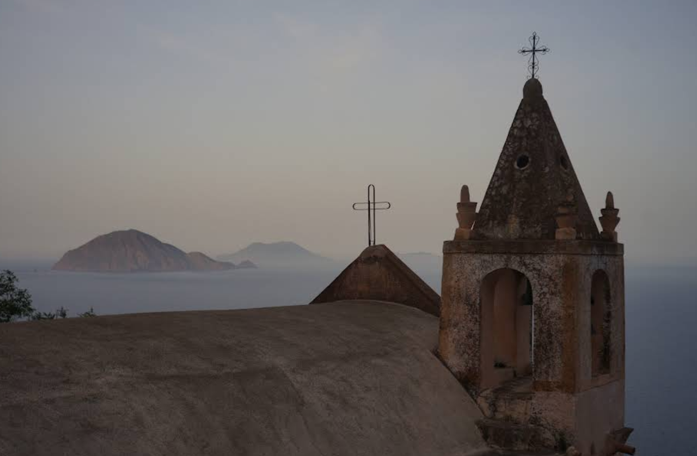
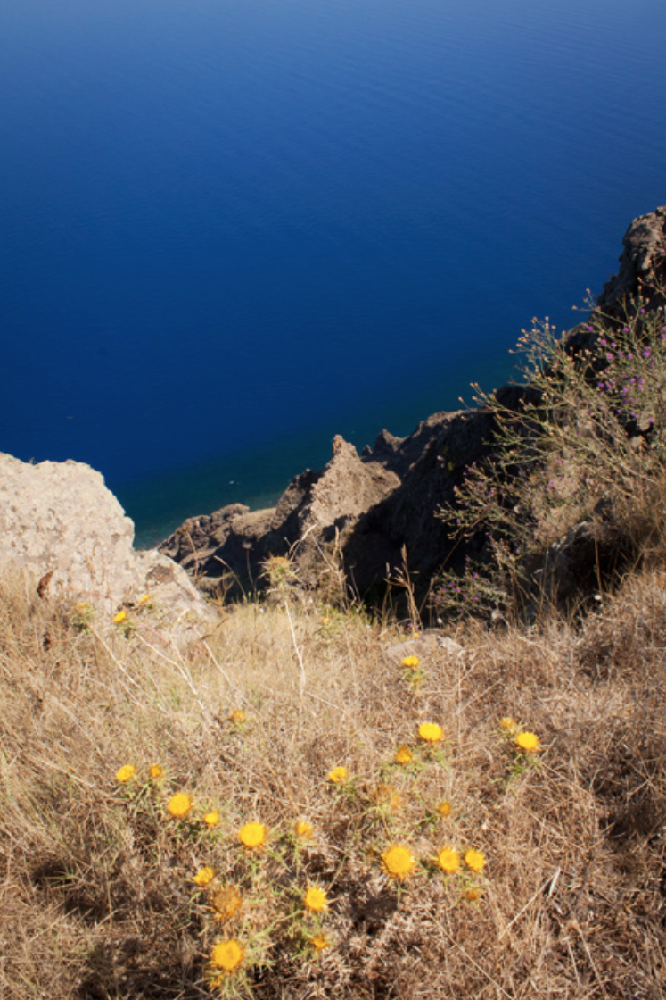

**Аликуди (Alicudi)** — самый западный и самый удалённый остров Эолийского архипелага. Это единственный остров, где нет автомобилей, асфальтированных дорог и даже велосипедов — только каменные ступени, мулы и тишина. Для яхтсменов Аликуди представляет собой уникальный опыт: полное отключение от цивилизации, кристально чистая вода и атмосфера, замершая во времени.

---

## Марины и якорные стоянки

### Porto di Alicudi - буи (восток)

**Porto di Alicudi** — единственная точка высадки на острове. Это небольшой бетонный причал у деревни **Alicudi Porto**, обслуживающий паромы, гидрофойлы и рыбацкие лодки. Полноценной марины нет — яхты швартуются на буях или становятся на якорь.

Причал длиной около 50 м, глубина у оконечности 3–5 м. Восточная сторона отведена для паромов, западная — для малых судов. Доступно 10–15 гостевых буёв, обслуживаемых местными рыбаками; стоимость — €40–60 в зависимости от сезона и длины яхты.

Стоянка хорошо защищена от западных и юго-западных ветров благодаря массиву острова, но полностью открыта при восточных и северо-восточных направлениях — в такую погоду стоянка опасна, рекомендуется уходить на **[Filicudi]({{ site.baseurl }}/filicudi/)**.

Инфраструктура минимальна: нет электричества на причале, нет воды, нет топлива. Ближайшая заправка — на **[Salina]({{ site.baseurl }}/salina/)** или **[Filicudi]({{ site.baseurl }}/filicudi/)**. На берегу есть один магазин с базовыми продуктами, пекарня и несколько тратторий.

`Координаты: 38° 32.40' N, 14° 21.00' E`

---

### Baia di Bazzina - якорь (юго-восток)

Небольшая бухта к югу от порта, пригодная для якорной стоянки в спокойную погоду. Грунт — песок и камни, глубина 8–15 м, якорь держит удовлетворительно. Бухта открыта при южных и восточных ветрах — только для дневной стоянки при стабильном прогнозе.

Это одно из лучших мест для купания и снорклинга на острове: прозрачность воды достигает 30–40 м.

`Координаты: 38° 32.10' N, 14° 21.20' E`

---

### Scoglio della Galera - якорь (северо-запад)

Якорная стоянка у скалы **Scoglio della Galera** на северо-западном побережье. Место доступно только при спокойном море и подходит для дневного купания. Глубина 10–20 м, грунт — скалы и крупный песок. Укрытия от ветра практически нет — стоянка строго при штиле или слабом восточном ветре.

`Координаты: 38° 32.80' N, 14° 20.20' E`

---

## Достопримечательности

### Alicudi Porto - деревня 

Вся жизнь острова сосредоточена на восточном склоне вулкана. Деревня состоит из белых домов, соединённых сетью каменных лестниц — около **1 500 ступеней**, поднимающихся от моря до верхних контрад (районов). Дороги на острове нет — все перемещения пешком или на мулах. Почту и продукты до сих пор доставляют ослами.

Прогулка по ступеням — главный аттракцион острова: открываются виды на **[Filicudi]({{ site.baseurl }}/filicudi/)**, **[Salina]({{ site.baseurl }}/salina/)** и Тирренское море. Рекомендуется удобная обувь и запас воды.

---

### Chiesa di San Bartolomeo - церковь

Главная церковь острова, расположенная на высоте около 300 м над уровнем моря. Построена в XVII веке, посвящена покровителю острова — **Святому Варфоломею**. От порта до церкви — примерно 30 минут подъёма по каменным ступеням.

С площадки перед церковью открывается панорамный вид на восточное побережье и соседние острова. Праздник Святого Варфоломея (24 августа) — главное событие года на острове.

---

### Timpone delle Femmine - гора (675 м)

Вершина потухшего вулкана и высшая точка острова. Подъём от порта занимает 2–3 часа по тропе через заброшенные террасы и дикие кустарники. На вершине — круговая панорама на весь Эолийский архипелаг, Сицилию и открытое Тирренское море.

Маршрут не размечен — рекомендуется местный проводник или GPS-трек. Лучшее время — раннее утро или предзакатные часы. Брать с собой не менее 2 литров воды.

---

### Filo dell'Arpa - скала

Впечатляющий скальный утёс на западном побережье острова, обрывающийся вертикально в море с высоты около 400 м. Это одна из самых высоких морских скал Эолийского архипелага. Название переводится как «струна арфы» — по форме утёса, напоминающего натянутую струну.

Осмотр возможен с моря на яхте (подход при штиле) или сверху — по тропе от верхних контрад. Скала особенно эффектна на закате, когда западное солнце подсвечивает вулканическую породу.

---

## Рестораны и магазины

Аликуди — самый аскетичный остров архипелага. Инфраструктура крайне ограничена, что является частью его очарования.

Рестораны:

- **Ristorante L'Airone** — единственный полноценный ресторан на острове. Кухня: свежая рыба, паста с каперсами и дикими травами, блюда из баклажанов. Средний чек: €25–35. Терраса с видом на море. Бронирование рекомендуется.

- **Bar Pasticceria** (у причала) — кафе с выпечкой, кофе и лёгкими закусками. Место встречи местных жителей и яхтсменов.

Магазины:

- **Alimentari** — один небольшой продуктовый магазин у порта с базовым набором: хлеб, сыр, консервы, вода, вино. Ассортимент зависит от поставок паромом — в шторм полки могут быть пустыми.

> **Важно для яхтсменов:** на Аликуди нет банкоматов и часто не работают терминалы оплаты картой. Берите наличные. Нет заправки, нет аптеки, нет медпункта.