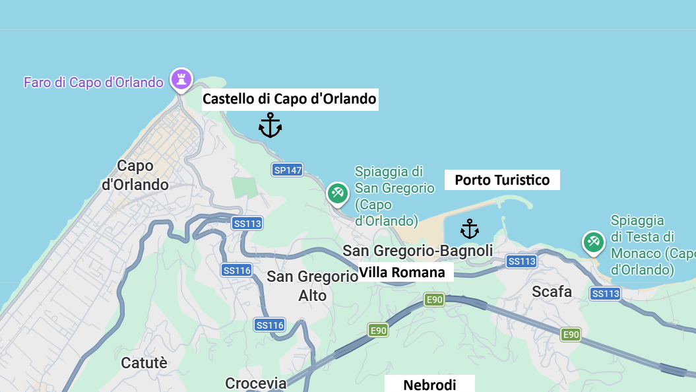
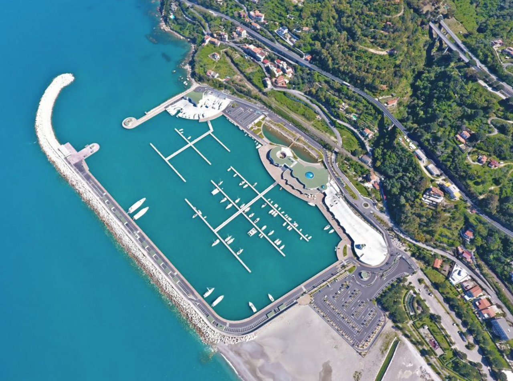
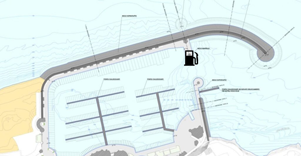
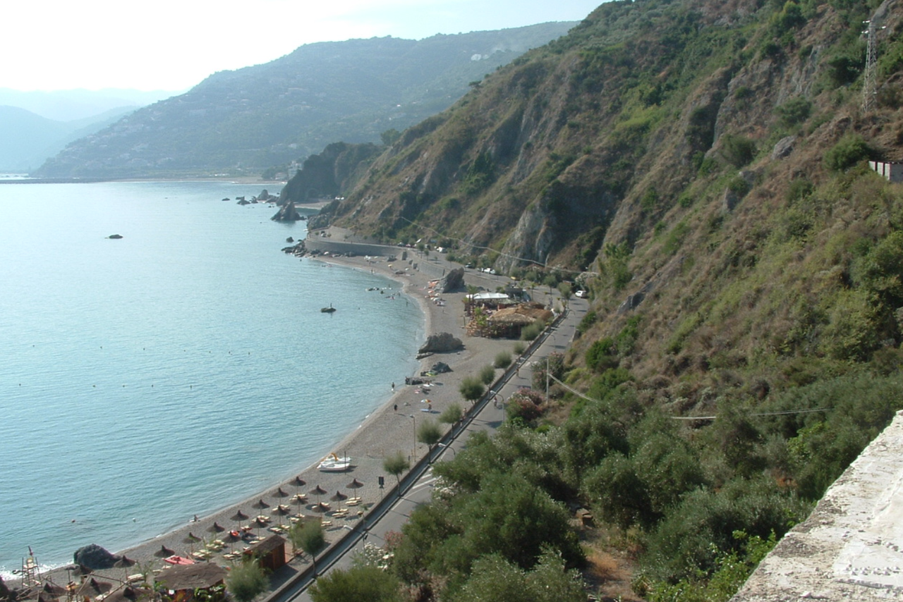
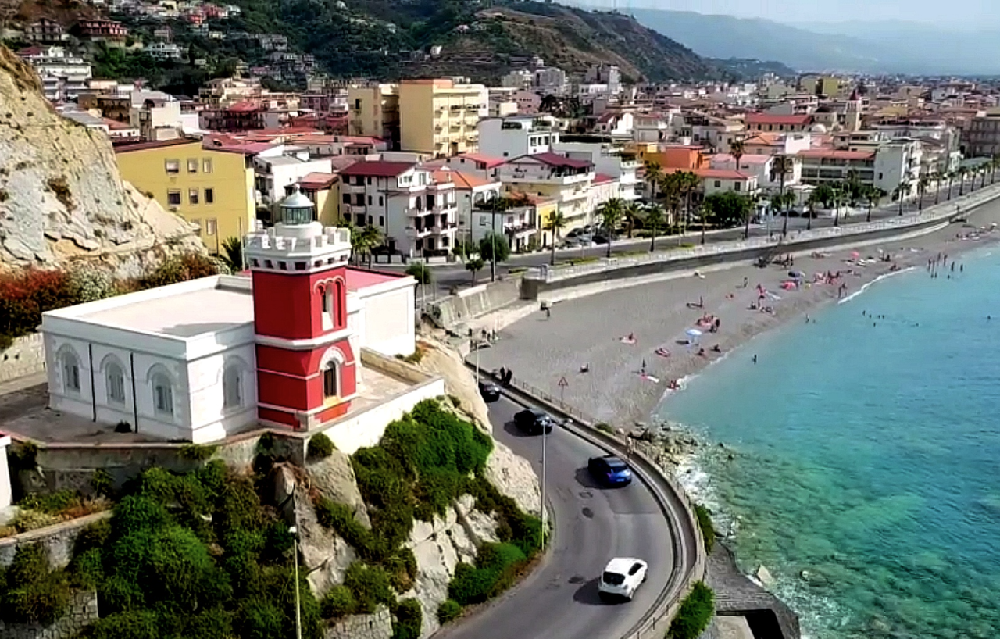
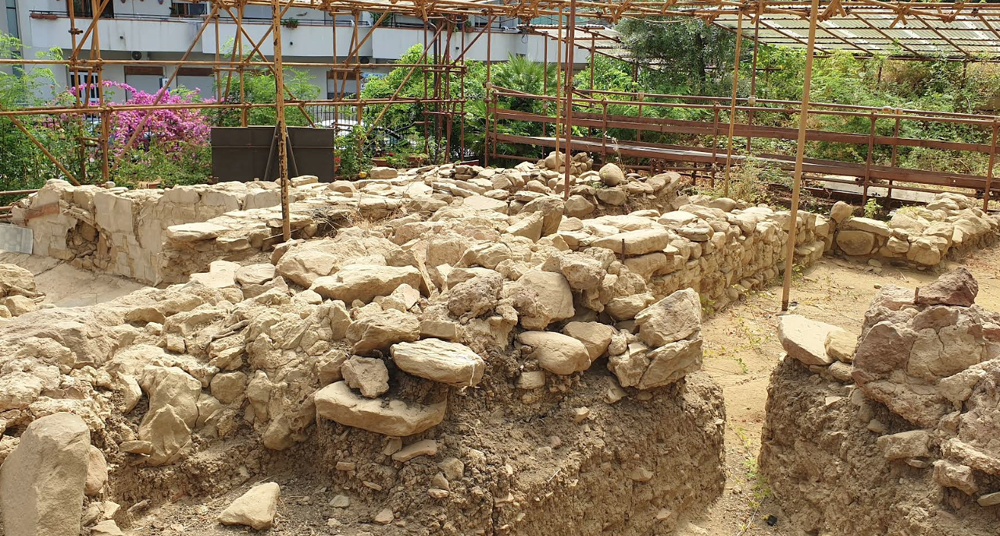
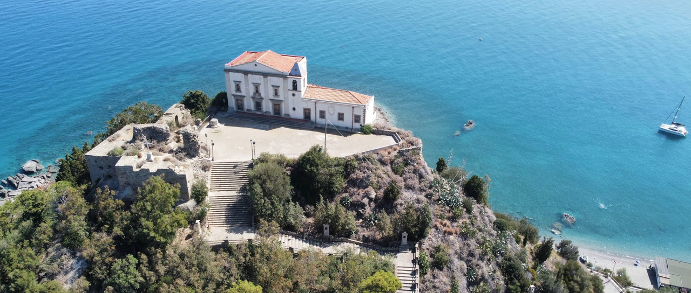
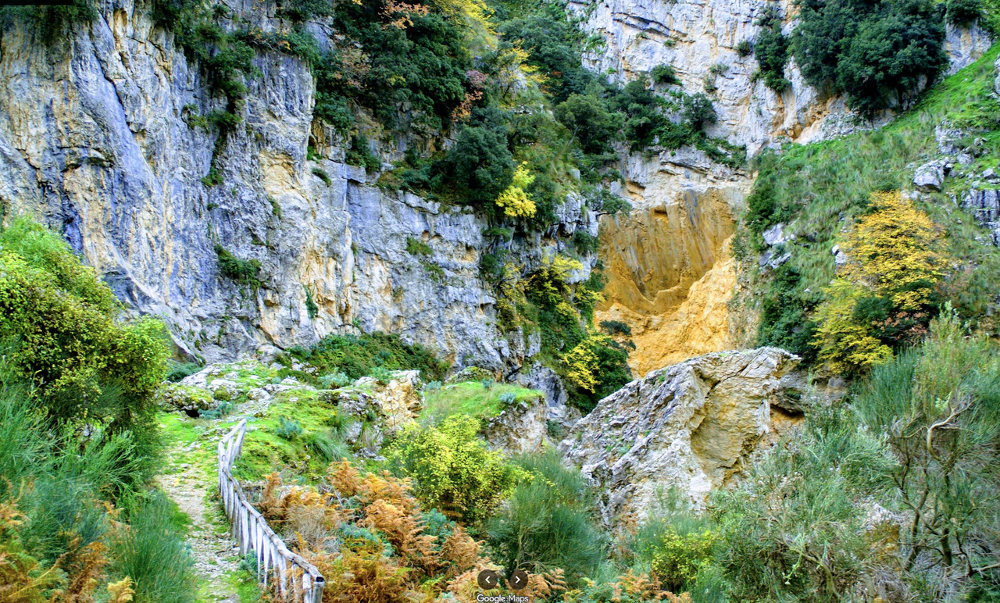

**Капо д'Орландо (Capo d'Orlando)** — приморский город на северном побережье Сицилии, примерно в 85 км к западу от Мессины. Это альтернативная стартовая точка для яхтинга на Эолийские острова — менее загруженная, чем **[Milazzo]({{ site.baseurl }}/milazzo/)** и **[Portorosa]({{ site.baseurl }}/portorosa/)**. Город расположен на живописном мысе между горами Неброди и Тирренским морем, сочетая удобную марину, длинные песчаные пляжи (около 14 км) и аутентичную сицилийскую атмосферу.

Переход от Capo d'Orlando до **[Vulcano]({{ site.baseurl }}/vulcano/)** составляет около 35 NM (3–4 часа при ветре 10–15 узлов), до **[Salina]({{ site.baseurl }}/salina/)** — около 30 NM. Летом из порта также ходят паромы и гидрофойлы на Эолийские острова.

---

## Инфраструктура

### Porto Turistico di Capo d'Orlando - марина

Туристический порт расположен в центральной части города, у подножия мыса **Capo d'Orlando**. Порт защищён двумя молами — северным и восточным — что обеспечивает хорошее укрытие от преобладающих ветров. Марина рассчитана на яхты длиной до 30 м и предлагает базовый набор услуг для транзитных стоянок.

Марина располагает примерно 200 швартовочными местами. Глубина у причалов — от 2 до 5 м. Швартовка «кормой к берегу» с использованием муринга. Порт хорошо защищён от западных и северо-западных ветров, но может быть некомфортен при сильном Grecale (СВ).

`Координаты: 38° 09.75' N, 14° 44.80' E`

Предоставляет следующие сервисы:

- вода и электричество
- туалеты и душевые
- топливная станция
- охрана и видеонаблюдение
- Wi-Fi
- слип и кран для подъёма

Стоимость стоянки в сезон: от 30 до 80 € за ночь в зависимости от длины яхты. Цены заметно ниже, чем в **[Portorosa]({{ site.baseurl }}/portorosa/)** и **[Milazzo]({{ site.baseurl }}/milazzo/)**, что делает Capo d'Orlando привлекательным для бюджетного старта.

---

### Spiaggia di San Gregorio - якорь (восток)

При стабильной погоде возможна якорная стоянка к востоку от мыса, у пляжей **Spiaggia di San Gregorio**. Грунт — песок, глубина 5–10 м, якорь держит хорошо. Стоянка открыта при северных и северо-восточных ветрах — только для дневного использования при устойчивом прогнозе.

`Координаты: 38° 09.50' N, 14° 45.50' E`

---

## Достопримечательности

### Faro di Capo d'Orlando - маяк

Историческая достопримечательность города — маяк на оконечности мыса, построенный в **1904 году**. Восьмигранная каменная башня высотой 10 м с балконом и фонарём, выкрашенная в терракотовый цвет с белой отделкой. Огонь расположен на высоте 27 м над уровнем моря, дальность — 16 NM. Маяк управляется **Marina Militare** и является навигационным ориентиром для судов, входящих в Тирренское море.

Маяк — отличная цель для пешей прогулки с панорамным видом на море и Эолийские острова. В ясную погоду видны **[Vulcano]({{ site.baseurl }}/vulcano/)**, **[Lipari]({{ site.baseurl }}/lipari/)** и **[Salina]({{ site.baseurl }}/salina/)**.

---

### Villa Romana di Bagnoli - руины

Руины римской виллы III века н.э., обнаруженные в 1986 году в районе **San Gregorio** к востоку от центра. Раскопаны шесть помещений термального комплекса с полихромными мозаичными полами, системой отопления **гипокауст** и элементами, стилистически близкими к североафриканской мозаичной традиции. Бо́льшая часть виллы остаётся под современной застройкой.

Время работы: по расписанию, вход свободный.

---

### Castello di Capo d'Orlando - замок

Руины средневековой сторожевой башни на вершине мыса. Башня была построена для защиты побережья от пиратских набегов и контроля морских путей. Сохранились фрагменты стен и фундамента. Место интересно скорее панорамными видами, чем архитектурой.

## Рестораны и магазины

**Capo d'Orlando** — полноценный сицилийский город с населением около 13 000 человек, поэтому инфраструктура здесь значительно лучше, чем на островах.

Рестораны:

- **Ristorante L'Aragosta** — кухня: рыба и морепродукты, сицилийская традиция. Средний чек: €30–40.
- **Trattoria del Porto** — кухня: домашняя сицилийская, рыба дня. Средний чек: €20–30. Удобно расположен у марины.
- **Pizzeria La Tettoia** — пицца и сицилийские блюда. Средний чек: €15–25.

Цены в целом ниже, чем в **[Milazzo]({{ site.baseurl }}/milazzo/)** и значительно ниже островных:
- Обед в кафе: 10–20 €
- Ужин в ресторане: 25–35 € на человека

Супермаркеты:

- **Conad Superstore** — крупный супермаркет с полным ассортиментом продуктов, напитков и товаров для дома. Хороший выбор вина и алкоголя. Примерно 10 минут пешком от марины.
- **Lidl Capo d'Orlando** — бюджетный супермаркет с базовым набором продуктов. Хорошие цены на воду, напитки и базовые продукты. Примерно 15 минут пешком.
- **Eurospin** — дискаунтер с низкими ценами. Удобен для больших закупок перед выходом. Такси — 5 мин.

---

## Транспорт

- **Железнодорожная станция** — прямые поезда до Мессины (1,5 часа), Палермо (2,5 часа) и Чефалу́ (1 час). Станция в 10 минутах пешком от марины.

---

### Nebrodi - парк

Уникальное преимущество Capo d'Orlando — близость к **Parco dei Nebrodi** (менее 20 км), крупнейшему природному парку Сицилии. Горные леса, озёра, водопады и традиционные деревни — отличный вариант для дневной экскурсии перед или после яхтинга.

