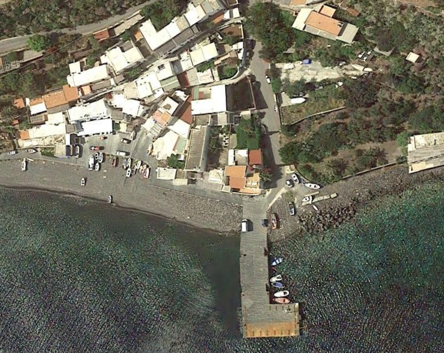
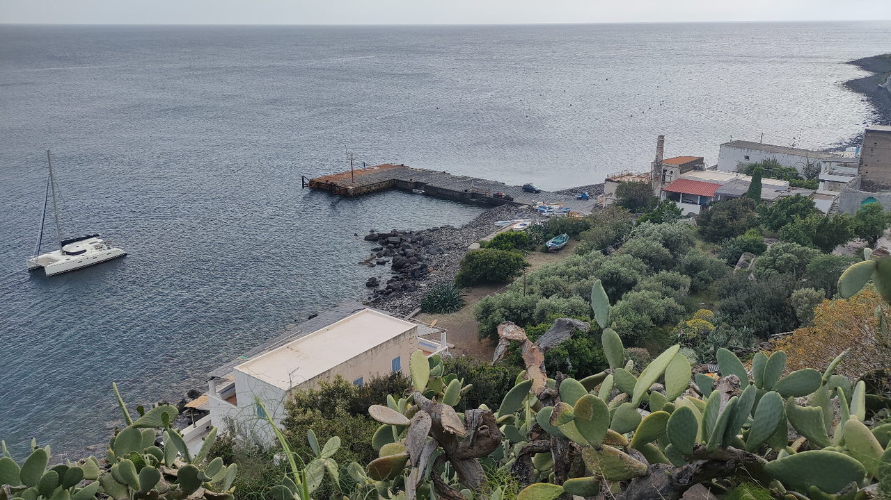
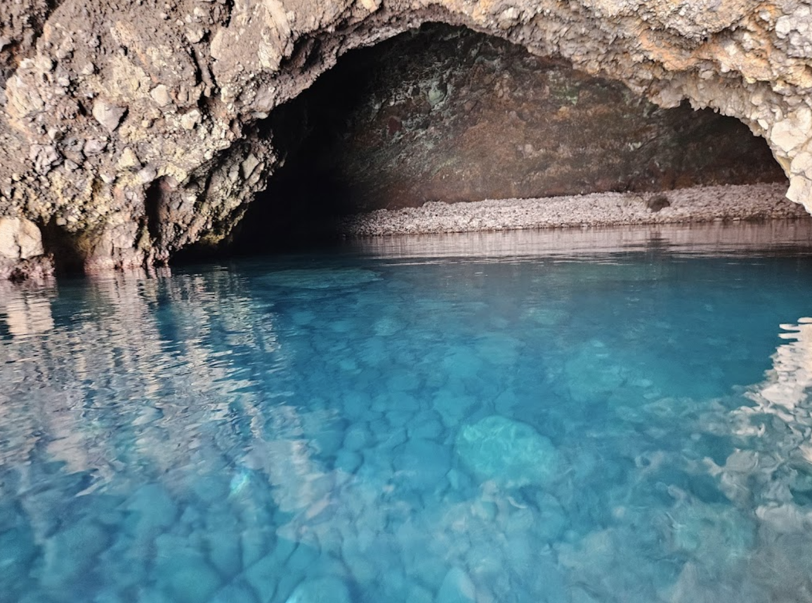

**Filicudi** — один из самых диких и живописных островов Эолийского архипелага, идеально подходящий для яхтинга благодаря кристально чистой воде, уникальным гротам (**Grotta del Bue Marino**) и скалам (**La Canna**).

---

## Марины и якорные стоянки

### Filicudi Porto - буи (восток)

**Pontile Filicudi** — это прибрежная зона у посёлка **Filicudi Porto**, служащая городским причалом для высадки на берег. Основная стоянка яхт возможна на буях или на якоре, так как полноценной стационарной марины здесь нет. В отдельные сезоны может устанавливаться небольшой временный понтон, в основном для трансфера пассажиров и лодок.

Главный причал — бетонный пирс длиной 55 м и шириной 12 м: восточная сторона отведена для яхт (глубина 6–9 м), западная — для паромов и гидрофойлов. Дополнительно доступны 30 гостевых буёв (**Campo Boe Filicudi**, VHF 72, тел. +39 340 957 9831) — рекомендованный вариант для ночёвки; буи обслуживает маринеро Массимо, который приходит на тузике.

При заходе необходимо внимательно следить за подводным волноломом между причалом и слипом, а также за отмелью у **Capo Graziano** (глубина всего 1,80 м). Стоянка хорошо защищена при ветрах ЮЗ–З, но плохо защищена при северных и восточных направлениях.

Рядом с понтиле находится базовая, но удобная инфраструктура: кафе, траттории и небольшой продуктовый магазин для повседневных нужд. Этого достаточно, чтобы купить свежий хлеб и поужинать на берегу. В целом **Pontile Filicudi** — это практичное и аутентичное место высадки.

`Координаты: 38° 33.70' N, 14° 34.95' E`

---

### Pecorini a Mare - буи (юг)

**Filicudi Pecorini a Marine** — это основной населённый пункт острова и основное место выхода на берег. Здесь есть городской причал для высадки, а для яхт используется стоянка на буях или на якоре, полноценной марины в классическом смысле нет. Место удобно именно как временная остановка с быстрым доступом к суше.

Стоянка предлагает 15 платных буёв двух типов — жёлтые и белые, принадлежащие разным владельцам. Грунт — песок и илистый песок, якорь держит хорошо; стоимость буя — €80–120 в зависимости от длины яхты. 
> Важно: самостоятельная якорная стоянка запрещена — только буи (VHF канал 09, тел. +39 388 791 3398).

Стоянка полностью открыта для всех направлений ветра, что делает её уязвимой при любом усилении. При волнении у берега почти всегда присутствует остаточная зыбь (глубины у причала всего 2–3 м).

Инфраструктура для небольшого острова хорошая: есть средний по размеру магазин, несколько кафе и ресторанов, пекарни и базовые сервисы. Этого достаточно для пополнения запасов на 1–2 дня и комфортного ужина без лишней суеты. В целом **Pecorini a Mare** — практичное и аутентичное место для стоянки, сочетающее простоту, атмосферу и всё необходимое для яхтсменов.

`Координаты: 38° 33.48' N, 14° 33.90' E`

## Достопримечательности

### Grotta del Bue Marino - грот

Крупная морская пещера на западном побережье острова Filicudi, доступная только с моря. Она известна внушительными размерами и игрой света. Широкий вход позволяет заходить на лодке, а внутри открываются тёмно‑синие и изумрудные оттенки воды на фоне вулканических стен. Название связано с гулким эхом волн, которое напоминает мычание «морского быка».

Пещера особенно популярна для купания, снорклинга, SUP и фридайвинга при спокойном море. Лучшее время посещения — утро или вечер, когда свет подчёркивает рельеф и глубину цветов. При волнении подходить внутрь не рекомендуется из‑за отражённой волны и резкой смены освещения.

`Координаты: 38° 34.28' N, 14° 32.45' E`

