**Липари (Lipari)** — крупнейший остров Эолийского архипелага, который является его туристическим и логистическим центром. Это самый оживлённый остров группы: здесь больше всего отелей, ресторанов, магазинов и экскурсий. Для яхтсменов Липари служит удобной базой для переходов на Vulcano, Salina, Panarea и Stromboli. Город Липари компактный, оживлённый и подходит как для короткой остановки, так и для полноценного отдыха.

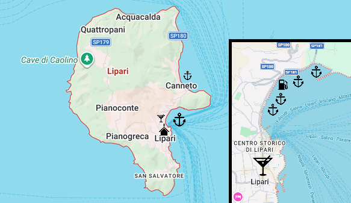

---

## Инфраструктура

С точки зрения яхтинга **Lipari** предлагает лучшие марины архипелага. Основные — **Marina Porto Pignataro** и несколько небольших марин в **Marina Lunga**. Они обеспечивают воду и электричество, но не все имеют душевые и туалеты. Стоимость стоянки в сезон обычно колеблется от 60 до 180 € за ночь в зависимости от размера яхты и времени года. Гавани хорошо защищены, что делает Липари надёжным местом для ночёвки.

Есть две заправочные станции:  
`Координаты: 38° 28.57' N, 14° 57.43' E`

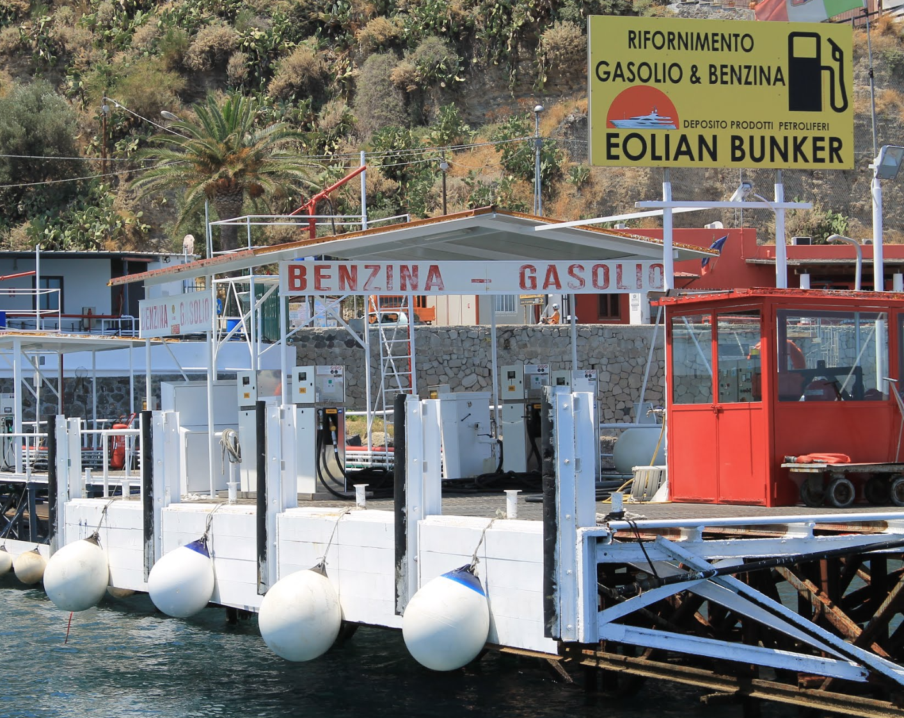

---

### Pontile La Buona Fonda

Сезонные понтоны. Марина располагает 50 швартовочными местами и принимает суда длиной до 60 м. Каждый причал оснащён электричеством и подачей воды. Предоставляется помощь при швартовке (служебная лодка и квалифицированный персонал). На пирсе действует круглосуточная охрана. Цены разумные.

Марина находится в бухте **Marina Lunga** в Липари — в шаговой доступности от исторического центра, примерно в 100 м от порта паромов и судов на подводных крыльях, рядом с остановками общественного транспорта. _Туалетов и душевых нет_. Связь по VHF канал 13, телефон +39 339 817 6588. 

`Координаты: 38°28.328′ N, 14°57.324′ E`

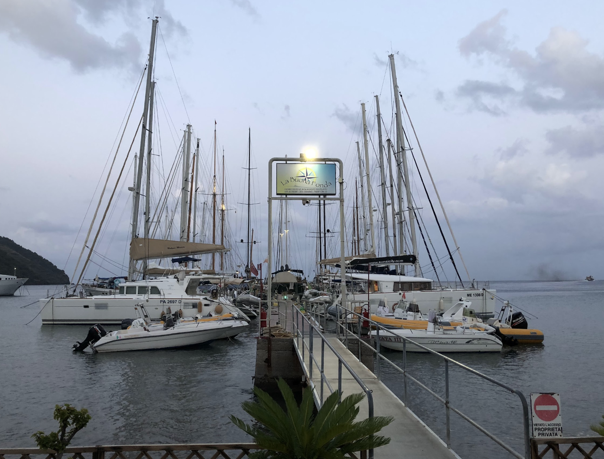

---

### Yacht Harbour Lipari

Один из самых полных наборов услуг. Марина располагает 50 швартовочными местами на Г-образном пирсе. Есть электричество, вода, душевые, туалеты, топливо. Ключевая особенность — оперативная и качественная помощь при швартовке, которая считается «визитной карточкой» причала. Команда сочетает профессиональный подход с доброжелательностью, создавая комфортные и безопасные условия стоянки. Сезонные понтоны. Связь по VHF канал 72, телефон +39 090 981 3152.

`Координаты: 38°28.38' N, 14°57.30' E`

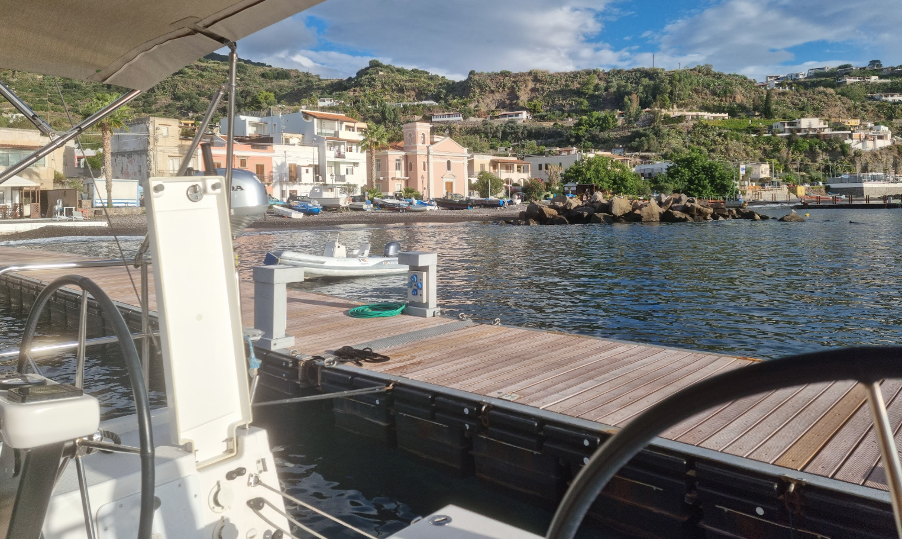

---

### Portosalvo

Это удобная и сервис-ориентированная марина в бухте **Marina Lunga**, рассчитанная на яхтсменов, которые хотят не просто швартовку, а комфортную базу для отдыха на Эолийских островах. Ближайший к городу понтон из всех. Понтон оснащён 50 местами (макс. длина 60 м, осадка 12 м), с электричеством (220/380V), водой, душевыми, туалетами, топливом, Wi-Fi, круглосуточной охраной и видеонаблюдением; связь по **VHF канал 6**, тел. +39 330 398 075. По запросу доступны: прачечная, такси, прокат скутеров и велосипедов, дайвер, экскурсии и медицинская помощь. 

Марина расположена очень удобно: около 400 м от центра Липари, в пешей доступности бары, магазины и супермаркеты. Команда марины помогает при швартовке и отходе, при необходимости используя служебные лодки. Благодаря сотрудничеству с профильными компаниями, **Portosalvo** может организовать качественную механическую и электрическую помощь, что особенно важно для чартеров. Сезонные понтоны.

На территории и вблизи марины есть: прачечная, помощь дайвера, такси‑сервис, аренда скутеров, велосипедов и автомобилей, экскурсии в музей и медицинская помощь.

Сильная качка от паромов и гидрофойлов.

`Координаты: 38°28.47' N, 14°57.32' E`

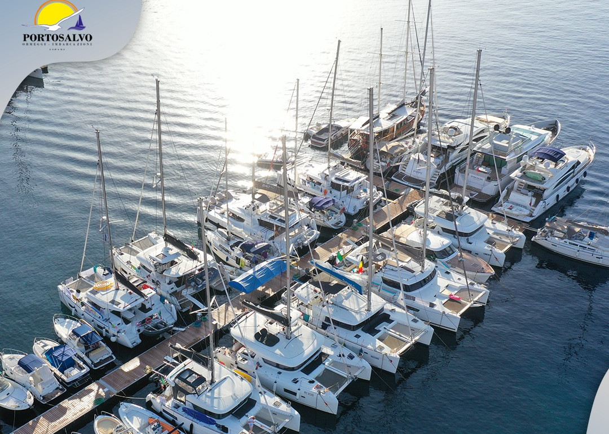

---

### Marina Porto Pignataro

Это основной порт и марина острова **Lipari**, расположенная на восточном побережье, в непосредственной близости от города. Порт хорошо защищён молами и служит главным узлом для паромов, гидрофойлов и прогулочных судов, связывающих Липари с другими Эолийскими островами и материком.

Марина находится напротив коммерческого порта, в естественной защищённой бухте с искусственным молом. Понтон располагает 70 местами (макс. длина 45 м, осадка 15 м), каждое оснащено электричеством (220/380V), водой, Wi-Fi, видеонаблюдением и круглосуточной охраной; топливо, душевые, туалеты, слип, кран и прачечная — полный набор сервисов. Связь по **VHF канал 74**, тел. +39 090 988 0354; `бесплатный шаттл` до центра Липари с 08:00 до 22:00. Порт находится в 1 км от города (15–20 минут пешком). Стоянка дорогая.

`Координаты: 38° 28.67' N, 14° 57.78' E`

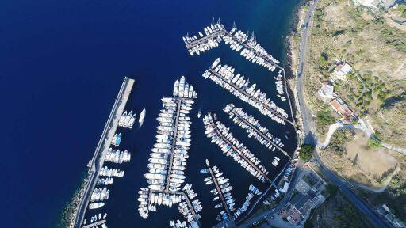

---

### Marina Corta

Красивая, атмосферная гавань и центр жизни Липари. Старая городская марина, которая до сих пор часто используется коммерческими судами. Идеально подходит как место высадки с близким доступом к **Castello di Lipari**. Тем не менее здесь много моторных лодок. Рыбаки выходят в 4 утра.

`Координаты: 38° 27.90' N, 14° 57.52' E`

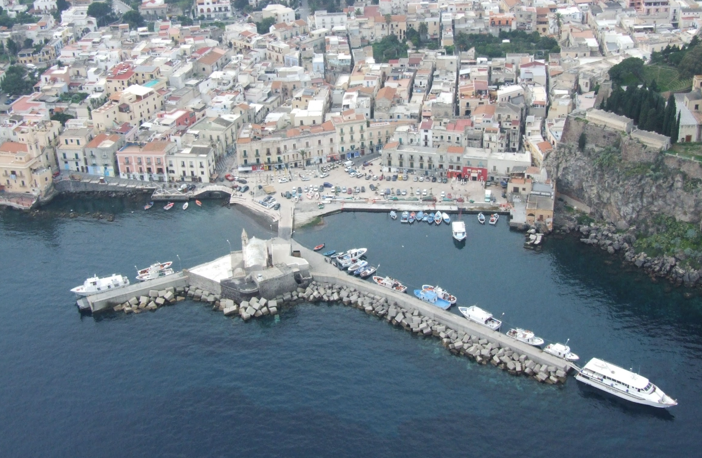
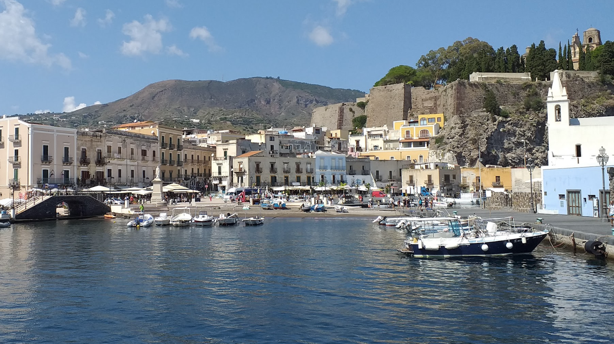

---

## Якорные стоянки

Всё побережье подходит для якорных стоянок. Наибольшей популярностью пользуется восточная часть **Lipari** у пляжа **Canneto**. Хорошо защищена при западных и северо‑западных ветрах. Белый вулканический пляж — красиво, но многолюдно.

`Координаты: 38° 29.63' N, 14° 57.87' E`

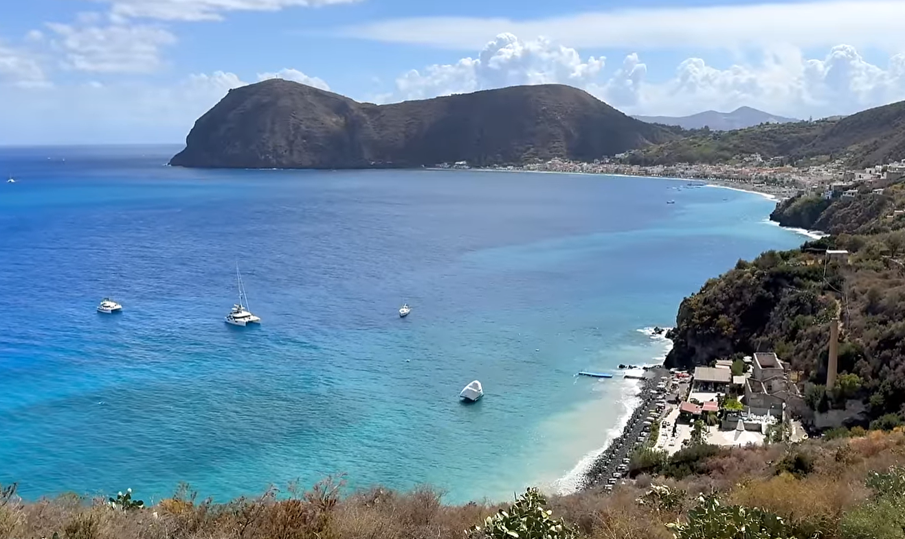

Также юго-восточная и южная часть у островов **Faraglioni di Lipari**.

`Координаты: 38° 26.37' N, 14° 56.57' E`

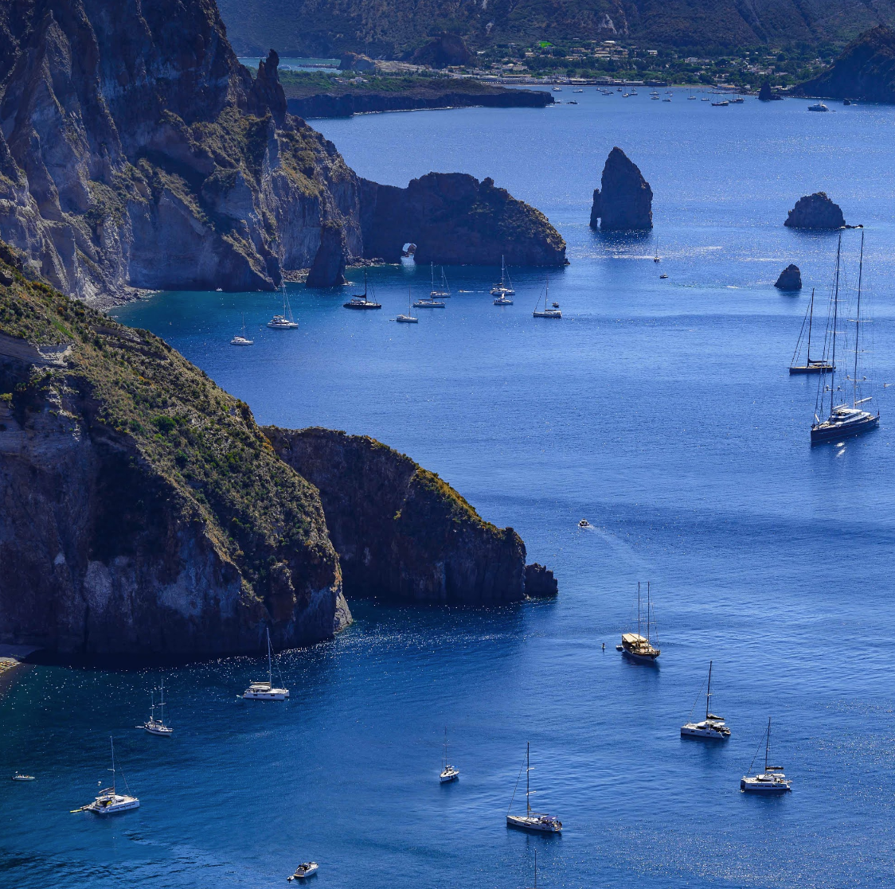

> Якорная стоянка вблизи городских марин **Marina Lunga / Porto Pignataro / Molo Aliscafi** официально не рекомендуется, часто запрещена — интенсивное судоходство, паромы, катера.

---

## Достопримечательности

### Castello di Lipari

Главная достопримечательность острова — **Castello di Lipari** с Археологическим музеем Эолийских островов (**Museo Luigi Bernabò Brea**). Комплекс расположен на скале над портом и включает кафедральный собор, археологические павильоны и смотровые площадки. Это ключевое место для понимания истории Эолийских островов и отличная точка обзора. 

Часы работы: май–октябрь 09:00–19:00, ноябрь–апрель 09:00–16:00. Вход бесплатный.

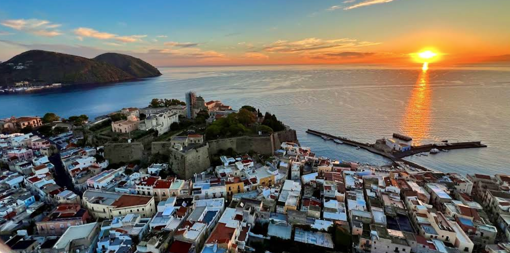

На территории находится **Археологический музей** Эолийских островов. Экспозиция охватывает историю Липари с неолита до римского периода. Музей помогает понять, что Lipari всегда был стратегически важным пунктом морских путей.

---

### Duomo di San Bartolomeo

Собор **Сан‑Бартоломео**, расположенный внутри **Castello di Lipari**, является главным религиозным храмом острова и важнейшим духовным центром. Он был возведён преимущественно в норманнский период и сочетает строгую архитектуру с элементами барокко, сохранив атмосферу тишины и уединения. Покровителем острова является **Святой Варфоломей** (San Bartolomeo) — апостол Христа, часть мощей которого, по традиции, хранится в соборе. Святой Варфоломей считается защитником жителей и моряков, а его праздник в августе — одно из главных событий года на Липари.

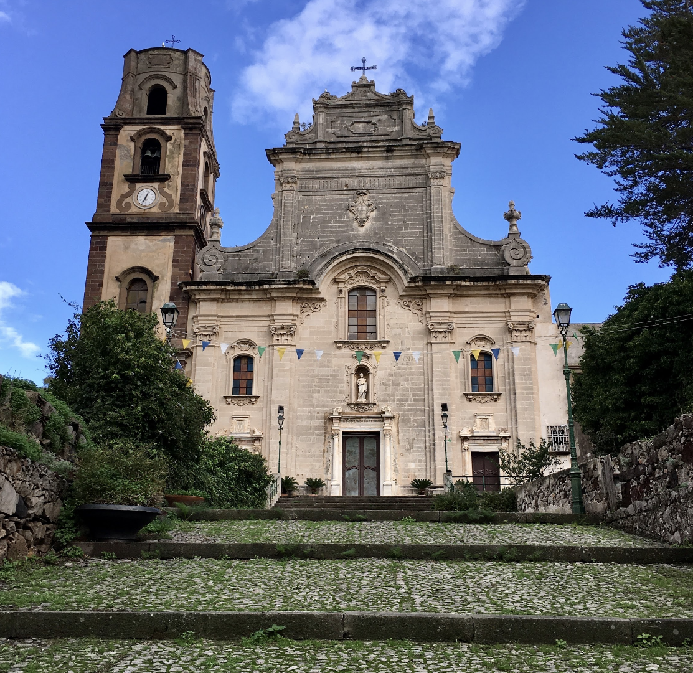

---

### Рестораны и магазины

Липари — лучший остров Эолийского архипелага для покупок и ресторанов. В районе **Marina Corta** и исторического центра расположены продуктовые магазины, винные лавки, пекарни и сувенирные лавки с обсидианом, каперсами и **Malvasia delle Lipari**. 

Цены умеренные по островным меркам:
- Обед в кафе: 15–25 €
- Ужин в хорошем ресторане: 25–40 € на человека

Кухня ориентирована на свежую рыбу, пасту, каперсы и локальные вина.

К примеру, **Ristorante da Filippino a Lipari**, расположенный на холме за крепостью у управы. Средний чек от €40–50.

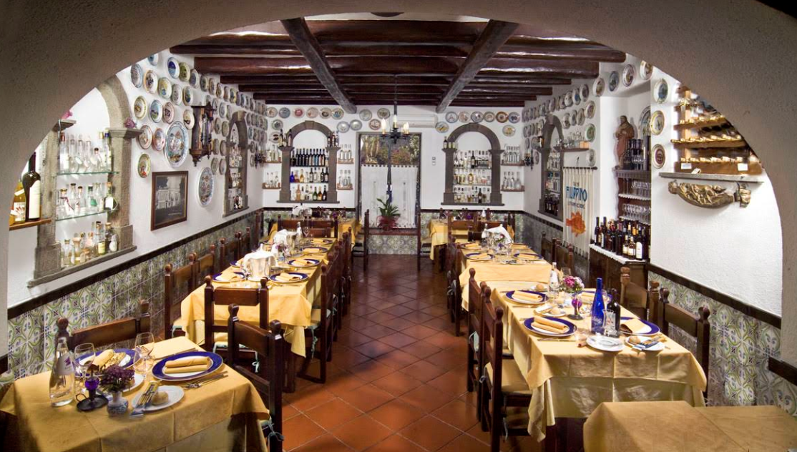

Также есть хорошие рестораны на набережной:

- **Osteria San Bartolo** — кухня: сицилийская, рыба, локальные продукты. Средний чек: €30–35.
- **Trattoria del Vicolo** — кухня: традиционная эолийская. Средний чек: €30–40.
- **Chimera** — кухня: сицилийская, рыба и мясо. Средний чек: €30–40.

> По утрам рыбаки часто посещают марины и лодки, стоящие на якорях, и предлагают свежий улов.
