# Porto di Milazzo
Главный порт материковой Сицилии и ключевой хаб для чартерного яхтинга на Эолийские острова (Lipari, Vulcano, Panarea, Stromboli, Salina). Отсюда начинаются и завершаются большинство чартеров в регионе благодаря удобной логистике, коротким морским переходам и развитой инфраструктуре.

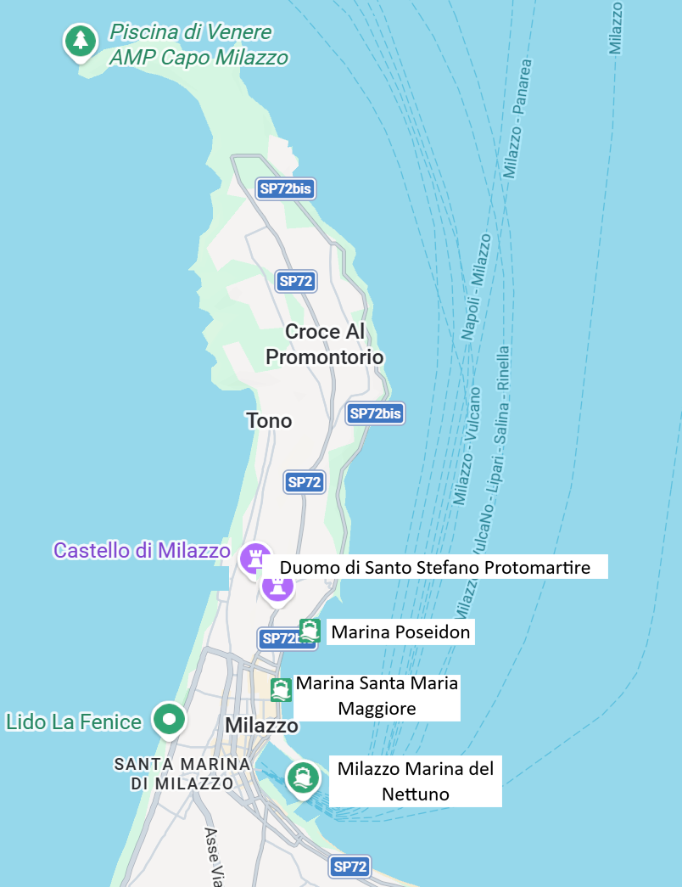

---
### Milazzo Marina del Nettuno
Марина используется для коммерческих судов. Чартерная часть находится в глубине. Хорошо защищена от волн. 

`Координаты: 38° 13.15' N, 15° 14.55' E`

[https://www.marinadelnettuno.it/servizi/](https://www.marinadelnettuno.it/servizi/)

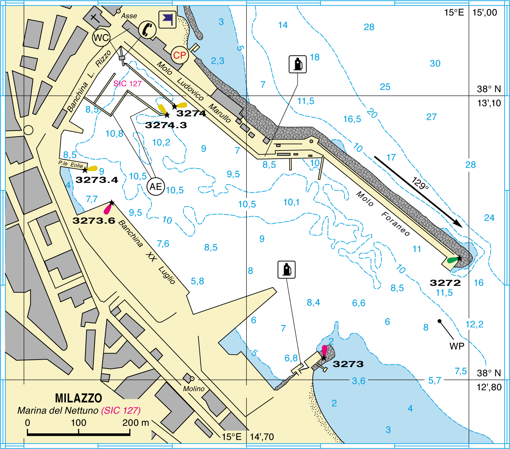
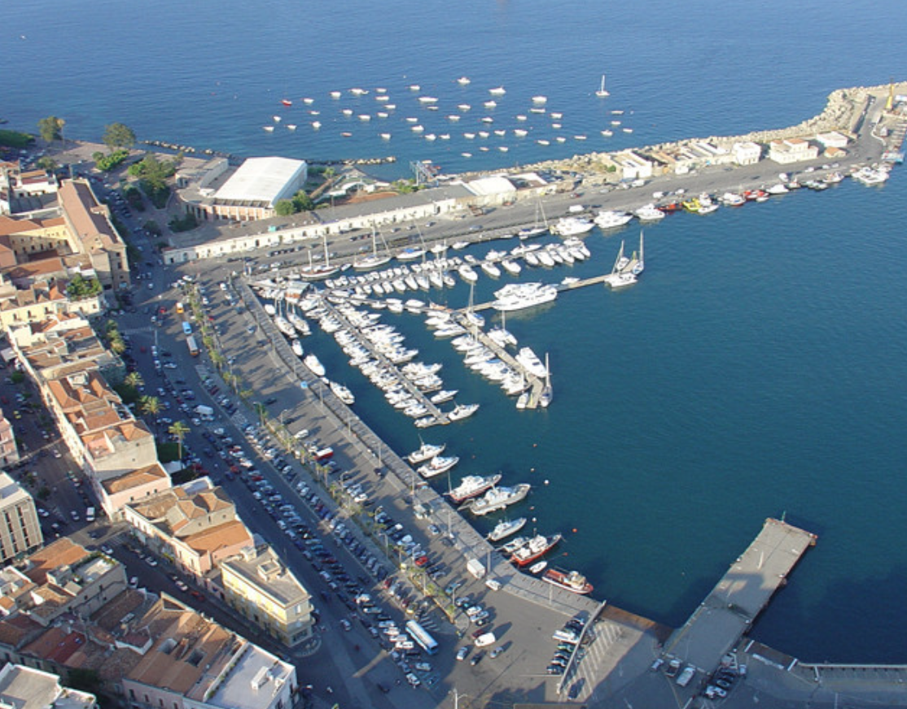

Предоставляет следующие сервисы:

- вода и электричество
- туалеты
- топливо
- ремонт и яхт-сервис
- охрана

Для закупок есть супермаркет **Supermercato Sigma** — полный выбор продуктов и **Supermercato Decò** с хорошим выбором алкоголя. 

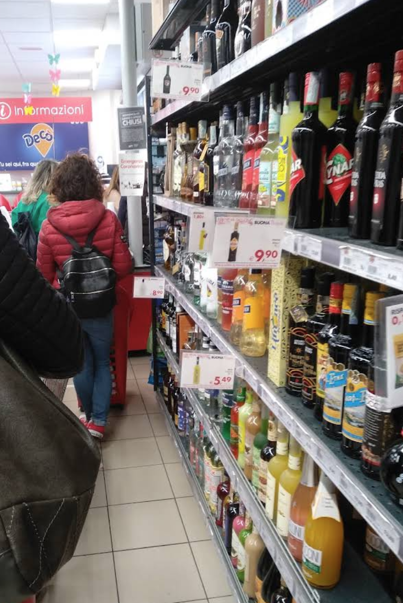

---
### Marina Poseidon
Уютная марина, первая на полуострове Миллаццо, основанная в 1998 году. Защищена бетонным волноломом, располагает около 150 мест для яхт до 35 м, `имеет топливную станцию` и предлагает круглосуточную помощь персонала.
Расположена в рыбацком районе **Vaccarella**, примерно в 10 минутах пешком от центра Миллаццо и **Арагонского замка**, ориентирована на комфортную и спокойную стоянку. 

`Координаты: 38° 13.77' N, 15° 14.88' E`

[https://poseidonmarina.it/servizi/](https://poseidonmarina.it/servizi/)

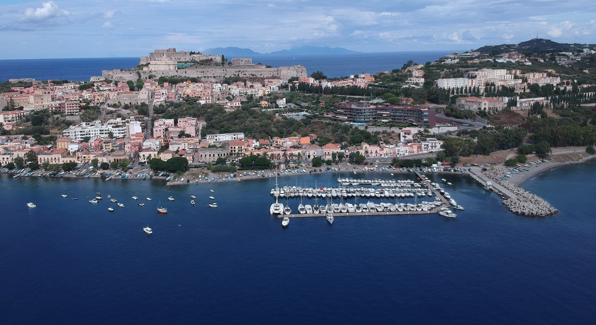

Предоставляет следующие сервисы:
- `Топливная станция` прямо в марине
- туалеты и душевые, круглосуточный доступ
- вода и электричество на понтонах
- помощь 24/7 при заходе/выходе и во время стоянки
- охрана, контроль доступа, освещение
- утилизация отходов

---
### Marina Santa Maria Maggiore

Небольшая туристическая марина, расположенная рядом с историческим центром Миллаццо и набережной. Предназначена для кратких остановок и транзитной стоянки яхт до 50 м, предлагает базовые услуги, но без расширенной инфраструктуры и топливной станции. Удобна за счёт шаговой доступности к магазинам, ресторанам и городским сервисам, однако уступает **Marina Poseidon** и **Marina del Nettuno** по уровню оснащения. Использует понтоны. Не защищена от волн.

`Координаты: 38° 13.58' N, 15° 14.67' E`

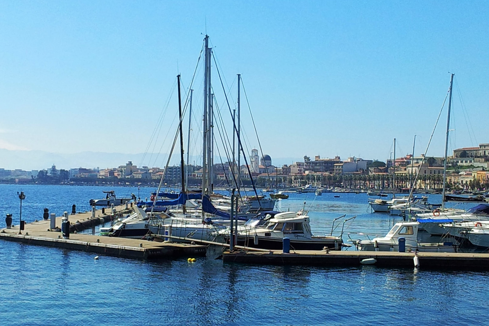

Предоставляет следующие сервисы:
- туалеты и душевые
- вода и электричество

## Достопримечательности

### Castello di Milazzo (Арагонский замок)
Главная достопримечательность города и один из крупнейших замковых комплексов в Сицилии. Расположен на холме с панорамными видами на город, порт и Эолийские острова. Внутри — бастионы, стены, археологические зоны и смотровые площадки. Время работы: 09:00–18:30 или до 20:00 в сезон. Билет стоит от 5 до 8 евро.

---
### Duomo di Santo Stefano Protomartire
Главный собор города с барочной архитектурой, находится в нижнем городе недалеко от набережной. Интересен как исторически, так и архитектурно, особенно в сочетании с прогулкой по центру.

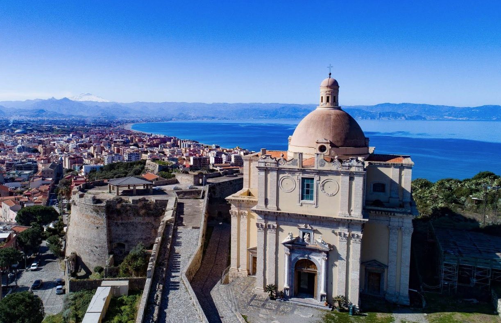
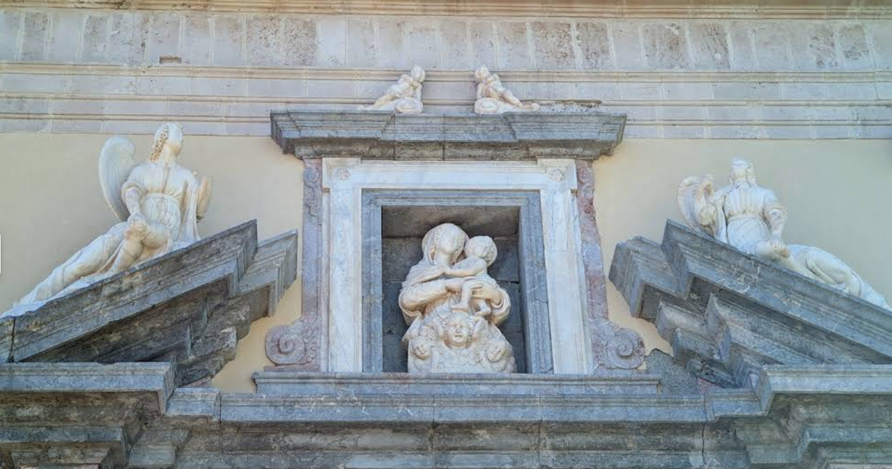

---
### Lungomare Garibaldi
Протяжённая набережная — идеальна для вечерних прогулок. Много кафе, ресторанов и видов на море и замок. Соединяет марину **Santa Maria Maggiore** с городом.

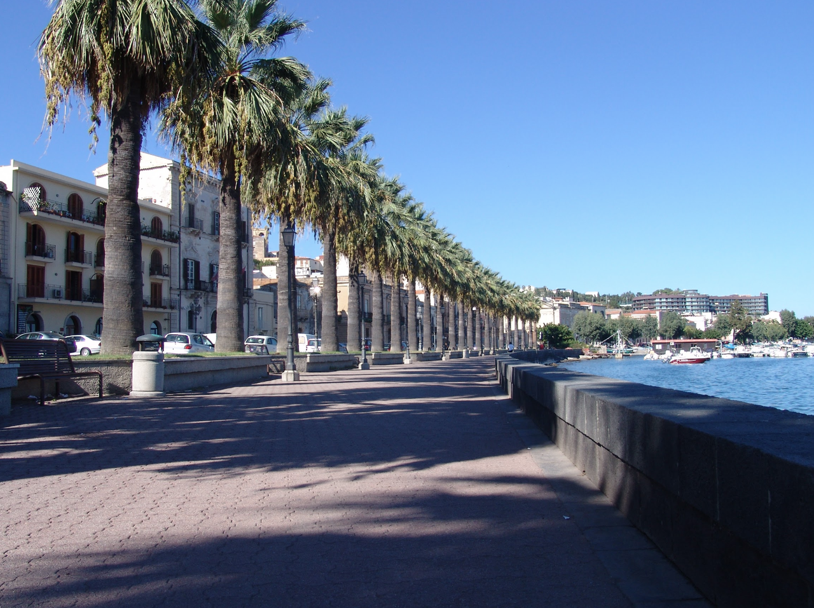

---
### Borgo Vaccarella
Аутентичный рыбацкий район у моря, рядом с **Marina Poseidon** и **Santa Maria Maggiore**. Атмосферное место для прогулки, фотографий и ужина из свежей рыбы. Отлично передаёт «настоящий» характер Миллаццо.

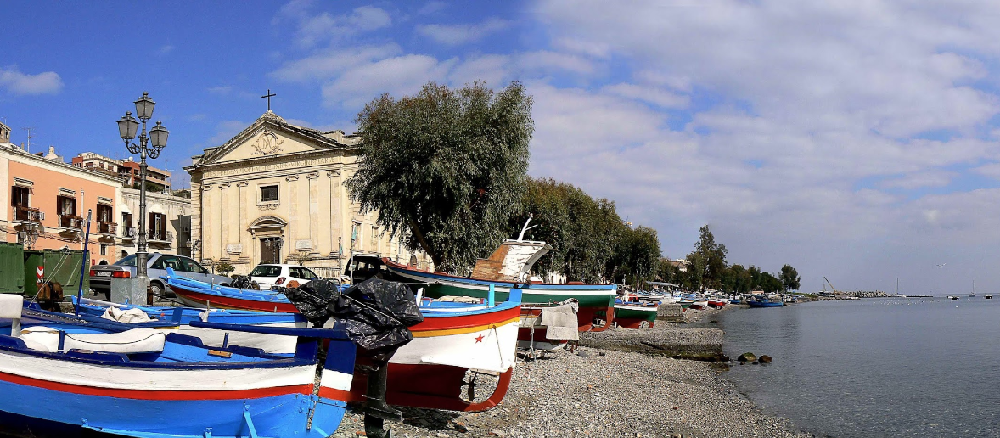

---
### Capo Milazzo
Природный мыс с пешеходными тропами, смотровыми точками и дикой природой. Здесь находится **Piscina di Venere** (природная морская купальня) — одна из самых фотогеничных природных локаций района. Входной билет — 3 евро.

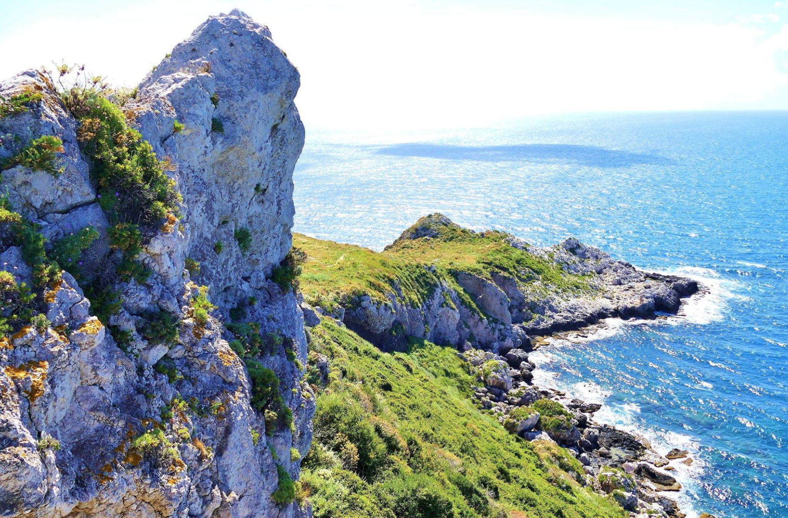
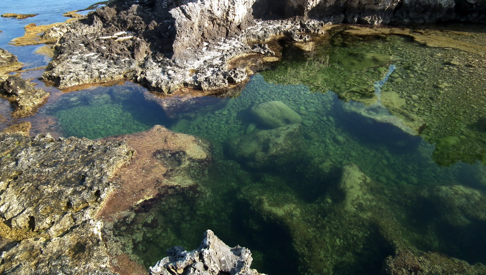