# Isola di Panarea

Остров **Panarea** известна своей атмосферой: коктейли на закате, стильная публика, живая музыка и клубная сцена в высокий сезон. Это самый «богемный» остров Эол.

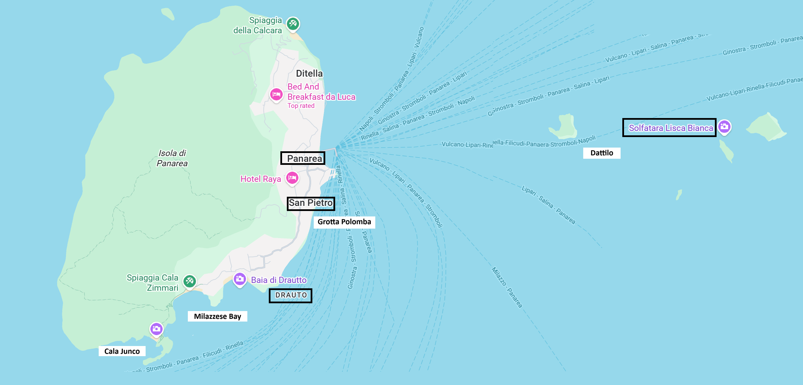

Остров с высокими скалистыми берегами, которые создают живописные виды и защищённые бухты для швартовки. Швартовка на якоре или буях в основном с западной стороны острова. Есть много хороших точек для дайвинга в группе мелких островов с западной части Panarea: особенно популярны точки у островков **Lisca Bianca**.

## San Pietro (восточная часть)
Главный посёлок острова и центр жизни. Белые дома, узкие улочки, бутики, бары и рестораны, лучшее место для вечернего аперитива и прогулок.

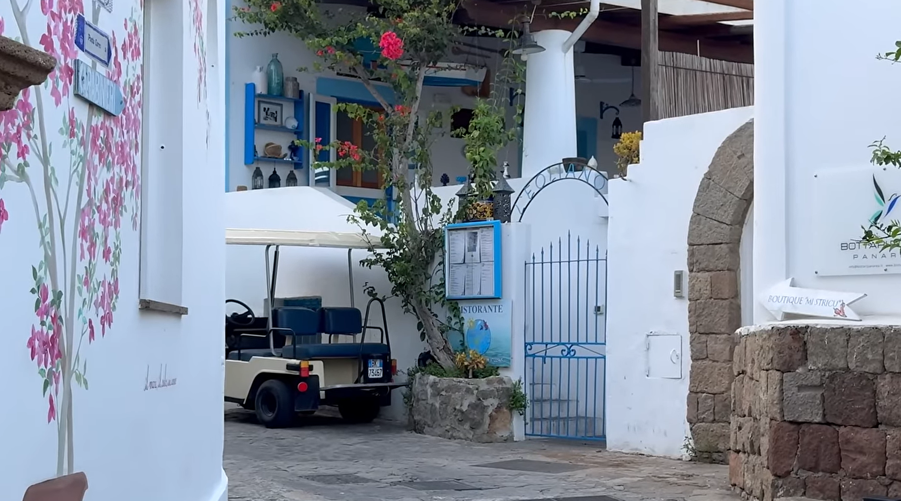

Для стоянки есть буи южнее пирса.

`Координаты: 38° 38.07' N, 15° 4.67' E`

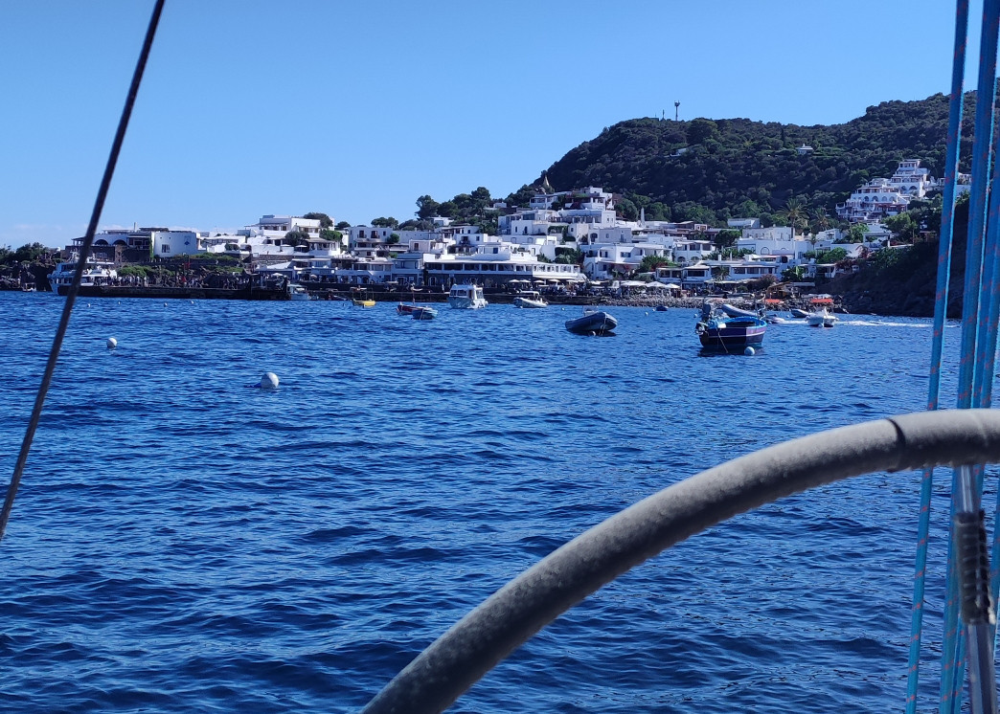

Высокий городской причал часто занят паромами, поэтому яхтсменам рекомендуется использовать буи или якорные стоянки. Городской пирс для высадки с тузика. 

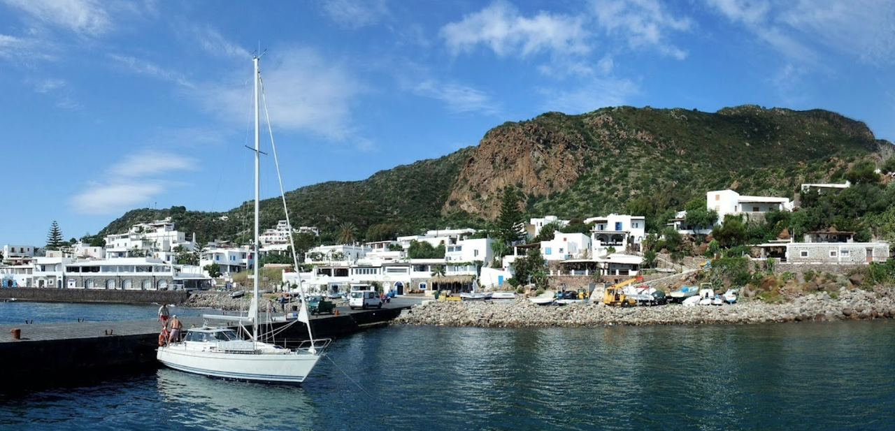

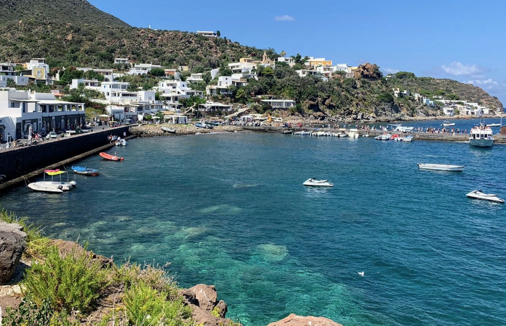

Так же есть буи севернее пирса.

`Координаты: 38° 38.32' N, 15° 4.67' E`

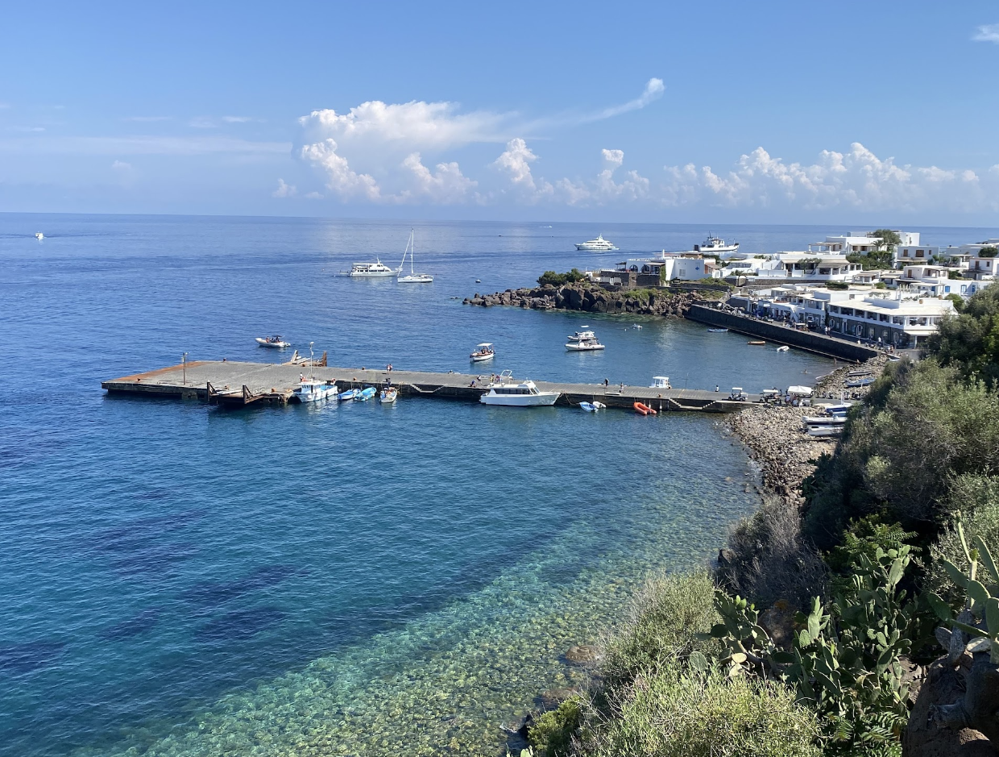

Есть несколько продуктовых магазинов. Цены высокие. В **Supermercato Panarea Tesoriero** - прямо у пирса `есть алкоголь`.

## Grotta Polomba (восточная часть ниже San Pietro)
это уединённая бухта с кристально чистой водой. Удобное место для швартовки на якоре. Высадка на берег с тузика проблематична. На против находится одна из достопримечательностей острова церковь **Chiesa di San Pietro**

`Координаты: 38° 38.03' N, 15° 4.65' E`

## Drauto (юго-восточная часть)

Есть буи для швартовки. Инфраструктуры нет, но есть небольшой пляж, где возможна высадка на берег.

`Координаты: 38° 37.73' N, 15° 4.17' E`

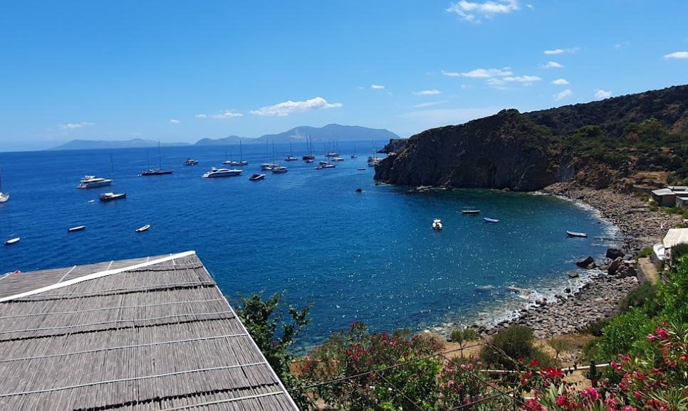
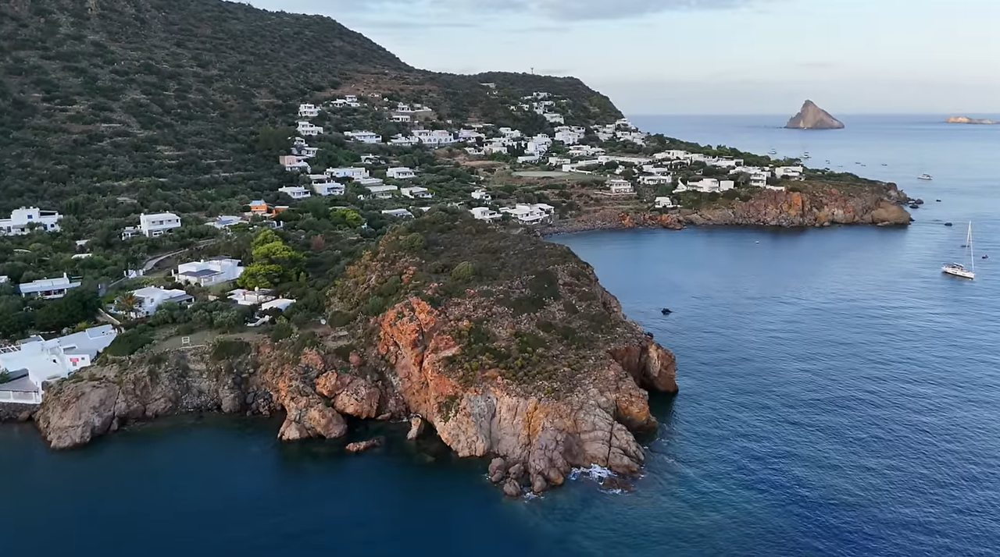

## Milazzese Bay (юго-восточная часть)

Якорная швартовка. Пляж. Возможна высадка на берег. Доисторическое поселение.

`Координаты: 38° 37.67' N, 15° 3.98' E`

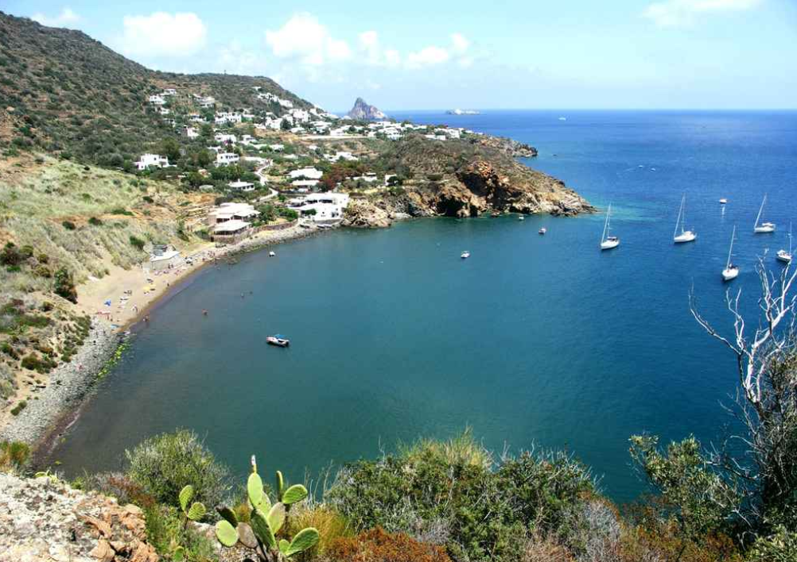
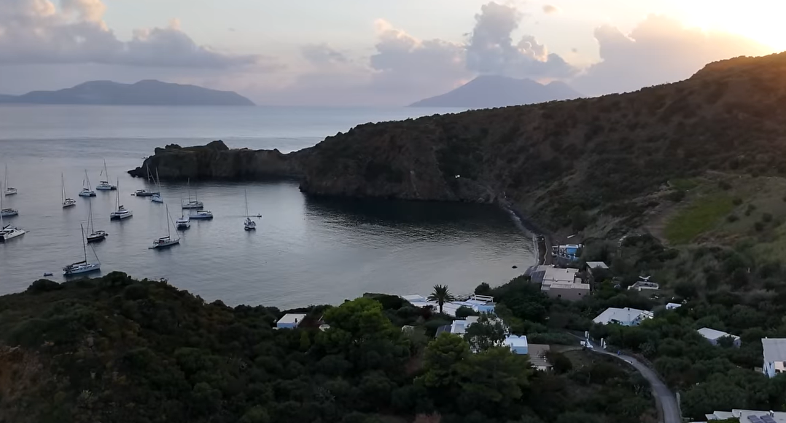

## Достопримечательности

### Chiesa di Maria SS. Assunta
это главный церковный храм острова Panarea, расположенный в центральной части поселка San Pietro, недалеко от порта и главной площади.
Церковь посвящена Успению Пресвятой Девы Марии и является духовным центром острова. Архитектура простая и типично эолийская: белые стены, лаконичный фасад, спокойный интерьер без излишеств, что хорошо отражает характер Panarea — сдержанный и аутентичный.

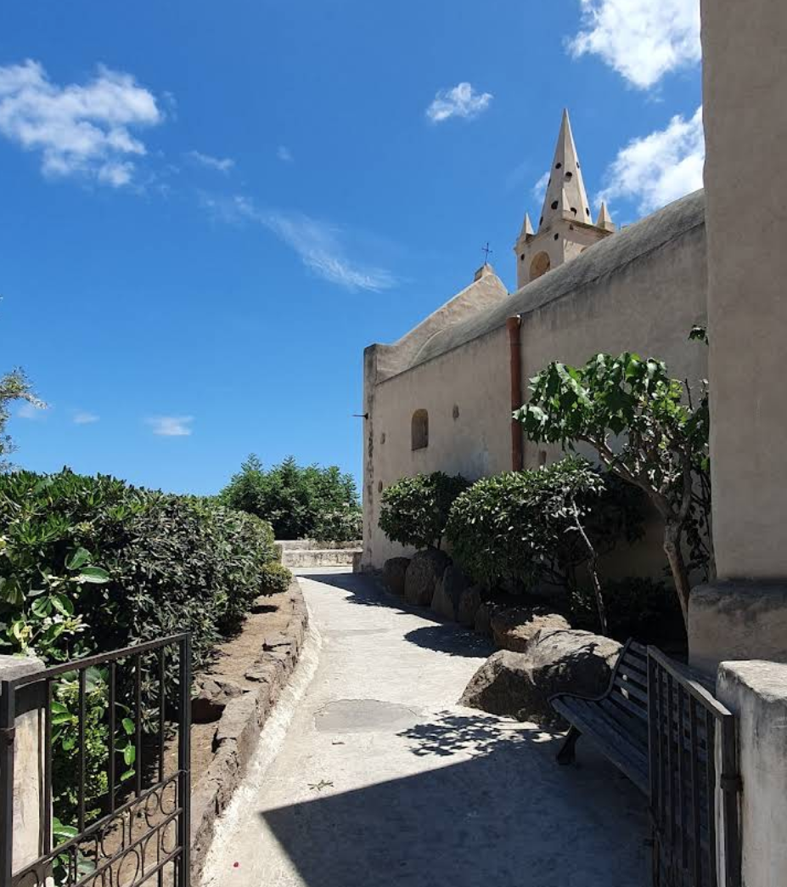

---

### Chiesa di San Pietro
Она посвящена апостолу Святому Петру, покровителю рыбаков и моряков, что символично для островной жизни. Церковь отличается скромной архитектурой, белыми стенами и спокойной атмосферой, отражающей традиционную религиозную культуру Эолийских островов. Часто служит местом тихого уединения и ориентиром при прогулках по старой части острова.

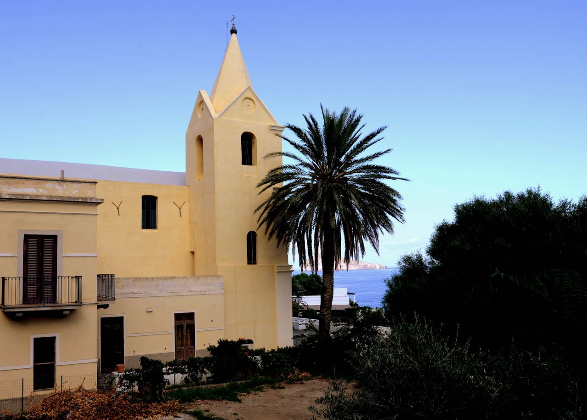

---

### Niche votive Vierge Noire
Это маленькое святилище ниша на улице и в природном месте, где размещено изображение Чёрной Богородицы. Святилище находится на острове не подолеку от города Ditella.

---

### Villaggio Preistorico
Старое поселение на острове Panarea находится в южной части острова, в районе Capo Milazzese.
Это доисторическое поселение бронзового века (примерно XVI–XIII вв. до н.э.), расположенное на скалистом мысе над морем, между Cala Junco и Punta Milazzese. Здесь сохранились остатки круглых каменных хижин, улиц и оборонительного расположения — типичного для древних Эолийских поселений.

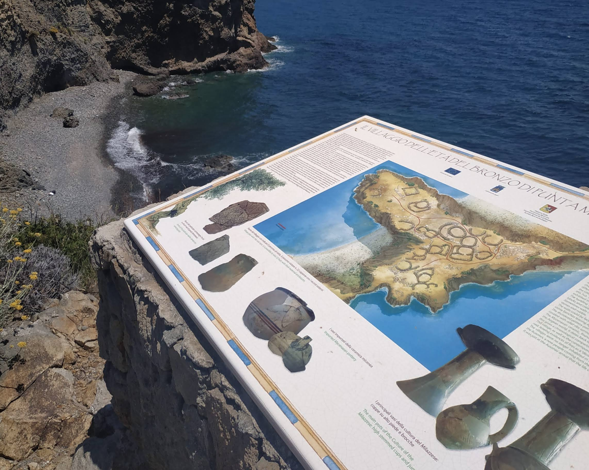

## Дайвинг

### Cala Junco (южная часть)

**Cala Junco (Panarea)** — одна из самых известных и красивых бухт и, пожалуй, визитная карточка Panarea. Это почти идеально круглая бухта с кристально чистой, спокойной водой, окружённая вулканическими скалами.

С моря **Cala Junco** — отличное место для дневной якорной стоянки и купания: прозрачная вода, снорклинг, SUP и эффектная цветовая градация от светло‑бирюзового до тёмно‑синего. На берег можно высадиться и пройти пешком к доисторическому поселению Capo Milazzese, расположенному прямо над бухтой.

`Координаты: 38° 37.52' N, 15° 3.60' E`

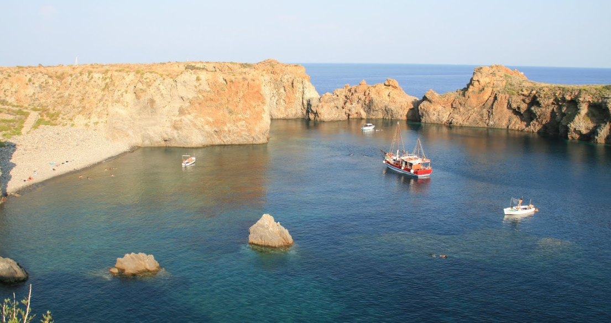
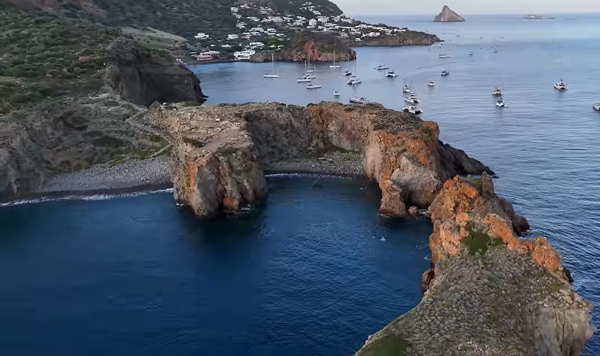

### Dattilo

Крутой скалистый островок (faraglione) у берегов Panarea, один из самых выразительных в группе маленьких островов вокруг неё. Он представляет собой почти вертикальную вулканическую скалу с резкими формами, поднимающуюся прямо из моря, и служит знаковым навигационным ориентиром для яхтсменов.
Швартовка на якоре в западной части. Высадки на берег нет.

`Координаты: 38° 38.30' N, 15° 5.92' E`

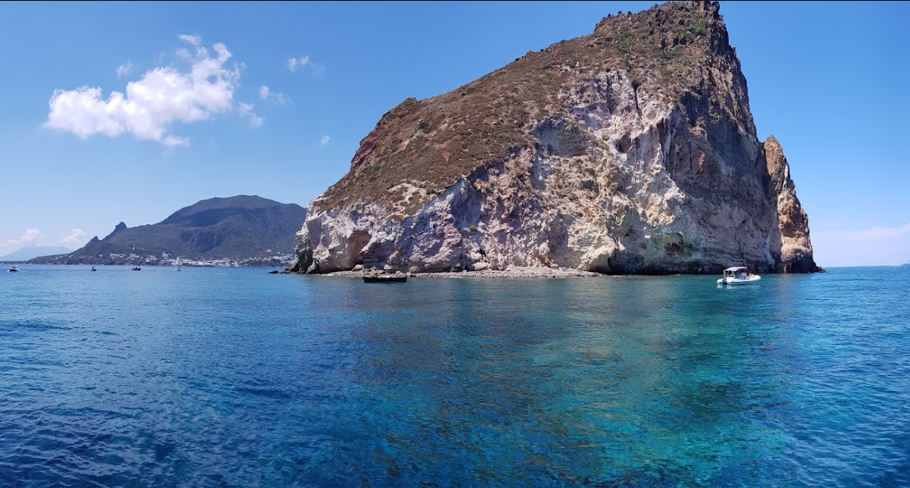
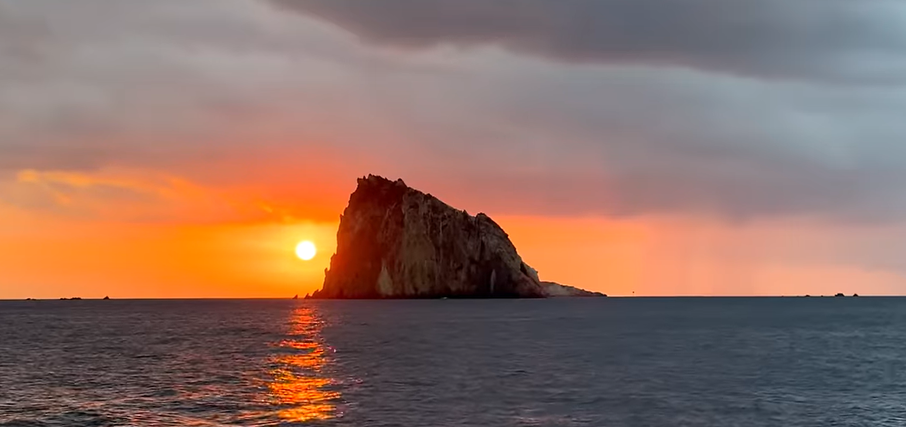

### Lisca Bianca 
Небольшой скалистый островок рядом с **Dattilo**, известный подводными фумаролами и выходами горячих газов прямо в море. Lisca Bianca — популярное место для купания и снорклинга благодаря подводным фумаролам, создающим эффект бурлящей воды. Якорная стоянка возможна только при спокойном море, обычно для дневного визита, без высадки на берег.

`Координаты: 38° 38.30' N, 15° 6.75' E`

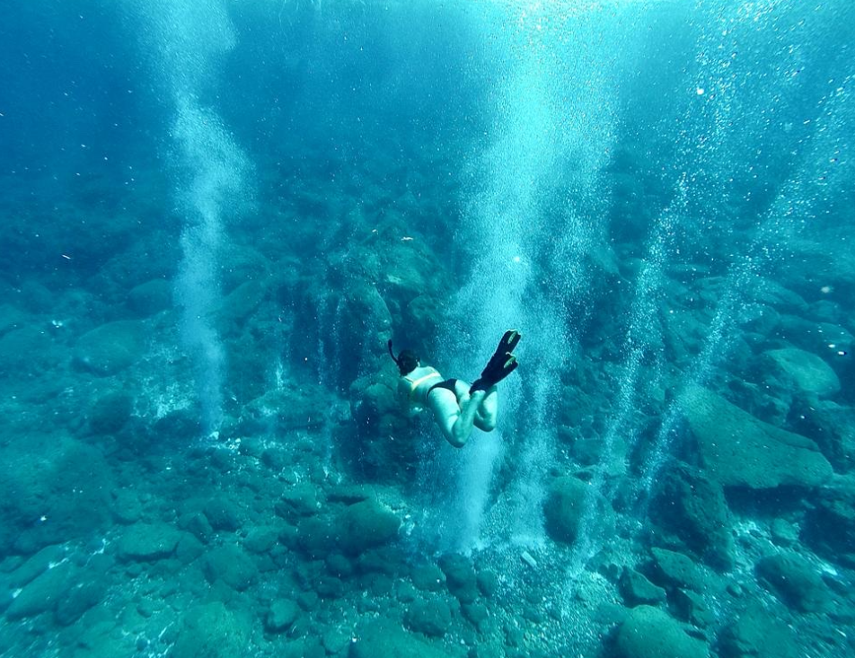