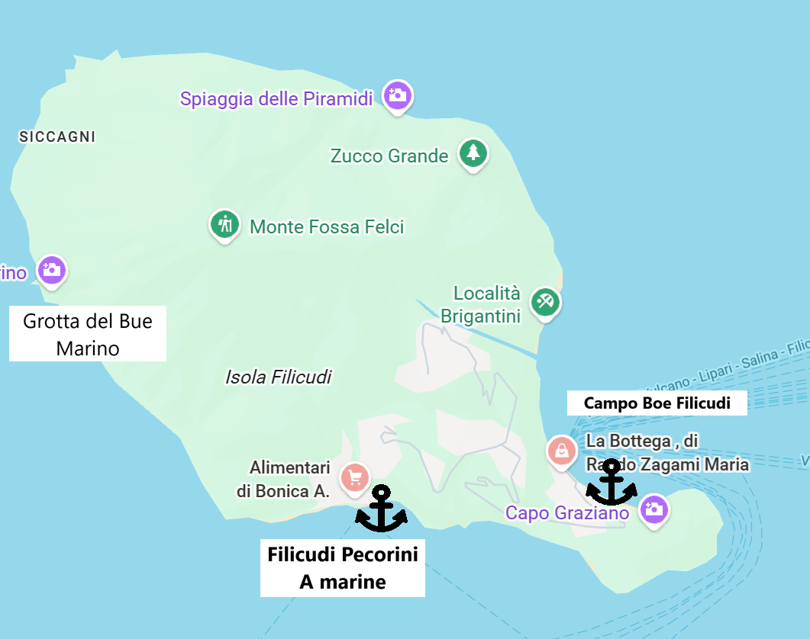
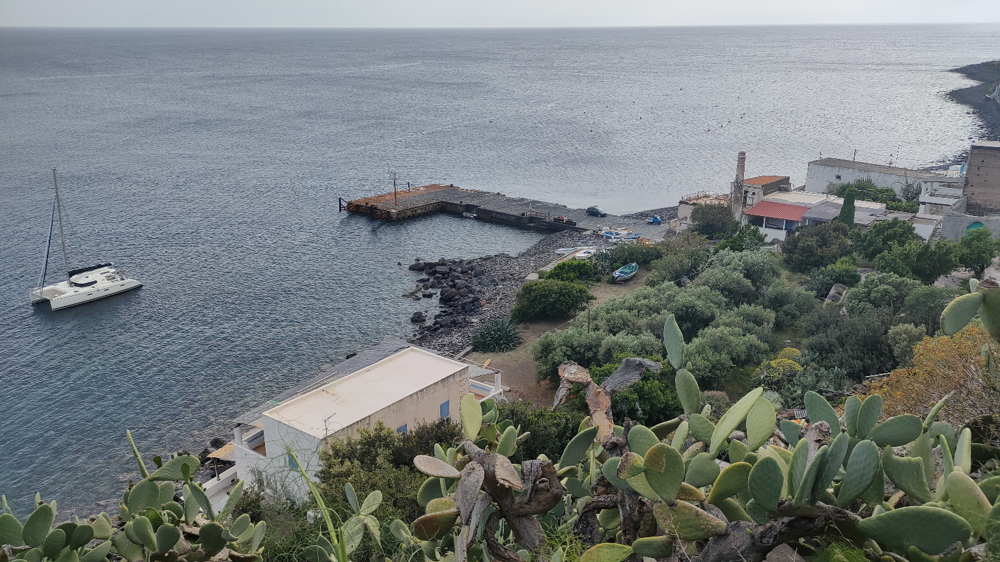
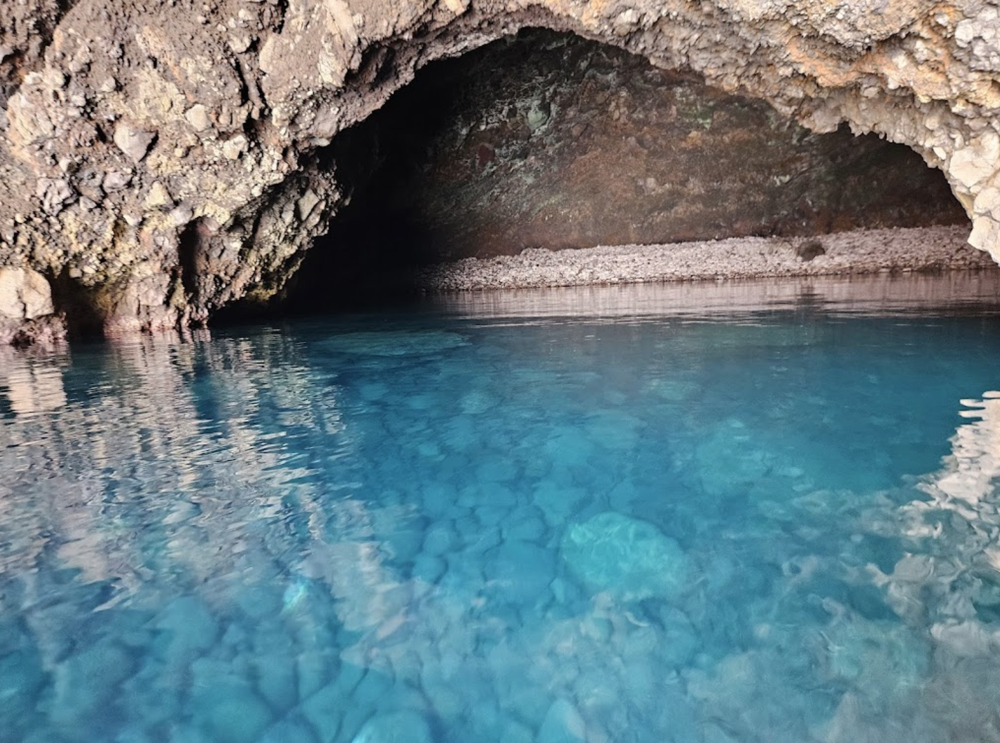

# Pecorini

**Pecorini** — один из самых диких и живописных островов Эолийского архипелага, идеально подходящий для яхтинга благодаря кристально чистой воде, уникальным гротам (Grotta del Bue Marino) и скалам (La Canna)

## Filicudi (северо-восточная страна)
**Pontile Filicudi** — это прибрежная зона у поселка Filicudi Porto, служащая городским причалом для высадки на берег. Основная стоянка яхт возможна на буях или на якоре, так как полноценной стационарной марины здесь нет. В отдельные сезоны может устанавливаться небольшой временный понтон, в основном для трансфера пассажиров и лодок.

Рядом с понтиле находится базовая, но удобная инфраструктура: кафе, траттории и небольшой продуктовый магазин для повседневных нужд. Этого достаточно, чтобы купить свежий хлеб и поужинать на берегу. В целом Pontile Filicudi — это практичное и аутентичное место высадки, хорошо дополняющее стоянки на Campo Boe или якоре вокруг острова.

## Pecorini A Marine  (южная сторона)
Pecorini a Mare (Filicudi Pecorini a Marine) — это основной населённый пункт острова и основное место выхода на берег. Здесь есть городской причал для высадки, а для яхт используется стоянка на буях или на якоре, полноценной марины в классическом смысле нет. Место удобно именно как якорная/буйная остановка с быстрым доступом к суше.
Инфраструктура для небольшого острова хорошая: есть средний по размеру магазин, несколько кафе и ресторанов, пекарни и базовые сервисы. Этого достаточно для пополнения запасов на 1–2 дня и комфортного ужина без лишней суеты. В целом Pecorini a Mare — практичное и аутентичное место для стоянки, сочетающее простоту, атмосферу и всё необходимое для яхтсменов.

## Grotta del Bue Marino

Крупная морская пещера на западном побережье острова Filicudi, доступная только с моря. Она известна внушительными размерами и игрой света. Широкий вход позволяет заходить на лодке, а внутри открываются тёмно‑синие и изумрудные оттенки воды на фоне вулканических стен. Название связано с гулким эхом волн, которое напоминает мычание «морского быка».

Пещера особенно популярна для купания, снорклинга, SUP и фридайвинга при спокойном море. Лучшее время посещения — утро или вечер, когда свет подчёркивает рельеф и глубину цветов. При волнении подходить внутрь не рекомендуется из‑за отражённой волны и резкой смены освещения.

