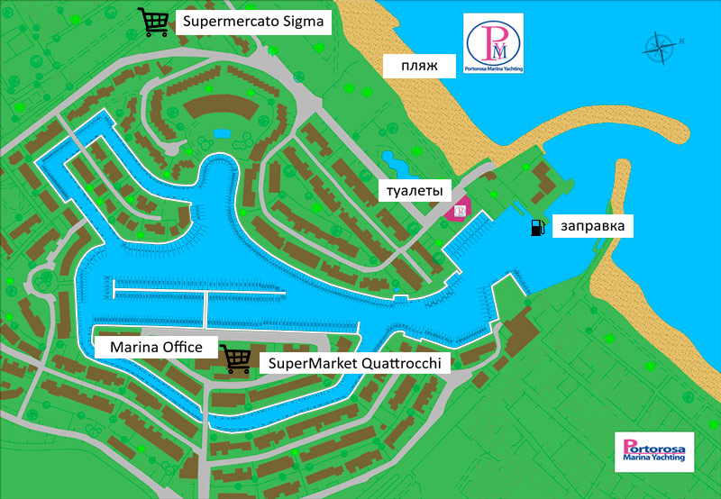
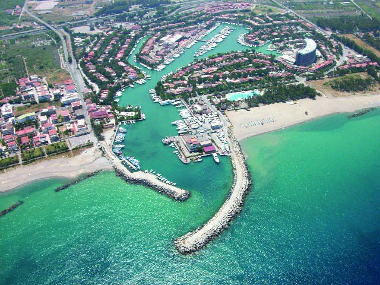
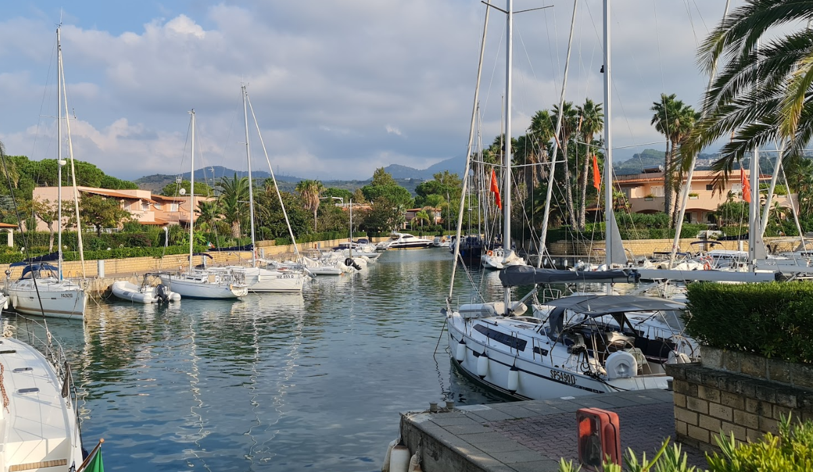
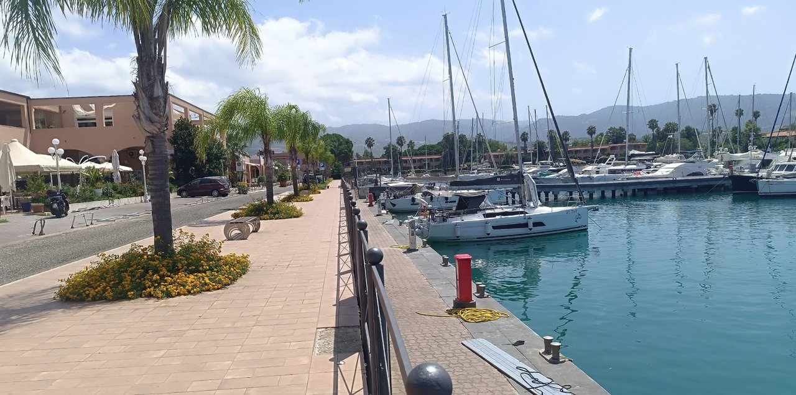
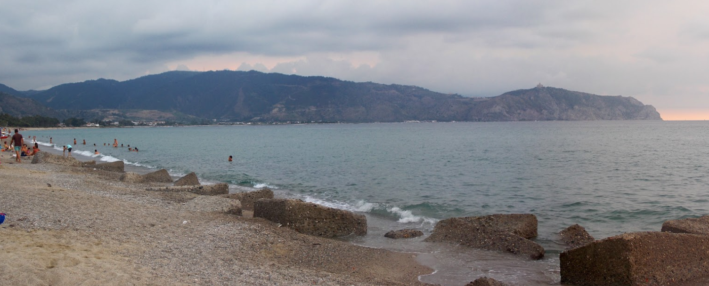
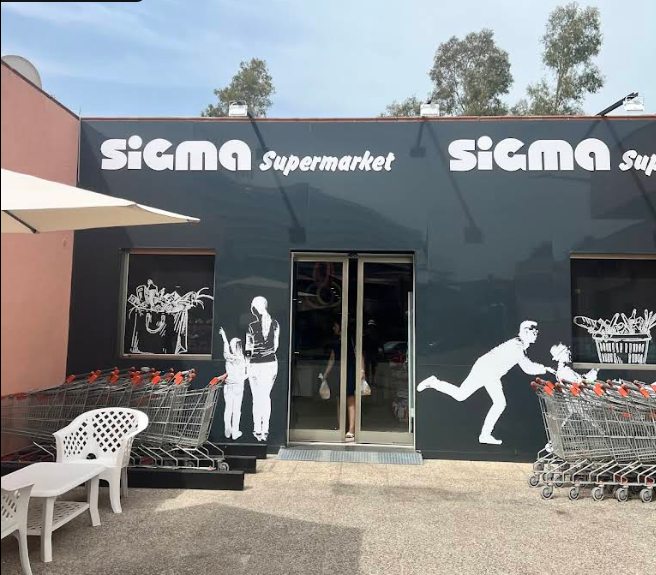
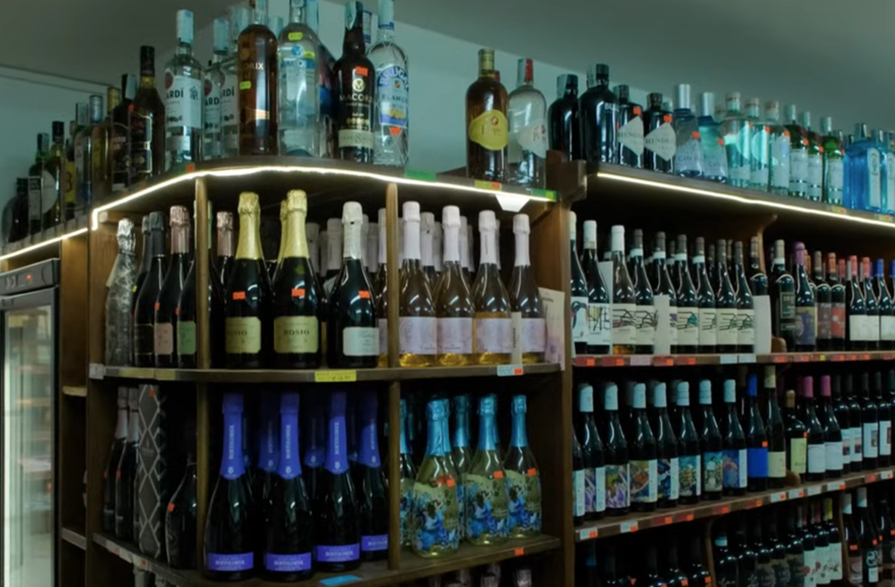
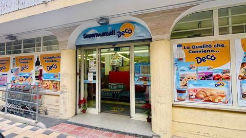
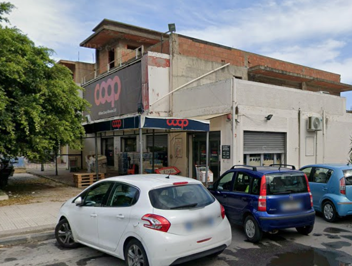

Марина Portorosa — одна из крупнейших туристических марин Сицилии и важный логистический узел, фактически «ворота» к Эолийским островам. Она расположена в канальной системе с лагунами и рассчитана на большое количество яхт, что делает её удобной для чартеров.

`Координаты: 38° 7.57' N, 15° 6.73' E`

[https://portorosamy.com/](https://portorosamy.com/)

В марине есть почти всё, что нужно перед выходом в море:

- вода и электричество
- душевые и туалеты
- топливо
- чартерные офисы
- яхт‑сервис и ремонт
- охрана и видеонаблюдение
- магазин на территории

---
### Что следует учитывать яхтсмену
- Чартерные суда часто швартуются на восточной стороне у входа.
- Основное здание марины расположено на правом берегу. Поскольку каналы не имеют мостов, чтобы добраться до магазина или чартерных офисов придётся обойти марину; удобнее делать это по восточной стороне — там есть мост.
- Каналы тесные, местами мелководье — будьте аккуратны при маневрировании.
- Плавание на моторных лодках не приветствуется.

## Отдых 

### Spiaggia libera vicino Portorosa
Бесплатный общественный пляж рядом с мариной, удобный для купания и отдыха после швартовки. Пляж с мелкой галькой и пологим заходом в воду, без оборудованных сервисов, но тихий и просторный. Подходит для короткой прогулки и купания вдали от туристической суеты.

## Рестораны

### ARTHE' CAFE'

Отличное место для зватраков и десерта. 

[меню](https://maps.app.goo.gl/5Py1qJsNSdLUJQwk9)

---

### Zammù

Бюджетный ресторан расположен прямо внутри терминала марины. Формат заведения многофункциональный: ресторан и пиццерия, бар с авторскими коктейлями, ремесленное мороженое. Кухня простая: гамбургеры, пицца, салаты, свежая паста и морепродукты. Средний чек: €10–20 на человека.

Режим работы: ежедневно 07:00–00:00. Принимаются карты; есть столики на открытом воздухе с видом на марину.

[ревью](https://wanderboat.ai/restaurants/italy/furnari/zamm%C3%B9/ocqhS_uoRBqRld2e5GbrhA)

---

### Ristorante La Plaza

Ресторан расположен прямо в торговом центре марины Portorosa, на центральном молу — удобная пешая доступность с любого понтона. Кухня — традиционная сицилийская и средиземноморская, с акцентом на свежую рыбу и морепродукты. Ценовой диапазон — €€–€€€, уровень чуть выше среднего, но соответствует качеству и локации. 

Важно: ресторан работает с марта по октябрь, ежедневно, на обед и ужин. Часы работы: обед 12:00–15:00, ужин 19:00–23:00/00:00. По вечерам возможна apericena с живой музыкой. Бронирование рекомендуется в высокий сезон.
+39 347 647 2173 | [меню](https://www.ristolaplaza.com/en/menu.html)

---

### Gradisca Restaurant & Lounge Bar Portorosa

Ресторан находится рядом с супермаркетом **Sigma**, прямо на территории марины Portorosa, что делает его удобным местом для ужина после захода в порт. Кухня преимущественно средиземноморская, с акцентом на свежую рыбу и морепродукты: тартар из тунца, осьминог на гриле, паста с омаром и мидиями. Цены — выше среднего (€12–30 за блюдо), соответствуют уровню ресторанов при маринах. По вечерам часто бывает живая музыка; это создаёт приятную атмосферу, но иногда приводит к шуму на борту при стоянке рядом.

Важно: ресторан открыт по пятницам, субботам и воскресеньям (08:00–23:30); в остальные дни закрыт. Резервирование столика рекомендуется в высокий сезон.

+39 377 314 5744 | [gradiscaportorosa.it](https://gradiscaportorosa.it) | [меню](https://www.gradiscaportorosa.it/wp-content/uploads/2024/08/restaurant-dinner-menu-gradiscaportorosa.pdf)

## Закупки

### Supermercato Sigma Portorosa
Хороший выбор продуктов. Всё, что нужно для яхтинга. Рядом с обычным местом швартовки чартеров. Из недостатков — слабый выбор алкоголя.
`Часы работы в субботу: 09:00–21:00`

---
### da Carmelina
Магазин в здании марины — небольшой, но здесь есть алкоголь и доставка на яхту. Также здесь готовят хорошие сэндвичи. Пешком идти довольно далеко; лучше взять такси.

`Часы работы в субботу: 08:30–21:00`

---
### Supermercati Decò
Удобный полноформатный супермаркет, подходящий для основной закупки продуктов и воды перед выходом к Эолийским островам. Ассортимент широкий (еда, напитки, товары для дома), цены заметно ниже, чем на островах. Хороший выбор для загрузки провизии на несколько дней. Небольшой выбор крепкого алкоголя, нет доставки. Такси — 11 мин. 
`Часы работы в субботу: 08:00–13:00 и 16:00–20:00`

---
### Coop 
Удобен для повседневных покупок и пополнения запасов. Ассортимент стандартный для Coop: продукты первой необходимости, охлаждённое мясо и сыры, паста, консервы, хлеб, овощи и фрукты, вода и напитки, а также базовые товары для дома. Небольшой выбор крепкого алкоголя. Такси — 8 мин. 
`Часы работы в субботу: 08:30–13:30 и 16:30–20:30`

