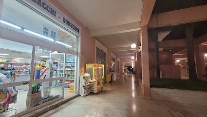

Это одна из крупнейших туристических марин Сицилии и основные «ворота» к Эолийским островам. Марина расположена в канальной системе с лагунами и рассчитана на большое количество яхт, что делает её удобной для чартера.

`Координаты: 38° 7.57' N, 15° 6.73' E`

[https://portorosamy.com/](https://portorosamy.com/)

В марине есть почти всё, что нужно перед выходом в море:

- вода и электричество
- душевые и туалеты
- `топливо`
- чартерные офисы
- яхт-сервис и ремонт
- охрана и видеонаблюдение
- магазин на территории

---
### Что следует учитывать яхтсмену
- Чартеры часто зашвартованы на восточной стороне у входа.
- Основное здание марины находится на правом берегу. Поскольку каналы не имеют мостов, придётся обходить марину, чтобы попасть в магазин или чартерные офисы. Обходите с восточной стороны — там есть мост.
- Каналы тесные, местами мелководье — будьте аккуратны с маневрами.
- Плавание на моторной лодке не приветствуется.

## Отдых 

### Spiaggia libera vicino Porto Rosa
Бесплатный общественный пляж рядом с мариной, удобный для купания и отдыха после швартовки. Пляж с мелкой галькой и пологим заходом в воду, без оборудованных сервисов, но тихий и просторный. Подходит для короткой прогулки и купания вдали от туристической суеты.

## Закупки

### Supermercato Sigma Portorosa
Хороший выбор продуктов. Всё, что нужно для яхтинга. Рядом с обычным местом швартовки чартеров. Из недостатков — слабый выбор алкоголя.
`Часы работы в субботу: 9-21`

---
### SuperMarket Quattrocchi
Магазин в здании марины — небольшой и дорогой, но есть алкоголь и доставка на яхту. Пешком обходить очень далеко; такси — 3 мин.
`Часы работы в субботу: 8:30-21`

---
### Supermercati Decò
Удобный полноформатный супермаркет, подходящий для основной закупки продуктов и воды перед выходом к Эолийским островам. Ассортимент широкий (еда, напитки, товары для дома), цены заметно ниже, чем на островах. Хороший выбор для загрузки провизии на несколько дней. Небольшой выбор крепкого алкоголя, нет доставки. Такси — 11 мин. 
`Часы работы в субботу: 8-13 и 16-20`

---
### Coop 
Удобен для повседневных покупок и пополнения запасов. Ассортимент стандартный для Coop: продукты первой необходимости, охлаждённое мясо и сыры, паста, консервы, хлеб, овощи и фрукты, вода и напитки, а также базовые товары для дома. Небольшой выбор крепкого алкоголя. Такси — 8 мин. 
`Часы работы в субботу: 8:30-13:30 и 16:30-20:30`

