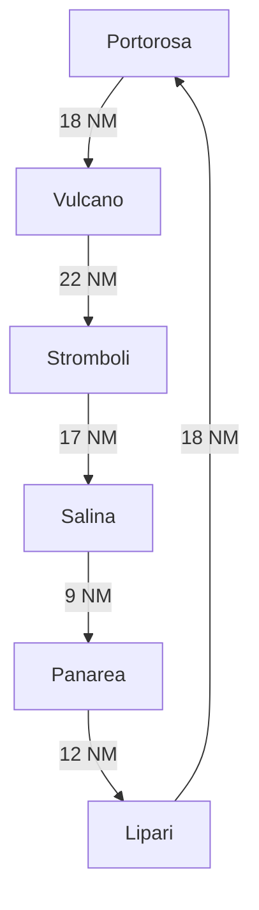

# Яхтинг на Липарских островах

## Маршруты

### Класический (сбалансированный)
Portorosa->Vulcano->Stromboli->Salina->Panarea->Lipari->Portorosa

### Посмотреть всё (без гонок)
Portorosa->Vulcano->Lipari->Stromboli->Salina->Filicudi->Portorosa

### Культурный (без гонок)
Portorosa->Vulcano->Salina->Lipari->Milazzo->Portorosa

### Гонки, только гонки
Portorosa->Lipari->Panarea->Salina->Filucudi->Vulcano->Portorosa
         

Каждая остановка на маршруте представлена своим цветом. Маршруты и расстояния указаны для наглядности.

  Вс.     Пн.      Вт.      Ср.        Чт.         Пт.

- нет туалетов
- часто якоря
- пирсы плавучие сезонные
- вода и электрика редкость
- берег сильным уклоном - бросайте якорь ближе.
- камни летят с горы могут повередеть лодку.
- швартовки при силоном волнении - отраженная волна