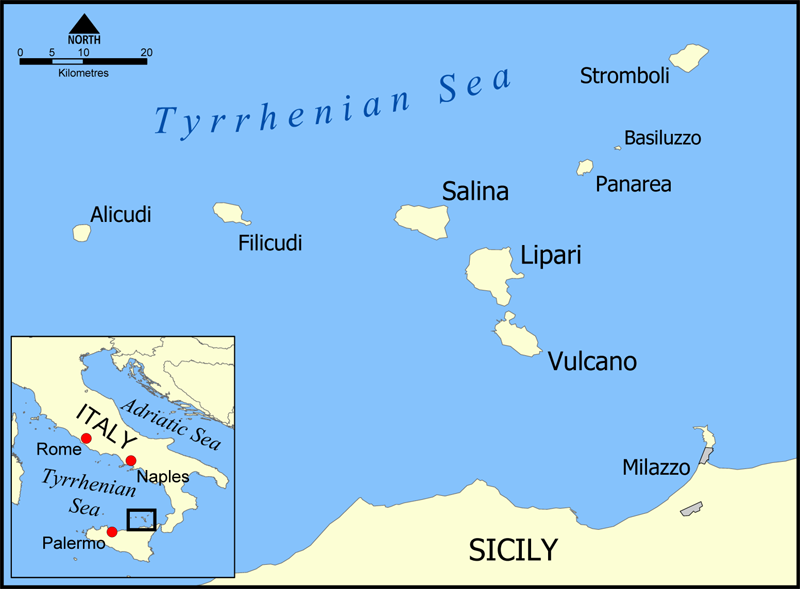

  <a href="{{ site.baseurl }}/" class="btn btn--info btn--large">Острова</a>

  <a href="{{ site.baseurl }}/routes/" class="btn btn--primary btn--large">Маршруты</a>
  
  <a href="{{ site.baseurl }}/winds/" class="btn btn--warning btn--large">Ветра</a>

## Карта

## Маршруты

### Классический — ~95 NM, 6 переходов

Самый популярный маршрут: все главные острова по кругу. Хороший баланс ветра, достопримечательностей и ночной жизни. Подходит для первого знакомства с архипелагом.

[Portorosa]({{ site.baseurl }}/portorosa/) → [Vulcano]({{ site.baseurl }}/vulcano/) *(19 NM)* → [Stromboli]({{ site.baseurl }}/stromboli/) *(25 NM)* → [Panarea]({{ site.baseurl }}/panarea/) *(10 NM)* → [Salina]({{ site.baseurl }}/salina/) *(13 NM)* → [Lipari]({{ site.baseurl }}/lipari/) *(11 NM)* → [Portorosa]({{ site.baseurl }}/portorosa/) *(22 NM)*

---

### Сбалансированный — ~90 NM, 6 переходов

Немного гонок и много впечатлений. Заход в **[Milazzo]({{ site.baseurl }}/milazzo/)** для закупок и осмотра замка.

[Portorosa]({{ site.baseurl }}/portorosa/) → [Vulcano]({{ site.baseurl }}/vulcano/) *(19 NM)* → [Salina]({{ site.baseurl }}/salina/) *(15 NM)* → [Stromboli]({{ site.baseurl }}/stromboli/) *(21 NM)* → [Lipari]({{ site.baseurl }}/lipari/) *(22 NM)* → [Milazzo]({{ site.baseurl }}/milazzo/) *(20 NM)* → [Portorosa]({{ site.baseurl }}/portorosa/) *(8 NM)*

---

### Посмотреть всё — ~100 NM, 6 переходов

Маршрут без гонок, только впечатления. Все семь островов за неделю — короткие переходы, максимум времени на берегу.

[Portorosa]({{ site.baseurl }}/portorosa/) → [Vulcano]({{ site.baseurl }}/vulcano/) *(19 NM)* → [Lipari]({{ site.baseurl }}/lipari/) *(4 NM)* → [Stromboli]({{ site.baseurl }}/stromboli/) *(22 NM)* → [Panarea]({{ site.baseurl }}/panarea/) *(10 NM)* → [Salina]({{ site.baseurl }}/salina/) *(13 NM)* → [Portorosa]({{ site.baseurl }}/portorosa/) *(30 NM)*

---

### Культурный — ~105 NM, 6 переходов

Впечатления и культура: винодельни **[Salina]({{ site.baseurl }}/salina/)**, замок и музей **[Lipari]({{ site.baseurl }}/lipari/)**, богемная **[Panarea]({{ site.baseurl }}/panarea/)**, замок **[Milazzo]({{ site.baseurl }}/milazzo/)** и парк Неброди из **[Capo d'Orlando]({{ site.baseurl }}/capo-d-orlando/)**.

[Portorosa]({{ site.baseurl }}/portorosa/) → [Salina]({{ site.baseurl }}/salina/) *(30 NM)* → [Lipari]({{ site.baseurl }}/lipari/) *(11 NM)* → [Panarea]({{ site.baseurl }}/panarea/) *(11 NM)* → [Milazzo]({{ site.baseurl }}/milazzo/) *(25 NM)* → [Capo d'Orlando]({{ site.baseurl }}/capo-d-orlando/) *(20 NM)* → [Portorosa]({{ site.baseurl }}/portorosa/) *(12 NM)*

---

### Гоночный — ~105 NM, 6 переходов

Максимум парусного спорта: длинные переходы, регатные акватории у каждого острова. Подходит для опытных экипажей.

[Portorosa]({{ site.baseurl }}/portorosa/) → [Lipari]({{ site.baseurl }}/lipari/) *(22 NM)* → [Panarea]({{ site.baseurl }}/panarea/) *(11 NM)* → [Salina]({{ site.baseurl }}/salina/) *(13 NM)* → [Filicudi]({{ site.baseurl }}/filicudi/) *(11 NM)* → [Vulcano]({{ site.baseurl }}/vulcano/) *(20 NM)* → [Portorosa]({{ site.baseurl }}/portorosa/) *(19 NM)*
  

## Рекомендуемые марины

| Остров | Название | Тип |
|--------|----------|-----|
| [**Vulcano**]({{ site.baseurl }}/vulcano/) | [Baia Levante]({{ site.baseurl }}/vulcano/#baia-levante---марина-восток) | Марина |
| [**Vulcano**]({{ site.baseurl }}/vulcano/) | [Porto di Ponente]({{ site.baseurl }}/vulcano/#porto-di-ponente---якорь-запад) | Якорь |
| [**Lipari**]({{ site.baseurl }}/lipari/) | [Porto Pignataro]({{ site.baseurl }}/lipari/#porto-pignataro---марина-восток) | Марина |
| [**Salina**]({{ site.baseurl }}/salina/) | [Marina Salina - Marinеdì]({{ site.baseurl }}/salina/#marina-salina---marinеdì) | Марина |
| [**Filicudi**]({{ site.baseurl }}/filicudi/) | [Pecorini a Mare]({{ site.baseurl }}/filicudi/#pecorini-a-mare---буи-юг) | Буи |
| [**Panarea**]({{ site.baseurl }}/panarea/) | [Cala Junco]({{ site.baseurl }}/panarea/#cala-junco---якорь-юг) | Якорь |
| [**Panarea**]({{ site.baseurl }}/panarea/) | [Pontile Iditella]({{ site.baseurl }}/panarea/#pontile-iditella---буи-восток) | Буи |
| [**Stromboli**]({{ site.baseurl }}/stromboli/) | [Punta Lena]({{ site.baseurl }}/stromboli/#punta-lena---якорь-север) | Якорь |

