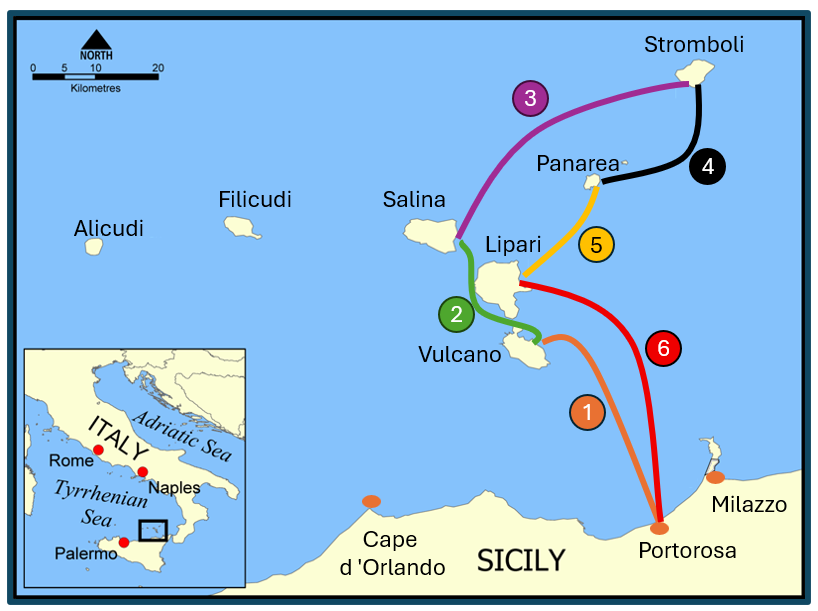
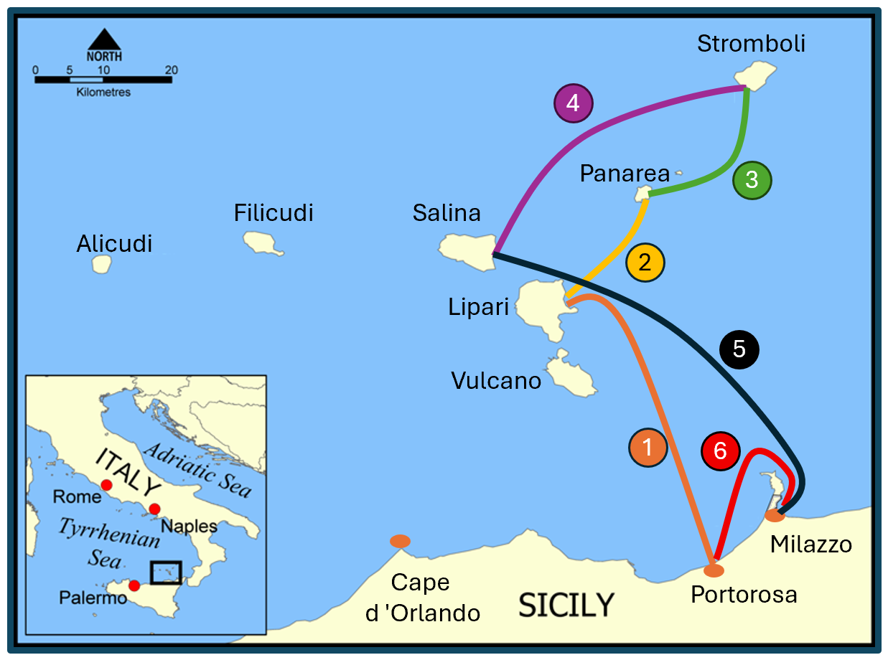
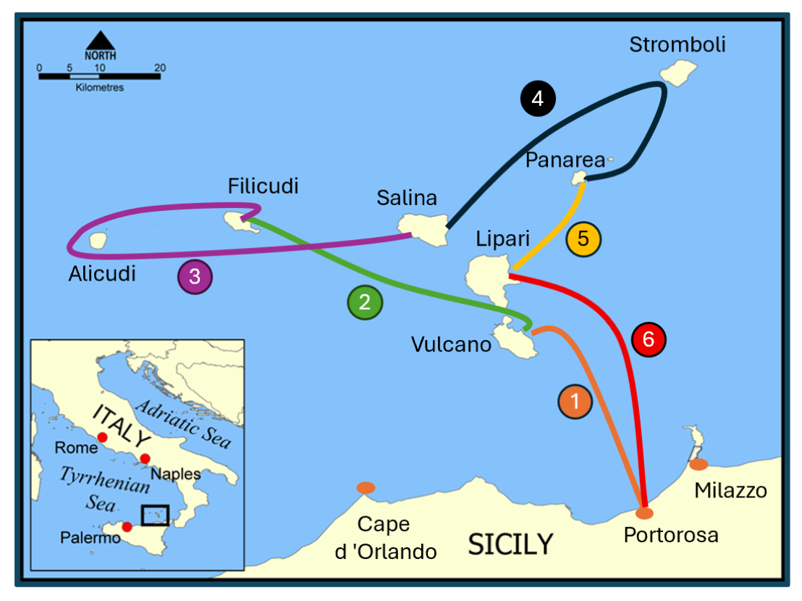
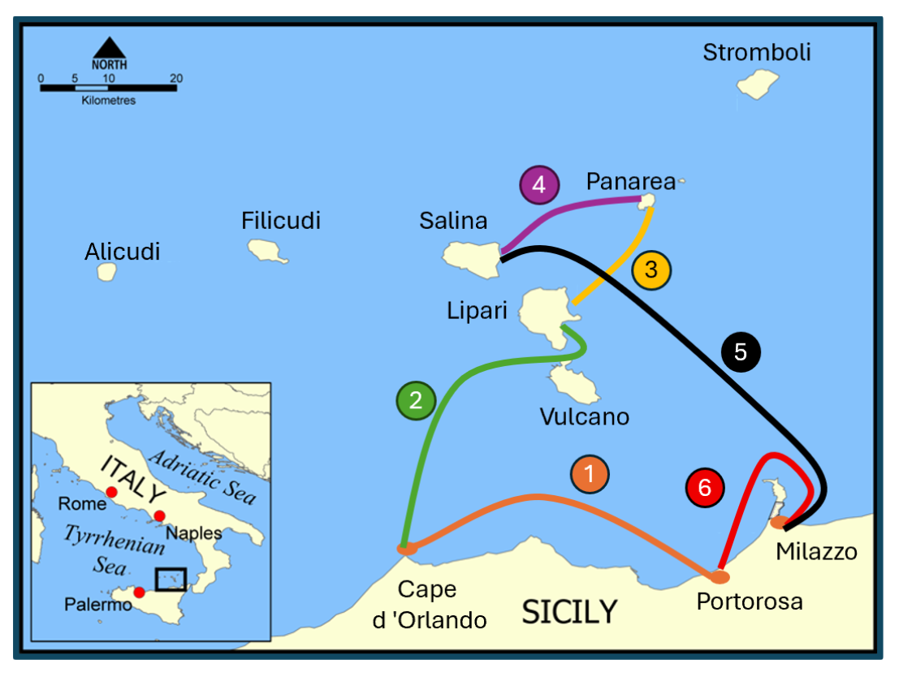

  <a href="{{ site.baseurl }}/" class="btn btn--info btn--large">Острова</a>

  <a href="{{ site.baseurl }}/routes/" class="btn btn--primary btn--large">Маршруты</a>
  
  <a href="{{ site.baseurl }}/winds/" class="btn btn--warning btn--large">Ветра</a>

### Классический — ~95 NM, 6 переходов

Пять главных островов по кольцу — проверенный маршрут, с которого начинают большинство чартеров. Грязевые ванны **[Vulcano]({{ site.baseurl }}/vulcano/)**, бары **[Lipari]({{ site.baseurl }}/lipari/)**, закат у кратера **[Stromboli]({{ site.baseurl }}/stromboli/)** и дегустация вин на **[Salina]({{ site.baseurl }}/salina/)**. Переходы короткие (4–21 NM), единственный длинный участок — возврат из Salina в Portorosa (30 NM) — идёт при попутном ветре. Идеален для первого знакомства с архипелагом.

- сб [**Portorosa**]({{ site.baseurl }}/portorosa/) →  
- вс [**Vulcano**]({{ site.baseurl }}/vulcano/) *(19 NM)* → 
- пн [**Salina**]({{ site.baseurl }}/salina/) *(10 NM)* → 
-  вт [**Stromboli**]({{ site.baseurl }}/stromboli/) *(20 NM)*  →
- ср [**Panarea**]({{ site.baseurl }}/panarea/) *(11 NM)* → 
- чт [**Lipari**]({{ site.baseurl }}/lipari/) *(10 NM)* →  
- пт [**Portorosa**]({{ site.baseurl }}/portorosa/) *(22 NM)*

---

### Сбалансированный — ~97 NM, 6 переходов

Золотая середина: четыре главных острова плюс заход в **[Milazzo]({{ site.baseurl }}/milazzo/)** — заправка, крепость и ужин на набережной. Переходы короткие и комфортные, а длинный участок Salina → Milazzo (25 NM) идёт под попутный бриз вдоль Сицилии. Хороший выбор для нового экипажа или первой недели на катамаране.

[Portorosa]({{ site.baseurl }}/portorosa/) → [Lipari]({{ site.baseurl }}/lipari/) *(22 NM)* → [Panarea]({{ site.baseurl }}/panarea/) *(11 NM)* → [Stromboli]({{ site.baseurl }}/stromboli/) *(10 NM)* → [Salina]({{ site.baseurl }}/salina/) *(21 NM)* → [Milazzo]({{ site.baseurl }}/milazzo/) *(25 NM)* → [Portorosa]({{ site.baseurl }}/portorosa/) *(8 NM)*

---

### Посмотрим всё! — ~140 NM, 6 переходов

Все семь островов за одну неделю — максимум архипелага. Маршрут уходит на запад до дикого **[Alicudi]({{ site.baseurl }}/alicudi/)**, огибает его и тянется к **[Salina]({{ site.baseurl }}/salina/)** — самый длинный переход (35 NM). На обратном пути — петля вокруг **[Stromboli]({{ site.baseurl }}/stromboli/)** через **[Panarea]({{ site.baseurl }}/panarea/)**. Требует уверенной навигации и запаса времени на погоду.

[Portorosa]({{ site.baseurl }}/portorosa/) → [Vulcano]({{ site.baseurl }}/vulcano/) *(19 NM)* → [Filicudi]({{ site.baseurl }}/filicudi/) *(20 NM)* → [Alicudi]({{ site.baseurl }}/alicudi/) ↻ [Salina]({{ site.baseurl }}/salina/) *(35 NM)* → [Panarea]({{ site.baseurl }}/panarea/) · [Stromboli]({{ site.baseurl }}/stromboli/) ↻ *(30 NM)* → [Lipari]({{ site.baseurl }}/lipari/) *(22 NM)* → [Portorosa]({{ site.baseurl }}/portorosa/) *(22 NM)*

---

### Культурный — ~120 NM, 6 переходов

Впечатления и культура: парк Nebrodi из **[Capo d'Orlando]({{ site.baseurl }}/capo-d-orlando/)**, замок и музей **[Lipari]({{ site.baseurl }}/lipari/)**, винодельни **[Salina]({{ site.baseurl }}/salina/)**, богемная **[Panarea]({{ site.baseurl }}/panarea/)** и крепость **[Milazzo]({{ site.baseurl }}/milazzo/)**.

[Portorosa]({{ site.baseurl }}/portorosa/) → [Capo d'Orlando]({{ site.baseurl }}/capo-d-orlando/) *(12 NM)* → [Vulcano]({{ site.baseurl }}/vulcano/) *(35 NM)* → [Lipari]({{ site.baseurl }}/lipari/) · [Panarea]({{ site.baseurl }}/panarea/) *(15 NM)* → [Salina]({{ site.baseurl }}/salina/) ↻ [Panarea]({{ site.baseurl }}/panarea/) *(26 NM)* → [Milazzo]({{ site.baseurl }}/milazzo/) *(25 NM)* → [Portorosa]({{ site.baseurl }}/portorosa/) *(8 NM)*

## Рекомендуемые марины

| Остров | Название | Тип | Цена/ночь |
|--------|----------|-----|-----------|
| [**Vulcano**]({{ site.baseurl }}/vulcano/) | [Baia Levante]({{ site.baseurl }}/vulcano/#baia-levante---марина-восток) | Марина | €40–100 (апр–окт) |
| [**Vulcano**]({{ site.baseurl }}/vulcano/) | [Porto di Ponente]({{ site.baseurl }}/vulcano/#porto-di-ponente---якорь-запад) | Якорь | бесплатно |
| [**Lipari**]({{ site.baseurl }}/lipari/) | [Porto Pignataro]({{ site.baseurl }}/lipari/#porto-pignataro---марина-восток) | Марина | €60–180 |
| [**Salina**]({{ site.baseurl }}/salina/) | [Marina Salina - Marinedi]({{ site.baseurl }}/salina/#marina-salina---marinеdi) | Марина | от €74 |
| [**Filicudi**]({{ site.baseurl }}/filicudi/) | [Pecorini a Mare]({{ site.baseurl }}/filicudi/#pecorini-a-mare---буи-юг) | Буи | €80–120 | 
| [**Panarea**]({{ site.baseurl }}/panarea/) | [Pontile Iditella]({{ site.baseurl }}/panarea/#pontile-iditella---буи-восток) | Буи | €80–120 |
| [**Stromboli**]({{ site.baseurl }}/stromboli/) | [Punta Lena]({{ site.baseurl }}/stromboli/#punta-lena---якорь-север) | Якорь | бесплатно |

