# Salina

**Салина (Salina)** — второй по величине остров Эолийского архипелага, известный своей природной красотой и винодельческой традицией. Остров славится производством знаменитого белого вина **Malvasia delle Lipari** и имеет два вулканических пика — **Monte dei Porri** (860 м) и **Monte Fossa delle Felci** (962 м). Для яхтсменов Салина привлекательна кристально чистой водой, изолированными бухтами и аутентичной атмосферой.

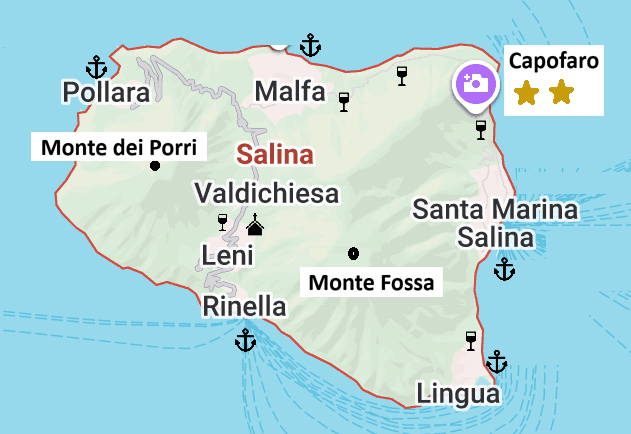

## Марины и якорные стоянки

### Pollara (западная часть)

**Pollara** — это небольшая рыбацкая деревушка и живописная бухта на западном побережье Салины. Здесь нет полноценной марины, но есть возможность якорной стоянки на буях. Бухта хорошо защищена от восточных ветров. 

Это место особенно популярно для любителей природы благодаря уникальной вулканической формации **Scogliera di Pollara** и кристально чистой воде. К северу есть живописная арка и заброшенная деревня.

Якорная стоянка на 10 буях, грунт — камни-песок, глубина 8–15 м. Стоимость буя — €50–80. Связь: **VHF канал 09**, тел. +39 340 123 4567. 

Бухта полностью открыта при западных и северо-западных ветрах. Вокруг фараглионов (скал) — мели, подходить осторожно. Дополнительная опасность — подводный кабель, уходящий на запад от бухты.

`Координаты: 38° 36.45' N, 14° 48.30' E`

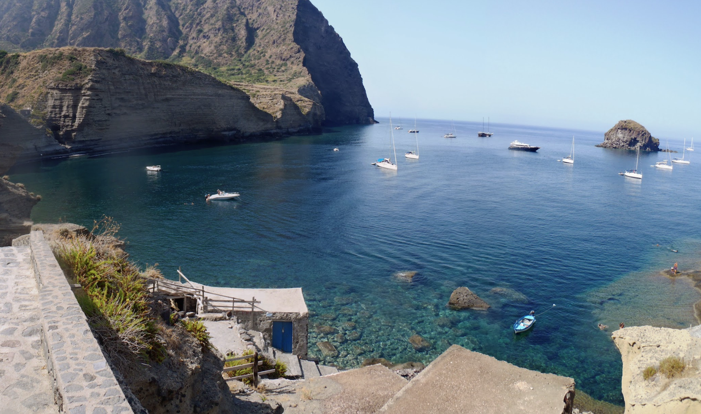

---

### Rinella (южная сторона)

**Rinella** — маленькая и спокойная рыбацкая деревня на южном побережье Салины. Это аутентичное место, идеальное для яхтсменов, ищущих уединение и спокойствие. Есть якорная стоянка на буях (8 мест) и возможность якоря. Грунт — песок, хорошее удержание.

Порт открыт для восточных и южных ветров; при Scirocco стоянка становится некомфортной и опасной. Важная опасность при заходе: отмель в 200 м западнее головы пирса — держаться подальше от западного края причала. По данным Sea-Seek, якорная стоянка к востоку от пирса очень глубокая (25+ м) — рекомендуется западная сторона (10–15 м) при северных ветрах. Место также открыто при либеччо (ЮЗ), что делает его уязвимым осенью.

Стоимость буя — €50–70. Связь: VHF канал 16, тел. +39 090 984 3451.

Рядом расположены небольшие рестораны с домашней кухней и магазин. Это идеальное место для ночёвки перед переходом на другие острова архипелага.

`Координаты: 38° 32.82' N, 14° 49.80' E`

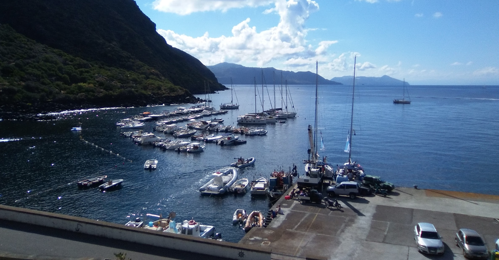

Есть дополнительные буи западнее от пирса.

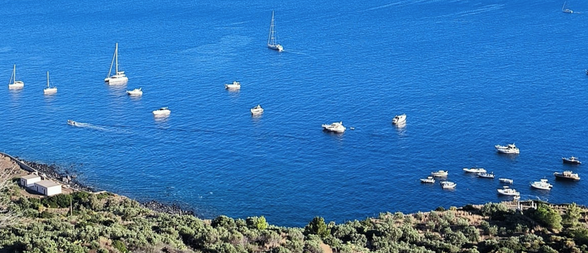

---

### Porticciolo di Malfa

Причал расположен на северном берегу Салины в живописной рыбацкой деревушке **Scalo Galera**. Порт небольшой: максимальная длина яхты 15 м, осадка 2 м. В настоящее время находится на ремонте. 

`Координаты: 38° 34.87' N, 14° 50.33' E`

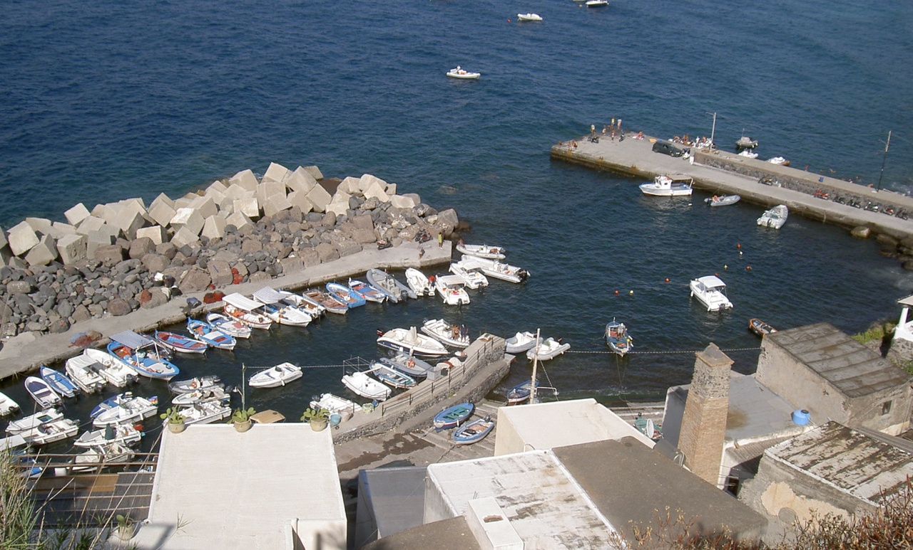

---

### Porto Commerciale - Salina

Городской коммерческий порт с **заправкой**. Швартовка возможна, однако не рекомендуется — имеются негативные отзывы относительно сервиса и персонала.

`Координаты: 38° 33.43' N, 14° 52.30' E`

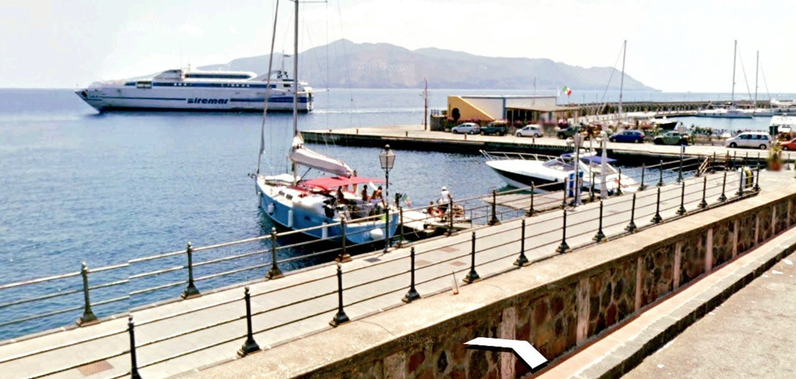

---
## Marina Salina - Marinedì

Марина расположена сразу к югу от **Porto Commerciale**. Это крупнейшая марина острова: 160 мест (макс. длина 60 м, осадка 4,5 м), полный набор услуг — электричество (16–125A), вода, душевые, топливо, Wi-Fi, кран, слип, прачечная, видеонаблюдение, ночной охранник, прокат велосипедов и автомобилей, дайвинг. **VHF канал 11**, тел. +39 090 369 2561. Стоимость: от €74/ночь.
Ночёвка дорогая, но предусмотрены скидки за многодневную стоянку.

`Координаты: 38°33.37'N, 14°52.30'E`

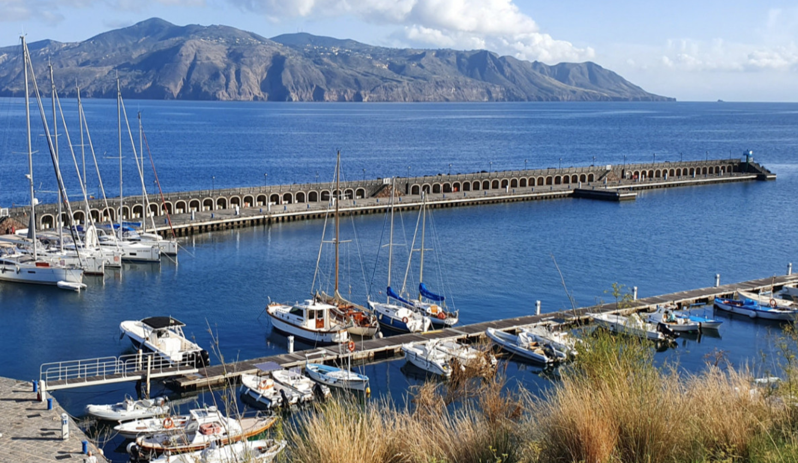

---
### Lingua
Это небольшая рыбацкая деревушка с маленьким причалом и якорной стоянкой. Грунт — морская трава; якорь держит плохо, якорить нужно осторожно, выбирая чистые участки дна. Хороший причал, пляж, вода; место достижимо на моторной лодке.

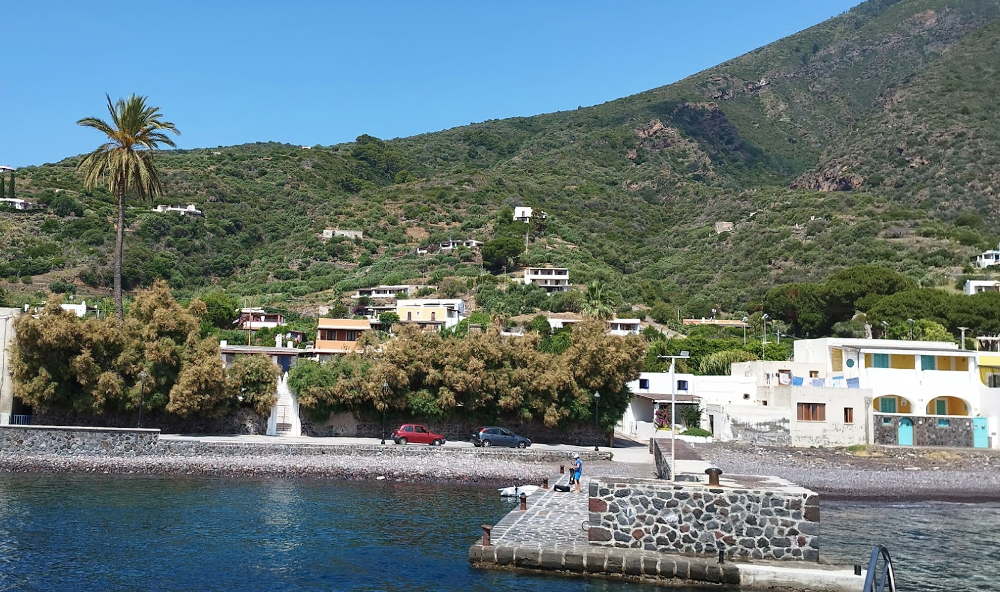

Стоянка полностью открыта при восточных и юго-восточных ветрах — в такую погоду бухта быстро разгуливается, качка становится некомфортной. Мелководье у берега ограничивает подход крупных яхт — осадка более 2,5 м создаёт трудности при швартовке к причалу.

`Координаты: 38°32.47'N, 14°52.23'E`

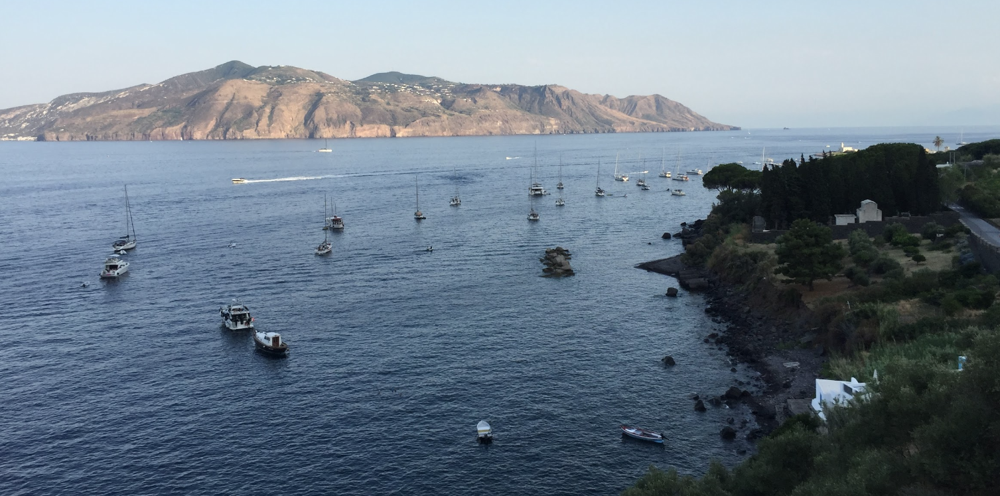

## Достопримечательности

### Vineyards and Malvasia Wine

**Салина** — родина знаменитого белого вина **Malvasia delle Lipari** (сладкое мускатное вино с защищённым географическим указанием). Виноградники расположены на склонах вулканических пиков и создают характерный ландшафт острова. 

Многие виноградники предлагают дегустации и экскурсии для яхтсменов. Местные виноделы с удовольствием показывают процесс производства и предлагают купить вино напрямую по доступным ценам.

## Azienda Agricola Colosi
Это семейное предприятие в третьем поколении, основанное более 40 лет назад. Виноградники (10 га) расположены на живописных террасах между Capo Faro и Porri на высоте с видом на море — так называемое «героическое виноградарство» (виноградники на вулканических террасах без орошения, все работы вручную).

Понедельник–пятница: 09:00–14:00 / 15:00–17:00. Тел. +39 090 984 4389.
Цены: €35 за 2 вина, €69 за 4 вина.

Добраться можно от **Marina Salina Marinedì** (3,6 км) или **Porticciolo di Malfa** (3 км).

> Важно: бронирование дегустации обязательно заранее по телефону или email — без предварительной записи посещение невозможно.

### Carlo Hauner Azienda Agricola

Carlo Hauner Sr. — уроженец Брешии, художник и дизайнер, который впервые приехал на Эолийские острова в 1963 году. Hauner восстановил заброшенные террасные виноградники (более 20 га), которые местные жители покинули из-за массовой эмиграции в Австралию и Америку. Он первым внедрил охлаждение ферментации и сушку винограда на лозе — небольшие революции, которые привлекли внимание ведущего итальянского критика Луиджи Веронелли и вывели Malvasia Hauner на столы лучших ресторанов Италии, Франции, США, Великобритании и Японии.

[hauner.it](https://hauner.it). Тел. +39 090 984 3141.

Как добраться: 5 минут пешком от **Marina Salina Marinedì**.

Дегустация: по записи, €20–30 на человека.

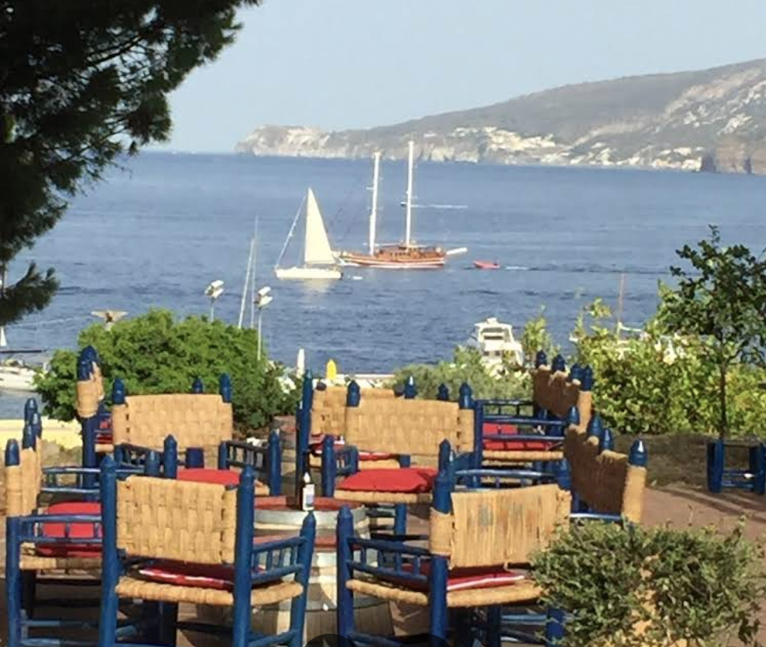

---

### Capofaro Locanda & Malvasia (Tasca d'Almerita) - ⭐⭐ Michelin 

**Capofaro** — роскошный бутик-отель, винодельня и ресторан на острове Salina, принадлежащий аристократической семье **Tasca d'Almerita** — виноделов в восьмом поколении. Исторический маяк на территории поместья был приобретён семьёй в 2017 году и превращён в шесть элегантных номеров с частными садами. Название «Capofaro» — «мыс маяка» — говорит само за себя: исторически это был первый навигационный огонь для судов, входящих в Тирренское море с севера.

**Расположение:** Via Faro 3, Malfa — север острова Салины.

**Телефон:** +39 090 984 4330.

**Сезон:** май — октябрь, 10:00 — закат.
 
**Дегустация:** только по предварительной записи. Формат: прогулка по виноградникам с сомелье, вина и закуски. Стоимость: от €40–60 на человека.

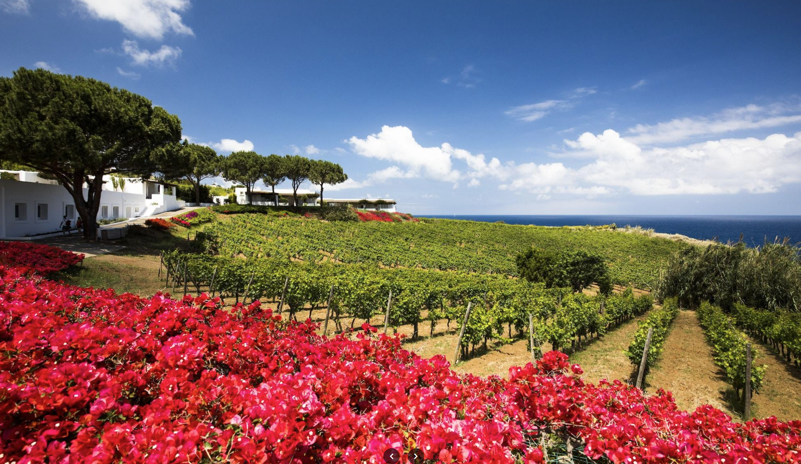

---

## Azienda Agricola Biologica Caravaglio

**Antonino «Nino» Caravaglio** — потомок одной из пяти испанских семей, приглашённых на Эолийские острова в начале XVI века для развития сельского хозяйства. Семья Caravaglio стояла у истоков виноградарства архипелага — именно их предки вместе с венецианскими торговцами завезли с Греции корнесобственные лозы Malvasia и Corinto Nero. Более **500 лет непрерывного виноградарства** на вулканических землях — история, которую можно почувствовать в каждом бокале.

**Расположение:** Malfa — примерно 15 минут пешком от Porticciolo di Malfa.

**Часы работы:** ежедневно 11:30–21:00.

**Бронирование:** ospitalita@caravaglio.it, тел. +39 392 256 8617.

**Дегустация:** около 2 часов, от €50 на человека.

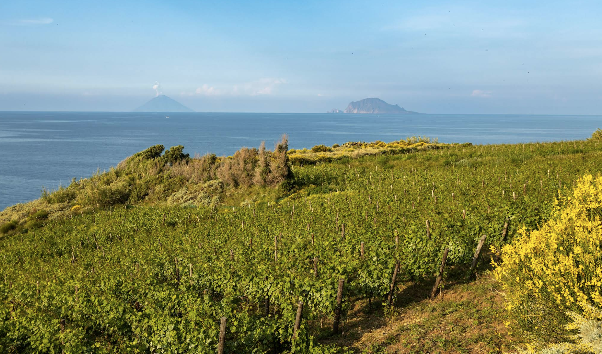

---

### Monte dei Porri и Monte Fossa delle Felci

Два вулканических пика на Салине предлагают захватывающие пешеходные маршруты и панорамные виды на Эолийский архипелаг.

**Monte dei Porri** (860 м) — легче для подъёма, примерно 1,5–2 часа туда и обратно. На вершине открывается вид на остальные острова и Тирренское море.

**Monte Fossa delle Felci** (962 м) — более сложный маршрут, примерно 3 часа туда и обратно. На вершине находится кратер озера, покрытого растительностью, что делает восхождение особенно привлекательным.

Оба маршрута стартуют из села **Valdichiesa** — центра острова.

Удобнее добираться от стоянок **Rinella** и **Pollara**.

Время каждого восхождения: 3–5 часов. Дистанция: 5,3–11,9 км в зависимости от маршрута.

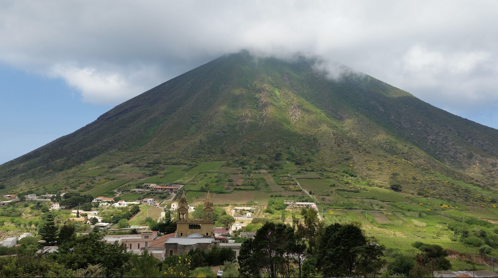

---

### Scogliera di Pollara

Уникальная геологическая формация на западном побережье у деревни **Pollara** — впечатляющие вертикальные скалы из красного вулканического туфа. Это место использовалось в кино и известно своей красотой, особенно на закате.

Скалы доступны для осмотра с моря на лодке или с берега пешком. Кристально чистая вода у подножия скал идеальна для снорклинга.

`Координаты: 38° 36.48' N, 14° 48.28' E`

---

### Spiaggia di Pollara

Небольшой чёрный пляж вулканического происхождения, расположенный у подножия **Scogliera di Pollara**. Пляж окружён красивыми скалами и считается одним из самых живописных мест архипелага.

Пляж небольшой, часто используется местными жителями и туристами. Рядом есть пляжный бар с напитками и закусками.

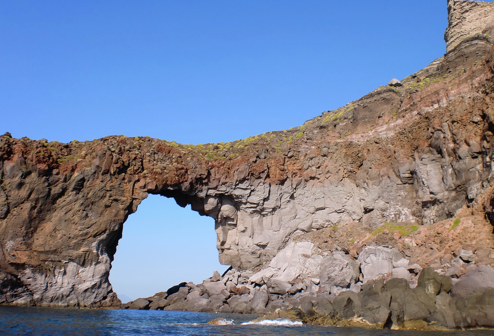

---

### Церковь Santa Marina

Маленькая, но изящная церковь в селе **Santa Marina**, расположенная на холме с видом на море. Это скромный, но атмосферный храм, который часто используется для причастий и религиозных праздников.

Рядом находятся дома местных жителей и несколько кафе, где можно попробовать местную кухню.

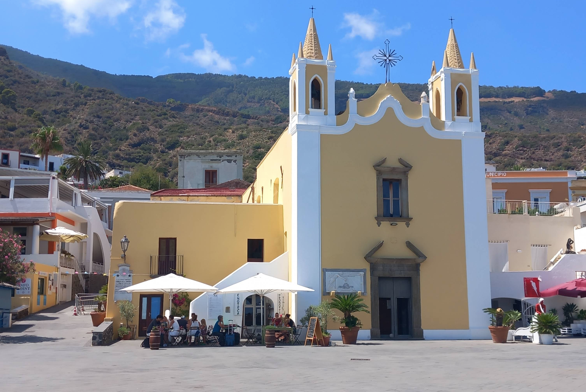

---

### Laghetto di Lingua

Это небольшое солоноватое озеро на юго-восточной оконечности острова Salina, отделённое от моря узкой полоской земли. Именно здесь, между I и II веками н.э., римляне построили производственный комплекс по добыче соли — один из важнейших памятников римской эпохи на Эолийских островах. Сейчас это природный заповедник, памятник ЮНЕСКО.

В сентябре 2021 года в Laghetto di Lingua впервые в истории наблюдений были зафиксированы пять розовых фламинго.

По данным UNESCO Smart Education Sicily, вокруг Laghetto di Lingua сосредоточены сразу три музея, которые можно посетить за одну прогулку: 

- **Museo del Mare e del Sale** — в маяке, у самого озера.
- **Museo Civico** — история острова и местной жизни.
- **Museo Archeologico** — находки из некрополя Vallone Mastrognoli (IV–III вв. до н.э. — V в. н.э.).
  
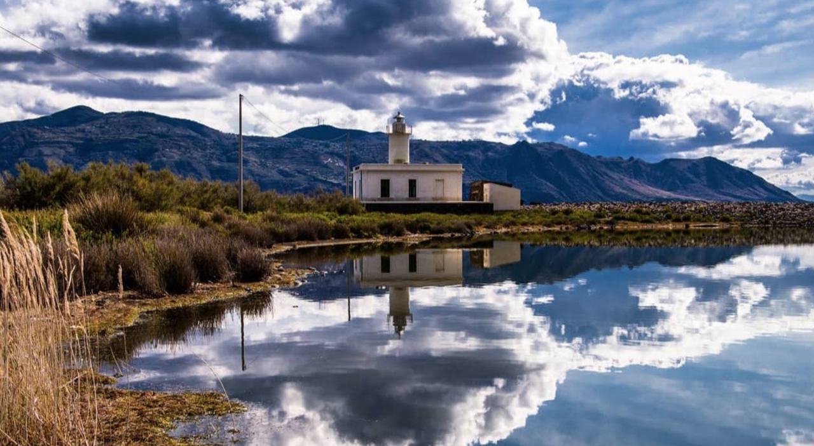

## Рестораны и магазины

Салина — остров для гурманов, где можно попробовать аутентичную эолийскую кухню и местные вина. Инфраструктура на острове развита слабее, чем на Липари, но это добавляет ему аутентичности.

Рекомендуемые рестораны:

- **Ristorante da Giuseppe** (Santa Marina) — кухня: свежая рыба, паста с кальмарами, каперсы. Средний чек: €30–40. Терраса с видом на море.

- **Trattoria Ristobar Tre Balconi** (Pollara) — кухня: эолийская, традиционные блюда. Средний чек: €25–35. Потрясающий вид на закат.

- **Enoteca Salina** (Santa Marina) — специализируется на местных винах и блюдах к ним. Дегустация Malvasia: €15–25 за бокал.

- **Grotta del Tasso** (Rinella) — кухня: рыба, морепродукты, паста. Средний чек: €28–38. Семейное производство.

Магазины:
- **Alimentari Salina** (Santa Marina) — продовольственный магазин с чёрным хлебом, сыром и местными деликатесами.
- **Vinoteca Eolie** (Santa Marina) — винотека с широким выбором Malvasia и других локальных вин.
- **Paninoteca** (Pollara) — кафе с сэндвичами и локальными продуктами.

