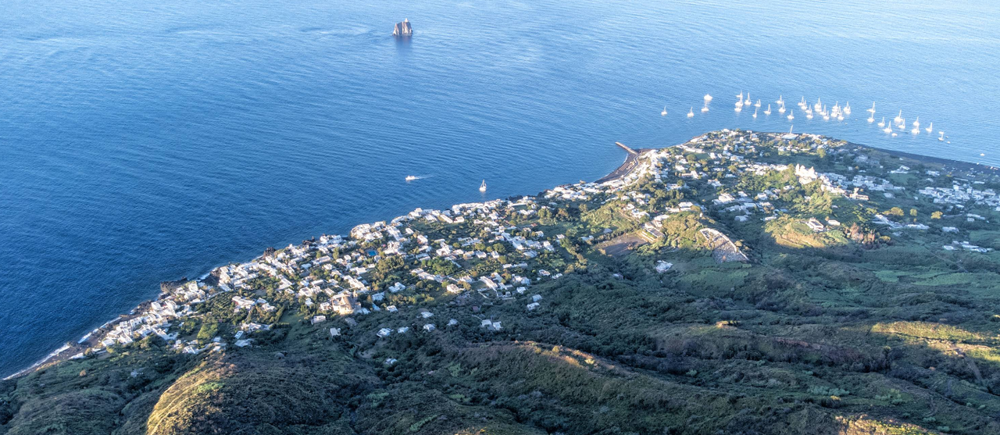

**Стромболи** — небольшой вулканический остров в Эолийском архипелаге, известный одним из самых активных вулканов Европы. Вулкан Стромболи извергается почти непрерывно уже тысячи лет, из-за чего остров часто называют «маяком Средиземного моря» — ночные выбросы лавы хорошо видны с моря.

Остров малонаселён, с двумя основными посёлками — **Stromboli** и **Ginostra** — и ориентирован на природу, трекинг и морские прогулки, а не на массовый туризм. Главные впечатления — подъём к смотровым площадкам (часто с гидом), наблюдение извержений на закате, чёрные вулканические пляжи и дикая атмосфера действующего вулкана.

## Марины и якорные стоянки

**Stromboli** не имеет настоящей марины — только небольшой бетонный причал **Scari (San Vincenzo)** на северо-восточной стороне острова, который занят местными лодками и паромами. Большинство яхт становятся на якорь прямо у деревни в `10–15 метрах глубины` на грубом песке и вулканическом гравии — держит неплохо, но нужно избегать зарослей Посидонии.

Якорная стоянка у **Scari** открыта для ветров с северо-запада через юг, то есть защищена только от восточных направлений. Из-за этого стоянка может стать некомфортной или опасной при ночной смене ветра. Альтернатива — якорная стоянка у **Ginostra** на юго-западе острова, которая даёт укрытие при северных ветрах, но также только в устойчивую погоду. 

---

### Ginostra - посёлок (юго-запад)
Крошечный и один из самых изолированных посёлков Италии. Ginostra — это тишина, простота и аутентичность. Постоянных жителей всего несколько десятков, машин нет, улиц почти нет — только тропинки и лестницы. Здесь ощущение, будто время остановилось: белые дома, террасы с видом на море и вулкан, минимум туристов.

`Координаты: 38° 47.08' N, 15° 11.45' E`

Есть два ресторана и маленький магазин.

Пирс используется для швартовки паромов. Можно встать на якорь рядом, есть место для тузика.

---

### Scari (San Vincenzo) - посёлок (северо-восток)

**Marina del Gabbiano-Stromboli** — рекомендуемое место швартовки вблизи ресторанов и магазинов. Также удобно для высадки пассажиров. 
Есть ограниченное количество мурингов. Вся береговая линия вдоль северо-восточной части подходит для стоянки и ночёвки. Дно пологое. Марин на острове нет. Единственный пирс используется для паромов.

`Координаты: 38° 48.17' N, 15° 14.62' E`

---

### Ficogrande - пляж (север)
Самый известный и посещаемый пляж на острове, недалеко от посёлка San Vincenzo. Широкий чёрный вулканический пляж с мелкой галькой и песком, оборудованный для купания. Есть кафе и бары в шаговой доступности. Вода здесь обычно чистая и прозрачная.

Главная особенность **Ficogrande** — уникальный вид на остров **[Strombolicchio](#strombolicchio---остров-северо-восток)** и вулкан. Иногда видны вспышки из кратера, что делает место особенно атмосферным. Лучшее место на острове для купания, закатов и наблюдения вулканической активности без подъёмов.

Пологий пляж на северной части острова. Возможна якорная стоянка. Есть высокий пирс.

`Координаты: 38° 48.42' N, 15° 14.30' E`

---

### Punta Lena - якорь (север)

Якорная стоянка южнее пирса **Ficogrande**. Защищена от северных ветров, подходит для ночёвки в устойчивую погоду. Дно песчано-галечное, держит хорошо.

`Координаты: 38° 48.27' N, 15° 14.60' E`

---

## Инфраструктура

Большинство ресторанов находятся в посёлке **San Vincenzo** на улице **Via Roma**. Есть несколько аутентичных заведений с видом на бухту, например **Da Luciano**.

Там же находятся продуктовые магазины, есть алкоголь. 
Например: **A Putia du Turcu** — время работы `10:00–12:30 и 15:45–19:30`.

---

## Достопримечательности

### Stromboli - вулкан

Посёлок **Stromboli (San Vincenzo)** — основная и самая популярная точка старта. Отсюда начинается классический маршрут на вулкан. Здесь находятся офисы гидов, контроль доступа, начало размеченных троп. 

Восхождение начинается ближе к закату. К 16:30 уже нужно приобрести в прокат каску и обувь. Крайне не рекомендуется идти в своей обуви — вулканический пепел скользкий и сильно пачкается. Также нужны фонарики — спуск проходит в темноте. 

- Подъём на 290 м — без гида. 
- Выше — только с лицензированным гидом. 

Тур с гидом: 
- Длительность: ~5 часов
- Набор высоты: ~500 м (8 км маршрут)
- Цена: от €30 с гидом
- Финал: наблюдение за лавовыми взрывами в сумерках

> Важно: Из-за активности вулкана подъём может быть ограничен или отменён. В связи с гибелью туриста в 2024 году подъём с гидом к жерлу был закрыт. [онлайн камера](https://www.ct.ingv.it/index.php/monitoraggio-e-sorveglianza/segnali-in-tempo-reale/video-sorveglianza-vulcanica-isole-eolie),  [контакты гидов](https://www.ilvulcanoapiedi.it/escursione-sul-vulcano-stromboli/)
 
Наблюдение за вулканом рекомендуется проводить в сумерках. Основная площадка для наблюдений находится над основным жерлом и оборудована укрытиями на случай пепла. Поведение вулкана непредсказуемо.

---

### Strombolicchio - остров (северо-восток)

Это небольшой скалистый остров-столб рядом со **Stromboli**, представляющий собой древний вулканический некк (остаток магматического канала), возрастом более 200 000 лет. На вершине находится маяк, к которому ведёт высеченная в скале лестница из примерно 200 ступеней, построенная в XIX веке. Высадки туристов нет — Strombolicchio служит навигационным ориентиром и эффектной точкой для прохода и фотосъёмки с яхты.

`Координаты: 38° 49.03' N, 15° 15.12' E`

---

## Ограничения

Подъём на вулкан без гида выше точки 290 метров штрафуется €500.

При проходе вокруг острова держать дистанцию от **Sciara del Fuoco** минимум 0,5 NM от берега.

Швартовка на западной и северо-западной части острова запрещена — это основной путь извергаемого пепла и камней.

Оставлять лодки без присмотра крайне не рекомендуется.

