# Stromboli

Стромболи (Stromboli) — небольшой вулканический остров в Эолийском архипелаге, известный одним из самых активных вулканов Европы. Вулкан Стромболи извергается почти непрерывно уже тысячи лет, из-за чего остров часто называют «маяком Средиземного моря» — ночные выбросы лавы хорошо видны с моря.

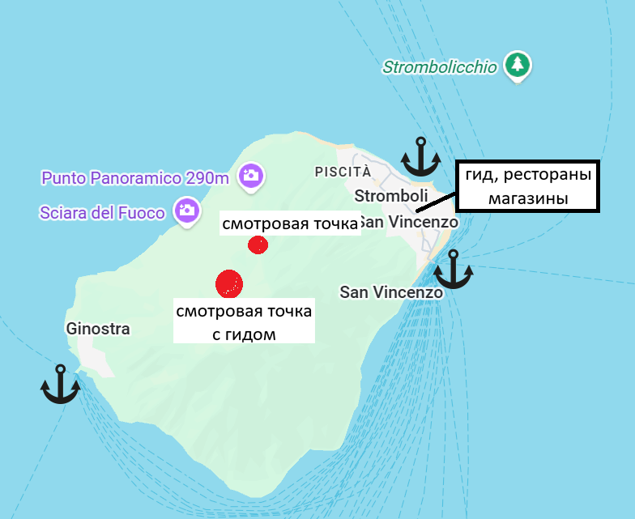

Остров малонаселён, с двумя основными посёлками — **Stromboli** и **Ginostra** — и ориентирован на природу, трекинг и морские прогулки, а не на массовый туризм. Главные впечатления — подъём к смотровым точкам (часто с гидом), наблюдение извержений на закате, чёрные вулканические пляжи и дикая атмосфера действующего вулкана.

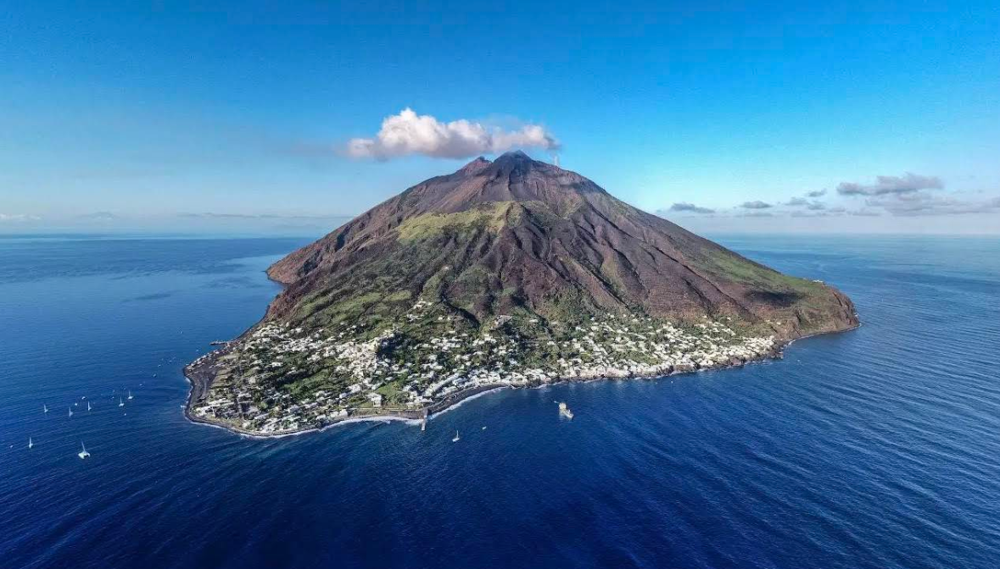

---

### Ginostra (юго-восточная часть острова)
Крошечный и один из самых изолированных посёлков Италии. Ginostra — это тишина, простота и аутентичность. Постоянных жителей всего несколько десятков, машин нет, улиц почти нет — только тропинки и лестницы. Здесь ощущение, будто время остановилось: белые дома, террасы с видом на море и вулкан, минимум туристов.

Есть два ресторана и маленький магазин.

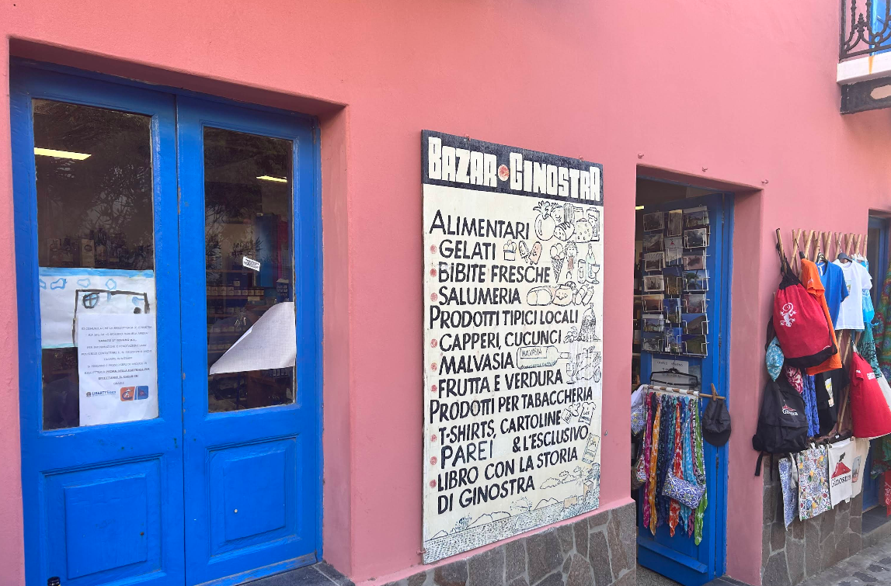

Пирс используется для швартовки паромов. Можно встать на якорь рядом, есть место для тузика.

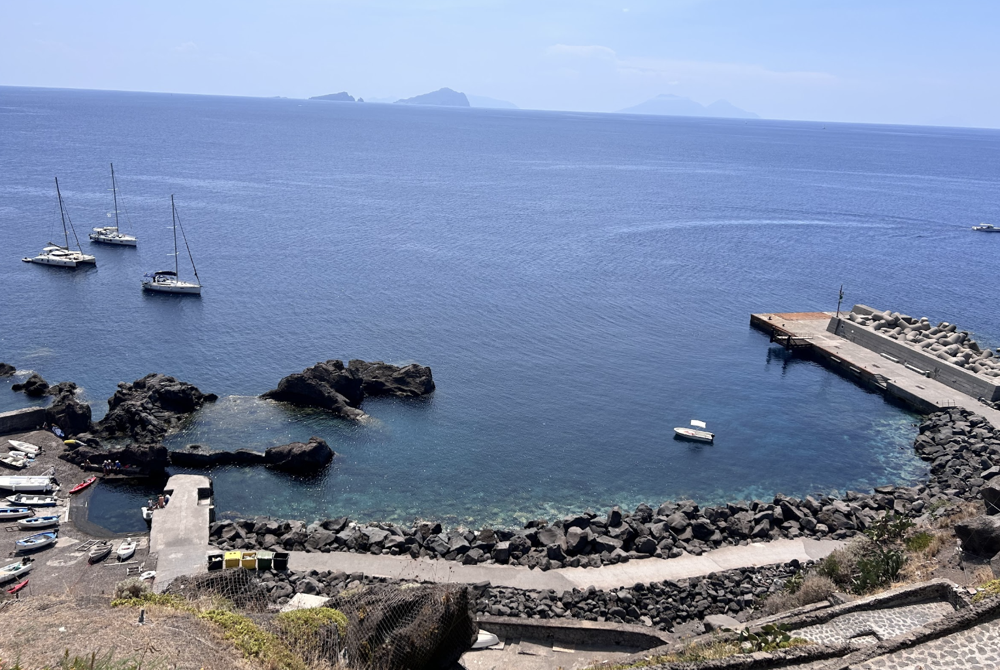

---

## Stromboli (San Vincenzo) (северо-восточная часть)

Рекомендуемое место швартовки вблизи ресторанов и магазинов. Также удобно для высадки пассажиров. 
Есть ограниченное количество мурингов. Вся береговая линия вдоль северо-восточной части подходит для стоянки и ночёвки. Дно пологое. Марин на острове нет. Единственный пирс используется для паромов.

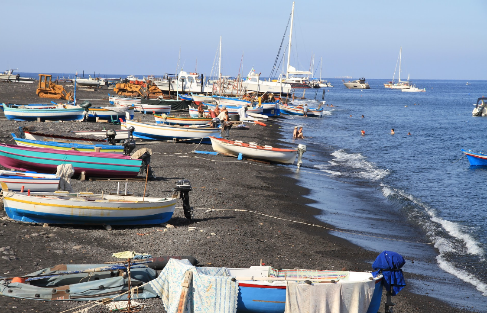
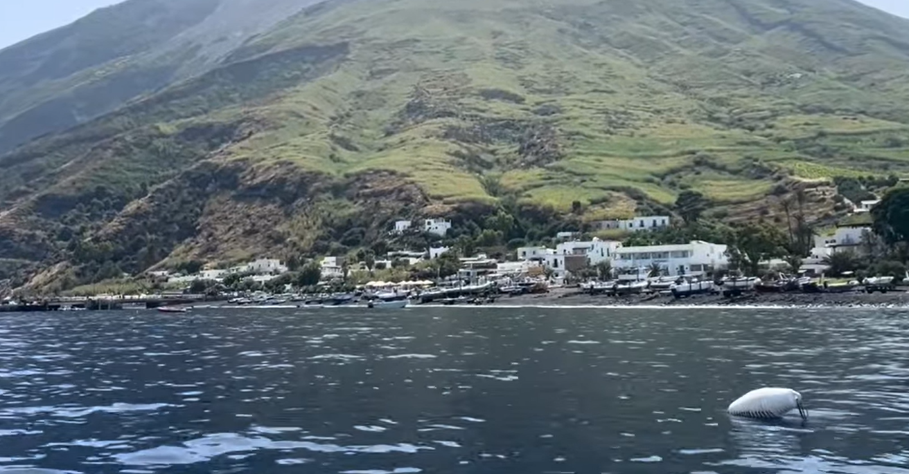

---

### Ficogrande (северная часть)
Это самый известный и посещаемый пляж на острове Stromboli, недалеко от посёлка San Vincenzo. Это широкий чёрно-вулканический пляж с мелкой галькой и песком, оборудованный для купания. Есть кафе и бары в шаговой доступности. Вода здесь обычно чистая и прозрачная.

Главная особенность **Ficogrande** — уникальный вид на остров **Strombolicchio**, а также вулкан. Иногда видны вспышки из кратера, что делает место особенно атмосферным. Это лучшее место на острове для купания, закатов и наблюдения вулканической активности без походов и подъёмов.

Пологий пляж на северной части острова. Возможна якорная стоянка. Есть высокий пирс. Рядом обычно швартуют танкер с водой.

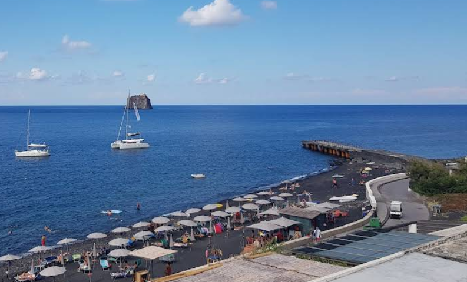

---

## Инфраструктура

Большинство ресторанов находятся в посёлке **San Vincenzo** на улице **Via Roma**. Есть несколько аутентичных заведений с видом на бухту, например, **Da Luciano**.

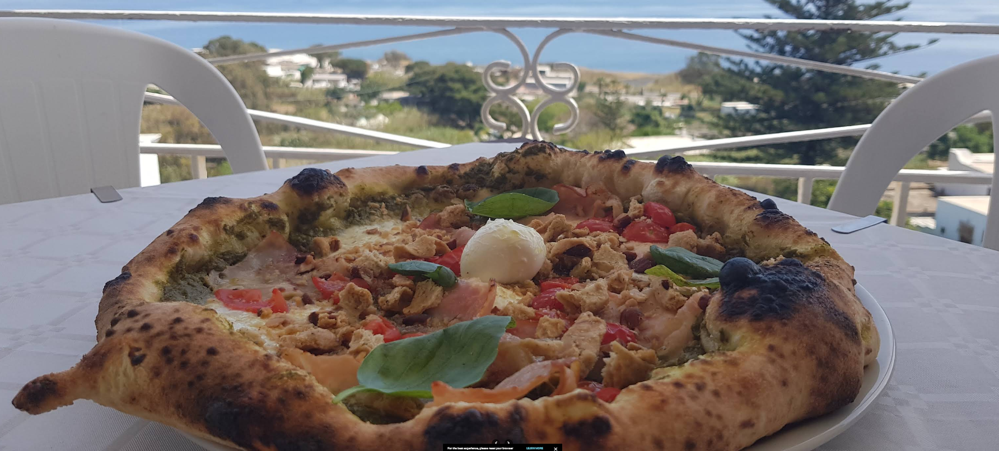

Там же находятся магазины. Есть продуктовые магазины и алкоголь. 
Например: **A Putia du Turcu** — время работы `10:00–12:30 и 15:45–19:30`.

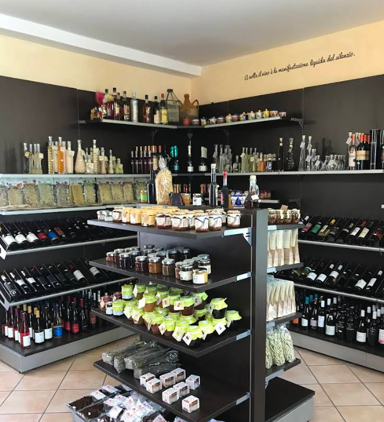

---

## Достопримечательности

### Вулкан

Посёлок **Stromboli (San Vincenzo)** — основная и самая популярная точка старта. Отсюда начинается классический маршрут на вулкан. Здесь находятся офисы гидов, контроль доступа, начало размеченных троп. 

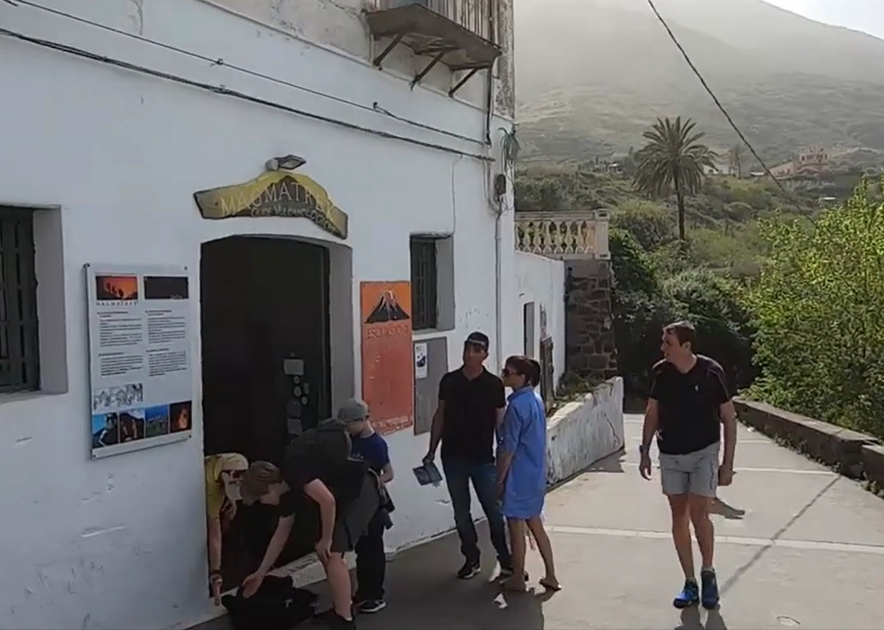

Восхождение начинается ближе к закату. К 16:30 уже нужно приобрести в прокат каску и обувь. Сильно не рекомендуется идти в своей обуви — вулканический пепел скользкий и грязный. Также нужны фонарики на время спуска, так как спуск проходит в темноте. 

- Подъём на 290–400 м — без гида. 
- Выше — только с лицензированным гидом. 

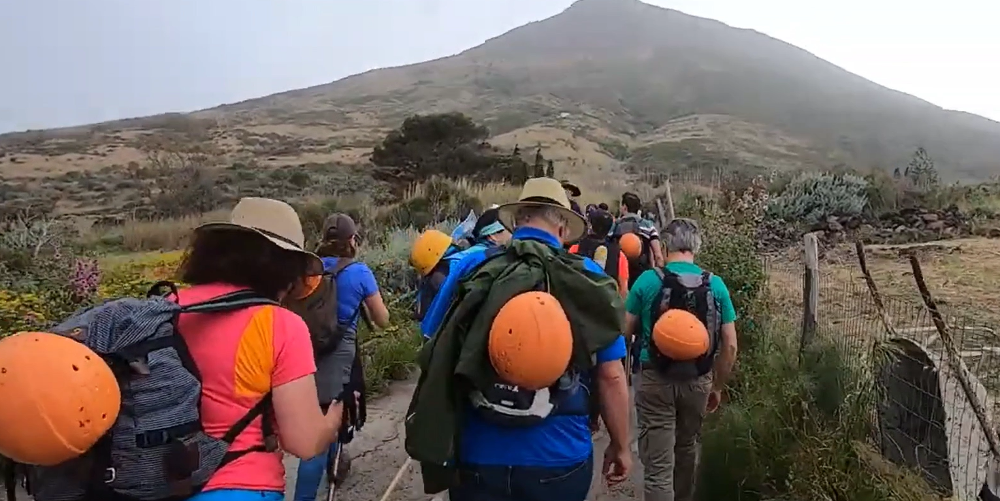

Из-за активности вулкана подъём может быть ограничен или отменён. Наблюдение вулкана рекомендуется проводить в сумерках. Основная площадка для наблюдений находится чуть выше основного жерла. Оборудована укрытиями на случай пепла. Поведение вулкана непредсказуемо.

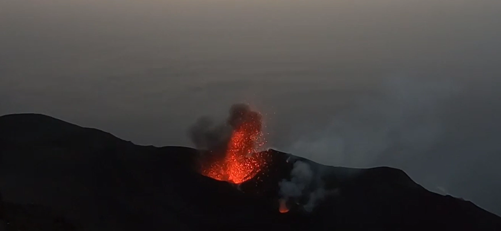

---

### Strombolicchio

Это небольшой скалистый остров-столб рядом со **Stromboli**, представляющий собой древний вулканический некк (остаток магматического канала), возрастом более 200 000 лет. На вершине находится маяк, к которому ведёт высеченная в скале лестница из ~200 ступеней, построенная в XIX веке. Высадки туристов нет — Strombolicchio служит навигационным ориентиром и эффектной точкой для прохода и фотосъёмки с яхты.

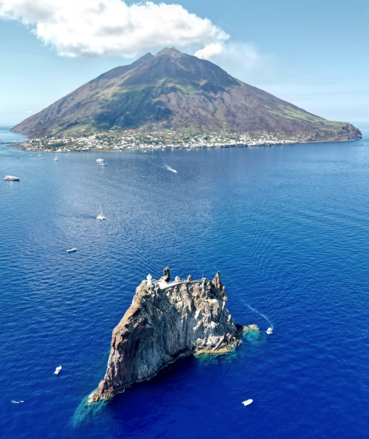

---

## Ограничения

Швартовка на западной и западно-северной части острова запрещена — это основной путь извергаемого пепла и камней.

Оставлять лодки без присмотра крайне не рекомендуется.

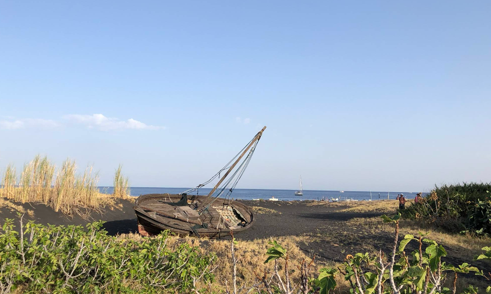