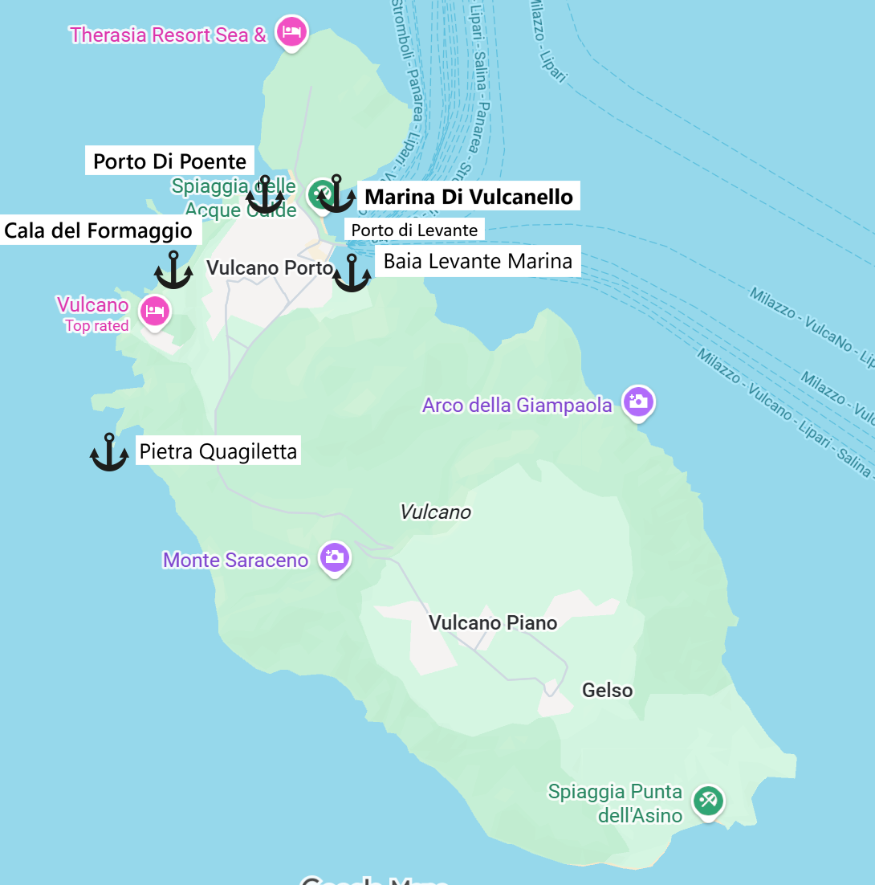
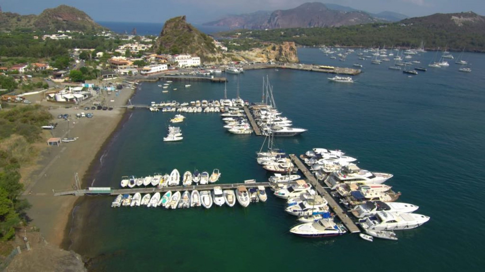
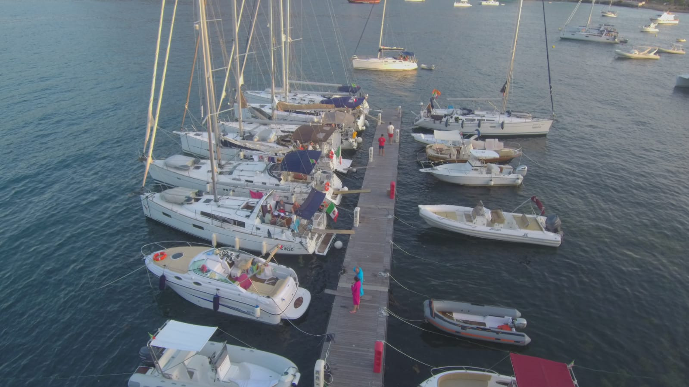
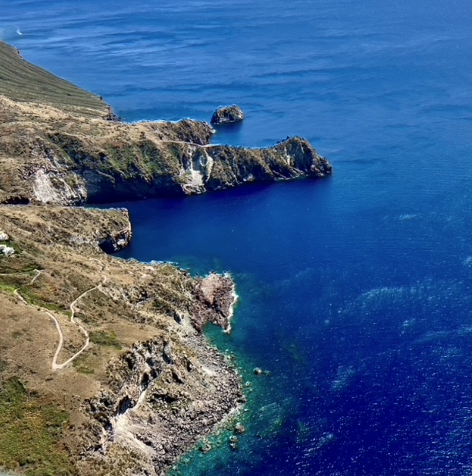
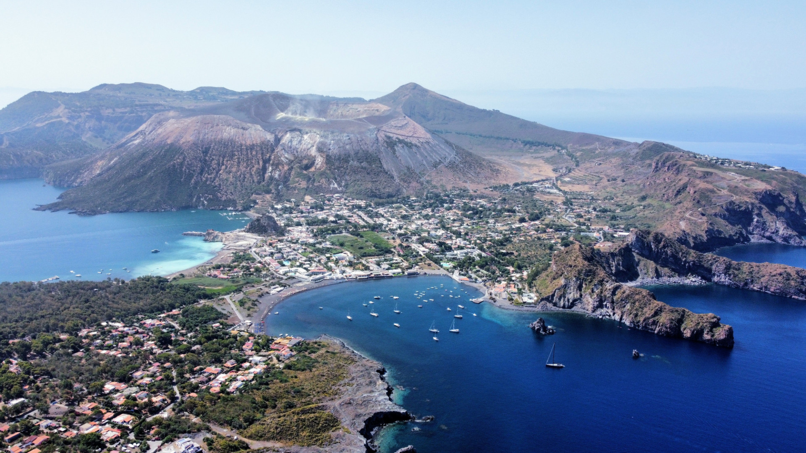
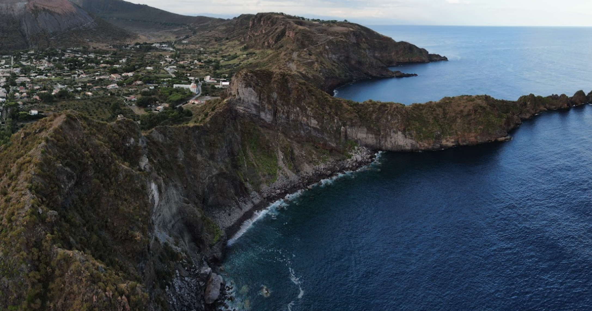
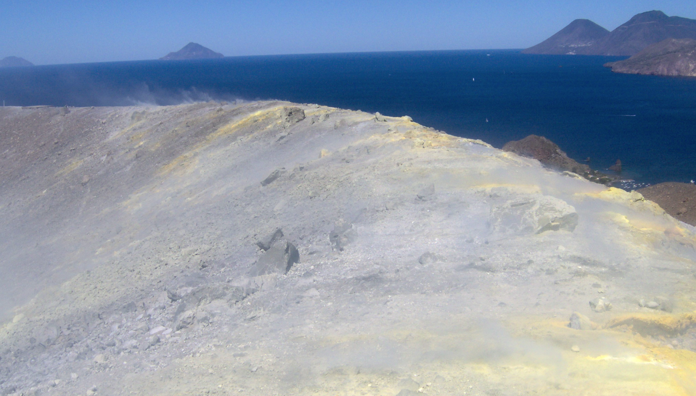
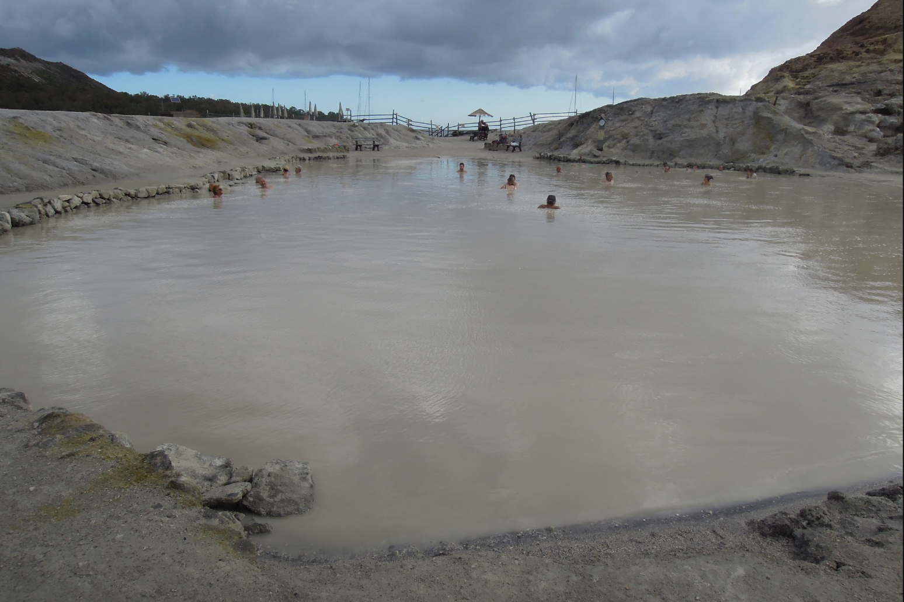

**Вулкано** — самый южный остров Эолийского архипелага, известный своей активной вулканической природой. Остров компактен: большинство природных объектов доступны пешком или за короткое время на яхте.

История **Vulcano** уходит в античность: древние греки считали остров кузницей бога огня **Гефеста**, а само слово «вулкан» вошло в языки мира именно отсюда. В римский период остров использовался для добычи серы и квасцов, а в Новое время переживал периоды извержений и эвакуаций. Сегодня **Vulcano** — это сочетание живой геологии, мифологии и спокойного курортного ритма, что делает его одной из самых необычных остановок на Эолийских островах.

## Марины и якорные стоянки

Основной порт острова — **Porto di Levante** на северо-восточной стороне, где яхты швартуются к причалу способом «корма к берегу» (Med-moor) или становятся на якорь за пределами паромной зоны. Глубина 5–6 м, грунт — ил и песок, держит хорошо; летом здесь доступны платные буи. На западной стороне острова — **Porto di Ponente**: живописная бухта с чёрным пляжем, чистым дном (5–10 м, песок) и красивыми закатами — чисто якорная стоянка без причалов.

_Дневная остановка_ — идеальный вариант для Porto di Ponente: купание, грязевые ванны, прогулка к кратеру и уход до вечера. _Ночная стоянка_ — предпочтительно в Porto di Levante при стабильном прогнозе; летом буи дают хорошую защиту. Перед ночёвкой обязательно проверять прогноз — смена ветра делает обе стоянки уязвимыми.

## Инфраструктура

### Baia Levante - марина (восток)
Сезонная марина с плавающими понтонами в **Porto di Levante**, которые, как правило, устанавливаются с середины апреля и работают до конца октября. Вне сезона причалов в воде нет. Марина хорошо защищена от западных и южных ветров, однако при северо‑восточном и восточном ветре комфорт стоянки заметно снижается — возможна зыбь и покачивание у понтонов.

Стоимость стоянки варьируется в зависимости от сезона и типа швартовки: у причала — примерно €40–100 за ночь, швартовка на буе — около €40–50. В пешей доступности от марины находятся рестораны, бары и небольшие продуктовые магазины, что делает остановку удобной для короткого визита или ночёвки без длительных переходов по острову.

`Координаты: 38° 24.78' N, 14° 57.72' E`

---

### Marina Di Vulcanello - марина (восток)
Это небольшая туристическая марина курортного типа в **Porto di Levante**, рассчитанная всего примерно на 6–10 яхт у понтона, поэтому места здесь ограничены и в сезон часто заняты. Основная альтернатива — швартовка на буе, что делает марину подходящей в первую очередь для короткой остановки или ночёвки. Защита лучше, особенно при западных и северо‑западных ветрах, однако при восточных направлениях также возможна зыбь.

Стоимость стоянки у понтона составляет порядка €120 за ночь, буй — около €50, при этом вода и электричество оплачиваются отдельно. Непосредственно у пирса есть ресторан, удобный для ужина после швартовки, но магазины и большинство ресторанов находятся в Vulcano Porto — добираться до них обычно приходится на такси или шаттле. В целом Marina di Vulcanello — это компактный и функциональный вариант стоянки с базовыми удобствами, но без городской инфраструктуры в шаговой доступности.

`Координаты: 38° 25.17' N, 14° 57.73' E`

## Якорные стоянки

### Pietra Quagiletta - якорь (запад)
Небольшой вулканический скальный островок у северо-западного побережья Vulcano, хорошо заметный при подходе с моря и служащий удобным навигационным ориентиром для яхтсменов.

**Piscina di Venere** — это естественная морская «чаша» у подножия скал на побережье Vulcano, образованная вулканическими породами и доступная только с моря. Место известно кристально чистой водой, спокойной акваторией при штиле и отличным снорклингом, часто посещается на лодке или с яхты в дневное время. Якорная стоянка возможна лишь на удалении и при очень спокойном море. Мобильной связи нет.

`Координаты: 38° 24.03' N, 14° 56.45' E`

---

### Porto Di Ponente - якорь (запад)

Удобная якорная стоянка у песчаного пляжа на западной стороне Vulcano, подходящая для дневной остановки и купания при спокойном море. Стоянка открытая, с ограниченной защитой от западных ветров, поэтому комфортна в штиль и при слабом бризе.

`Координаты: 38° 25.20' N, 14° 57.23' E`

---

### Cala del Formaggio - якорь (запад)

Удобная якорная стоянка у скалистого берега на западной стороне Vulcano с чистой водой и хорошими глубинами. Стоянка подходит для дневной остановки и купания при спокойном море, но открыта к западной и юго-западной волне.

`Координаты: 38° 25.12' N, 14° 56.87' E`

## Достопримечательности

### Vulcano - вулкан

Главная достопримечательность — вулкан **Gran Cratere della Fossa** с подъёмом к дымящимся фумаролам и панорамами на соседние острова. 
Подъём без гида заканчивается в 17:30.

---

### Fanghi di Vulcano - грязи

Грязевые ванны — одно из самых известных мест на Эолийских островах. Натуральные серные грязи считаются полезными для кожи и суставов. Время купания ограничено из-за высокой концентрации серы (10–15 минут).

> Могут быть закрыты из-за строительных работ.

**Горячие источники Фомари** — морские участки, где прямо в воду выходят тёплые вулканические газы. Купаться можно самостоятельно — особенно приятно вечером или при умеренной погоде.

## Рестораны 

Среди популярных заведений — **Ristorante The King of Fish**, где подают свежую рыбу и морепродукты по весу; средний чек обычно составляет €40–50 на человека.

На северной части острова также находится ресторан с ⭐ Michelin звездой: **Il Cappero** на территории **Therasia Resort and Spa**. Добраться можно на такси. Средний чек обычно составляет от €100 на человека.

